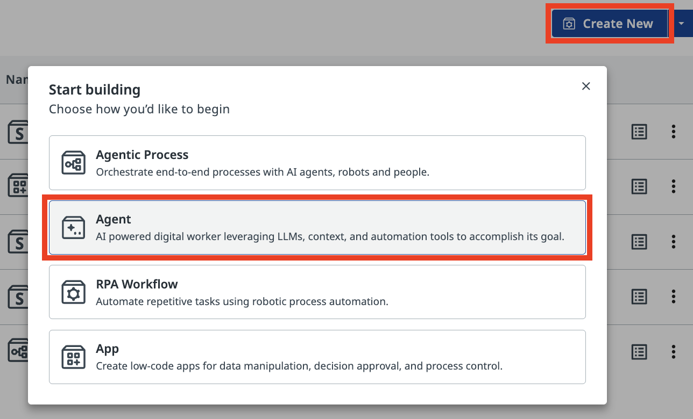
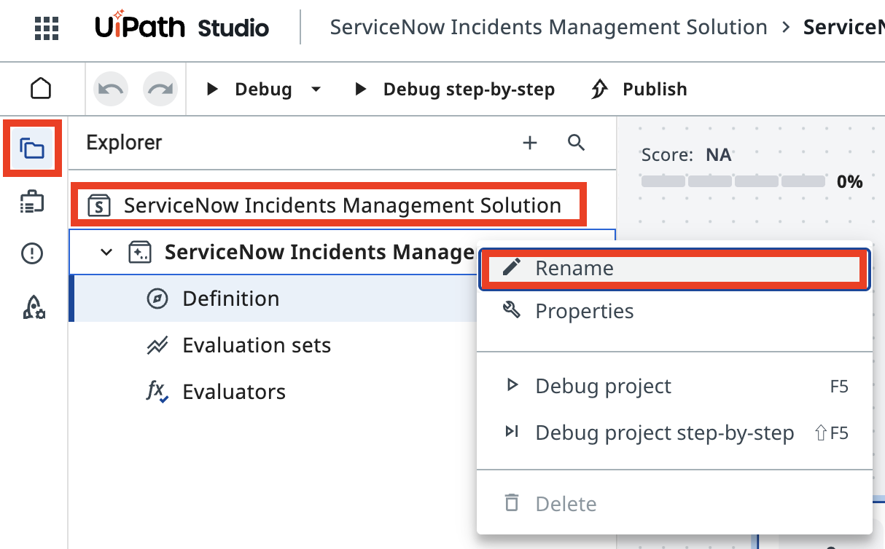
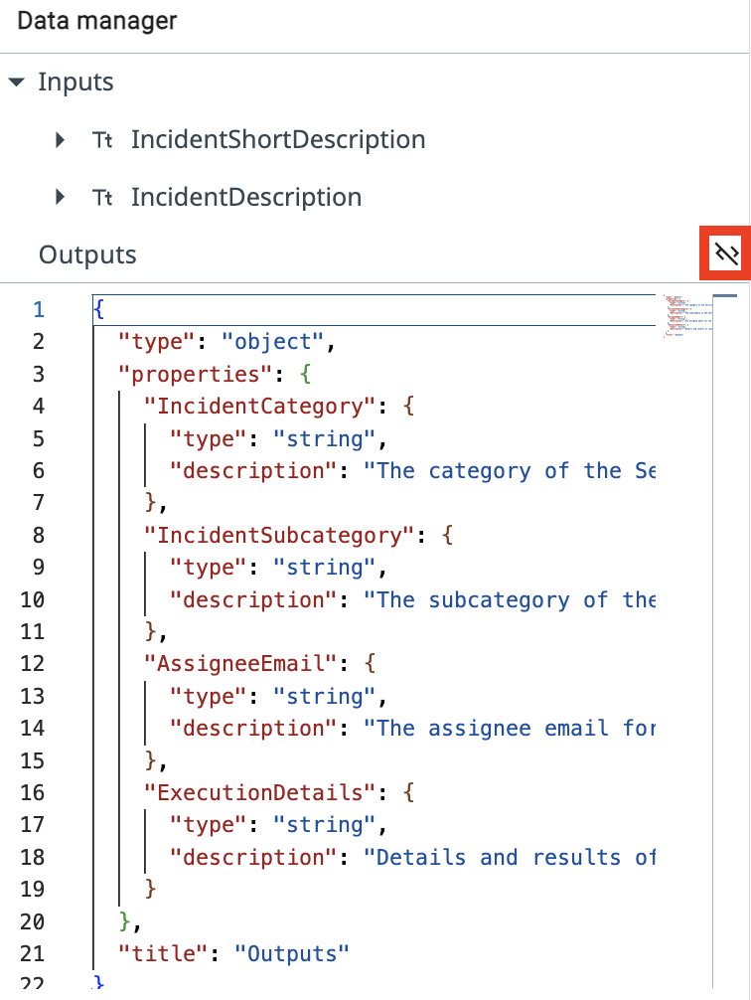
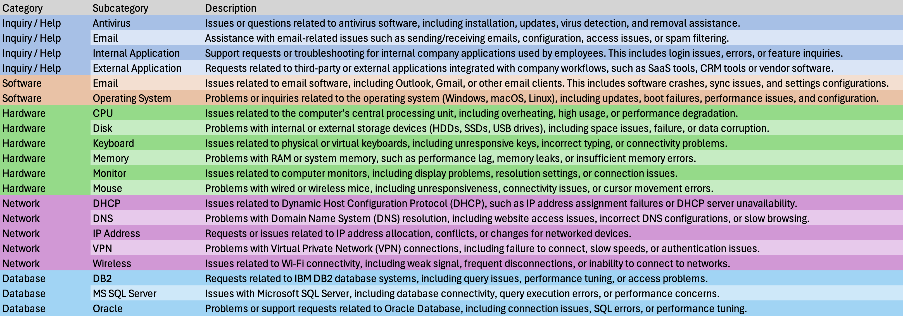
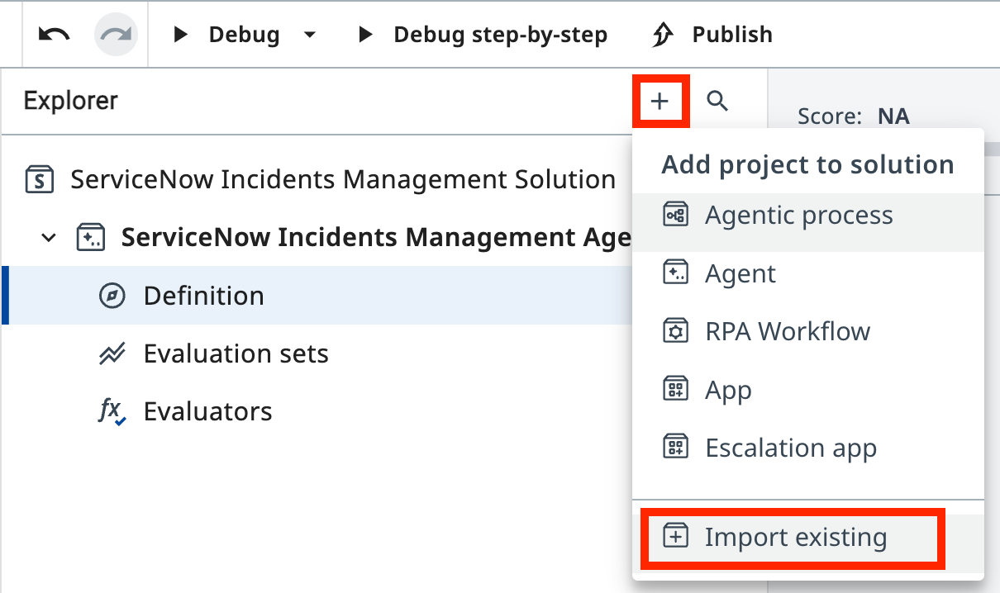
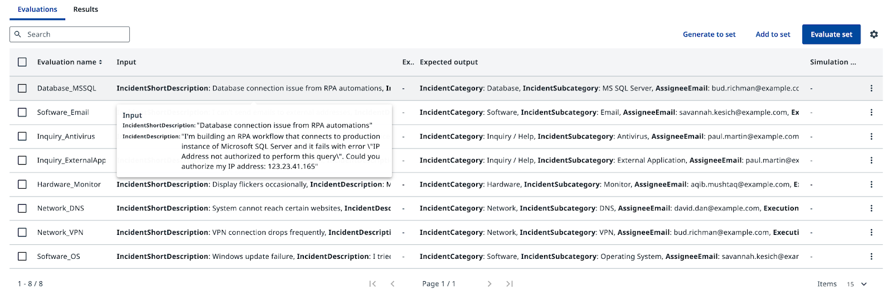

# LLM with Context

**Build a context-grounded ServiceNow incident categorization agent**

!!! tip "What you'll do"
    1. Create and configure a new agent with input and output arguments
    2. Write system and user prompts, then test the agent with sample incidents
    3. Add Context Grounding to prevent hallucinations, and configure an Assignee Lookup tool
    4. Validate the agent's performance using Evaluations

## Goal

Create a ServiceNow incident categorization agent in **Agent Builder**, configure its prompts, learn how to ground it in real data using **Context Grounding**, and build **Evaluations** for quality assurance and reliability testing.

## How Context Grounding Works

Without grounding, an LLM may produce plausible-sounding but incorrect category–subcategory pairs — combinations that don't exist in your system. Context Grounding anchors the agent to a real data source, so every decision traces back to valid entries in your context.

When the agent categorizes an incident, it references actual category and subcategory combinations from your data, eliminating the risk of inventing new ones.

## What the Evaluations Step Adds

Evaluations let you run a batch of test cases against your agent before deploying it. You define expected outputs for a set of sample incidents, run the evaluation, and measure how well the agent performs across edge cases. This is a form of regression testing — it helps ensure that prompt changes or model upgrades don't break existing functionality.

## Steps

### 1. Create and configure the agent


[[[
In **Studio Web**, create a new **Agent Solution**.
|30|
{ .screenshot }
]]]

!!! tip "Autopilot"
    When you create an agent, Studio Web may suggest using Autopilot to auto-generate a solution using AI assistant. You can dismiss it and build manually (as we're doing here), or experiment with Autopilot later for practice.

[[[
Rename the solution so that it's easier to find it later, for example:

- **Solution Name**: 
```text
ServiceNow Incidents Management Solution
```

- **Agent Name**: 
```text
ServiceNow Incidents Management Agent
```

|50|
{ .screenshot }
]]]


!!! tip "Arguments"
    Agent arguments let your agent take in information about a business case and return a result, same way as any other activities or RPA processes do. This allows you to pass information from a trigger in Orchestrator or use the output of an agent to launch another automation.


[[[
Open the **Data Manager** panel. Add the following **Input Arguments**. Type should be **String**.
```css hl_lines="1"
IncidentShortDescription
```
```
Short description of the ServiceNow incident
```
```css hl_lines="1"
IncidentDescription
```
```
Full description of the ServiceNow incident
```
|50|
{ .screenshot }
]]]

[[[
Next, create the following Output Arguments:
```css hl_lines="1"
IncidentCategory
```
```text
The category of the ServiceNow incident
```
```css hl_lines="1"
IncidentSubcategory
```
```text
The subcategory of the ServiceNow incident
```
```css hl_lines="1"
AssigneeEmail
```
```text
The assignee email for the ServiceNow incident
```
```css hl_lines="1"
ExecutionDetails
```
```text
Details and results of classification
```
|50|

]]]

Luckily, you can import them at once by **switching to JSON editor mode** and pasting the below JSON schema:

[[[
```json
{
  "type": "object",
  "properties": {
    "IncidentCategory": {
      "type": "string",
      "description": "The category of the ServiceNow incident"
    },
    "IncidentSubcategory": {
      "type": "string",
      "description": "The subcategory of the ServiceNow incident"
    },
    "AssigneeEmail": {
      "type": "string",
      "description": "The assignee email for the ServiceNow incident"
    },
    "ExecutionDetails": {
      "type": "string",
      "description": "Details and results of classification"
    }
  },
  "title": "Outputs"
}
```
|50|

{ .screenshot }
]]]

### 2. Configure the agent prompts

After the input and output data is defined, understand the difference between System and User prompts before writing them.

**System Prompts** provide consistent guidelines that define an agent's role and capabilities, while **User Prompts** direct its attention to specific tasks and input parameters. Understanding this distinction is essential for effectively designing and implementing AI agents that can perform complex tasks while maintaining appropriate operational boundaries.

[[[

**System prompt**

System prompt allows you to describe in natural language the agent's role, goal and constraints. You specify any rules for it to follow, and information about when it might want to use certain tools, escalations, or context.
|50|

**User prompt**

User prompts allow you to structure how the inputs/arguments are passed to the agent, and you can also show in the user prompt how we'll refer to certain inputs in the system prompt.
]]]


```markdown hl_lines="1 3 7 9" title="Enter the following text in the System Prompt field:"
You are a ServiceNow Incidents categorization agent, an AI assistant tasked with managing newly created ServiceNow incidents. Your primary responsibility is to analyze incident details and determine the correct Category, Subcategory, and Assignee email address for each incident.

# Categorize the incident

- Determine the Incident Category and Subcategory based on Description and Short Description.

# Once categories have been established, determine the on-duty Assignee email address who handles this type of requests.

# Summarize the actions taken. In the ExecutionDetails, provide:
a. Incident Category
b. Incident Subcategory
c. Assignee Email
d. Reasoning for your decisions
```

```markdown hl_lines="1 6" title="Enter the following text in the User Prompt field:" 
Analyze and categorize the following ServiceNow incident:

Incident Short Description: {{IncidentShortDescription}}
Incident Description:       {{IncidentDescription}}

Determine the appropriate category, subcategory, and assignee email for this incident based on the provided information.
```

Let's test the agent with these sample incident details to observe how it behaves without grounding. Run the agent and provide the following input arguments:


```css title="Short Description:"
CRM software crashes on launch
```

```css title="Description:"
Every time I try to open the CRM software, it crashes immediately. I've already tried reinstalling it.
```

In the output panel you'll see the agent send the request to the LLM and receive a response. But how does it determine the category names and the assignee email address?

Without context grounding, the agent may return confident but inaccurate categories and assignee information—categories that don't actually exist in your system. This is the hallucination problem.

To ground responses in real categories and look up the on-duty expert's email, you'll add two things:

- Context Grounding
- Assignee Lookup automation

### 3. Add context grounding

Context Grounding provides the agent with a structured data source. The context is named **ServiceNow Incidents Categorization Information** and contains the valid Category–Subcategory pairs used in our training organization. It lists available categories and subcategories with a brief description for each:

{ .screenshot width="900" }


[[[
This gives the agent the structured data it needs to categorize any incoming ticket. Click **Add context** in the **Contexts** section of the agent configuration. 

!!! tip "If you are in Canvas mode, use the "+" button next to Contexts."

|30|
{ .screenshot }
]]]


Select **ServiceNow Incidents Categorization Information** from the available resources under the **ServiceNow Incidents** folder and add it with following description: 
```
Use this context when you need to establish the Category and Subcategory of ServiceNow incidents
```

### 4. Add assignee lookup tool


[[[
Now, import the **SNOW Assignee Lookup Automation** project. 

Click the **+** button in the Explorer and choose **Import existing** to add it into your solution.
|50|
{ .screenshot }
]]]


[[[
Search for "SNOW Assignee" and select **SNOW Assignee Lookup Automation**.
|30|
{ .screenshot }
]]]

Add this automation as a tool to your agent. Click **Add tool** in the **Tools** section, then select **RPA workflow**.

{ .screenshot width="800" }


[[[
Select **SNOW Assignee Lookup Automation** from the list of available workflows in your current solution.
|50|
{ .screenshot }
]]]

[[[
Add a description for the tool so the agent knows when to use it:
|30|
```text
Use this tool to determine the email address of the current on-duty expert for a given Category and Subcategory.
```
]]]

### 5. Update system prompt 

??? tip "Review the changes"
    Here are the changes that we need to apply in order for prompt to reflect new tools use. Review carefully:
    ```diff 

    --- Original
    +++ With Context and tools

    # Categorize the incident.

    -- Determine the Incident Category and Subcategory based on Description and Short Description.
    +- Determine the Incident Category and Subcategory based on Description and Short Description from Categorization Information Context.
    +- Context contains table with only possible Category-Subcategory pairs. Do not mix Category-Subcategory pairs if specific pair is not present in the context. Do not generate new categories if they are not present in the context.
    +- Pick the Category-Subcategory pair that aligns well with Incident Descriptions. If you are not sure or no category pair is a clear match, return "Unknown" as category.

    -# Once categories have been established, determine the on-duty Assignee email address who handles this type of requests.
    +# Once categories have been established, determine the on-duty Assignee email address who handles this type of requests by calling Assignee Lookup automation.

    # Summarize the actions taken. In the ExecutionDetails, provide:
    a. Incident Category
    b. Incident Subcategory
    c. Assignee Email
    d. Reasoning for your decisions

    ```


```markdown hl_lines="5 6 7 9" title="Update the System Prompt to reference both the context and the tool:"
You are a ServiceNow Incidents categorization agent, an AI assistant tasked with managing newly created ServiceNow incidents. Your primary responsibility is to analyze incident details and determine the correct Category, Subcategory, and Assignee email address for each incident.

# Categorize the incident.

- Determine the Incident Category and Subcategory based on Description and Short Description from Categorization Information Context.
- Context contains table with only possible Category-Subcategory pairs. Do not mix Category-Subcategory pairs if specific pair is not present in the context. Do not generate new categories if they are not present in the context.
- Pick the Category-Subcategory pair that aligns well with Incident Descriptions. If you are not sure or no category pair is a clear match, return "Unknown" as category.

# Once categories have been established, determine the on-duty Assignee email address who handles this type of requests by calling Assignee Lookup automation.

# Summarize the actions taken. In the ExecutionDetails, provide:
a. Incident Category
b. Incident Subcategory
c. Assignee Email
d. Reasoning for your decisions

```

Test the agent again with the same CRM crash sample incident. Now review the **Execution Trace** to observe:

- The agent's LLM call to analyze the incident
- The agent querying the Context Grounding data
- The agent calling the Assignee Lookup tool
- The final categorization in the Result tab

{ .screenshot width="900" }

The output should now show only valid categories and an assignee email retrieved from the lookup tool — no hallucinations. Congratulations!

### 6. Test with Evaluations

Evaluations are a form of regression testing that automatically validate results against a predefined set of inputs. For now, run the evaluation set to confirm the agent handles all eight scenarios correctly. You'll explore Evaluations further in the next step.

Go to the Evaluation sets tab and click **Import**. 

??? tip "Evaluation set"
    Paste the JSON below into the text field. After import you should see several evaluations.
    ```json
    {
      "fileName": "evaluation-set-1761459564848.json",
      "id": "18c3387f-00ed-4deb-b4e8-886f1164f517",
      "name": "SNOW Categorization Evaluation",
      "batchSize": 10,
      "evaluatorRefs": [
        "33c47b32-563b-4d16-b323-11e187f954be"
      ],
      "evaluations": [
        {
          "id": "811adc0e-aff0-434f-99fa-f32ed562bf1d",
          "name": "Database_MSSQL",
          "inputs": {
            "IncidentShortDescription": "Database connection issue from RPA automations",
            "IncidentDescription": "I'm building an RPA workflow that connects to production instance of Microsoft SQL Server and it fails with error \"IP Address not authorized to perform this query\". Could you authorize my IP address: 123.23.41.165"
          },
          "expectedOutput": {
            "IncidentCategory": "Database",
            "IncidentSubcategory": "MS SQL Server",
            "AssigneeEmail": "bud.richman@example.com",
            "ExecutionDetails": ""
          }
        },
        {
          "id": "789d90ad-fca8-44f3-8179-d1ca95317a1f",
          "name": "Software_Email",
          "inputs": {
            "IncidentShortDescription": "I can't send emails to external addresses",
            "IncidentDescription": "I can receive emails just fine, but every time I try to send one to anyone outside the company domain, it fails. I'm not sure if it's an issue with my email client or something on the server side. Could you assist me with this?"
          },
          "expectedOutput": {
            "IncidentCategory": "Software",
            "IncidentSubcategory": "Email",
            "AssigneeEmail": "savannah.kesich@example.com",
            "ExecutionDetails": ""
          }
        },
        {
          "id": "97bc068e-8394-40c8-ad31-e0832e93f697",
          "name": "Inquiry_Antivirus",
          "inputs": {
            "IncidentShortDescription": "Laptop slowing down",
            "IncidentDescription": "I noticed my laptop is slowing down every time a security scan starts running, can you please look into this?"
          },
          "expectedOutput": {
            "IncidentCategory": "Inquiry / Help",
            "IncidentSubcategory": "Antivirus",
            "AssigneeEmail": "paul.martin@example.com",
            "ExecutionDetails": ""
          }
        },
        {
          "id": "754cf068-5e59-4436-8733-f92ebca7fa55",
          "name": "Inquiry_ExternalApplication",
          "inputs": {
            "IncidentShortDescription": "CRM software crashes on launch",
            "IncidentDescription": "Every time I try to open the CRM software, it crashes immediately. I've already tried reinstalling it."
          },
          "expectedOutput": {
            "IncidentCategory": "Inquiry / Help",
            "IncidentSubcategory": "External Application",
            "AssigneeEmail": "paul.martin@example.com",
            "ExecutionDetails": ""
          }
        },
        {
          "id": "adc73bed-75e6-45b3-801c-5919df70ec6d",
          "name": "Hardware_Monitor",
          "inputs": {
            "IncidentShortDescription": "Display flickers occasionally",
            "IncidentDescription": "My screen flickers randomly throughout the day. It's not completely unusable, but it's very distracting."
          },
          "expectedOutput": {
            "IncidentCategory": "Hardware",
            "IncidentSubcategory": "Monitor",
            "AssigneeEmail": "aqib.mushtaq@example.com",
            "ExecutionDetails": ""
          }
        },
        {
          "id": "3d139ef0-05df-488c-b56f-4165258900dc",
          "name": "Network_DNS",
          "inputs": {
            "IncidentShortDescription": "System cannot reach certain websites",
            "IncidentDescription": "Some websites are not loading on my system, but they work fine on my phone. I suspect there's an issue with my network settings."
          },
          "expectedOutput": {
            "IncidentCategory": "Network",
            "IncidentSubcategory": "DNS",
            "AssigneeEmail": "david.dan@example.com",
            "ExecutionDetails": ""
          }
        },
        {
          "id": "9c7e9e2a-8e3f-453d-894d-d5ba12a80932",
          "name": "Network_VPN",
          "inputs": {
            "IncidentShortDescription": "VPN connection drops frequently",
            "IncidentDescription": "My VPN keeps disconnecting randomly, making it hard for me to work remotely."
          },
          "expectedOutput": {
            "IncidentCategory": "Network",
            "IncidentSubcategory": "VPN",
            "AssigneeEmail": "bud.richman@example.com",
            "ExecutionDetails": ""
          }
        },
        {
          "id": "3d114888-f0b0-400b-82f3-ed20aa300df3",
          "name": "Software_OS",
          "inputs": {
            "IncidentShortDescription": "Windows update failure",
            "IncidentDescription": "I tried to install the latest Windows update, but it keeps failing with error code 0x80070002"
          },
          "expectedOutput": {
            "IncidentCategory": "Software",
            "IncidentSubcategory": "Operating System",
            "AssigneeEmail": "savannah.kesich@example.com",
            "ExecutionDetails": ""
          }
        }
      ],
      "modelSettings": [],
      "createdAt": "2025-10-26T06:19:24.848Z",
      "updatedAt": "2025-10-26T06:19:24.848Z"
    }
    ```

{ .screenshot width="900" }

Click **Evaluate set** and review the results. Each test case runs your agent once, and you'll see whether the outputs match the expected values. Evaluations help you maintain quality and catch regressions when you update your prompts or change models, ensuring that adjusting a prompt to address one issue didn't break another use case.

Your agent's categorization logic is ready. In the next step, you'll connect it to ServiceNow.

