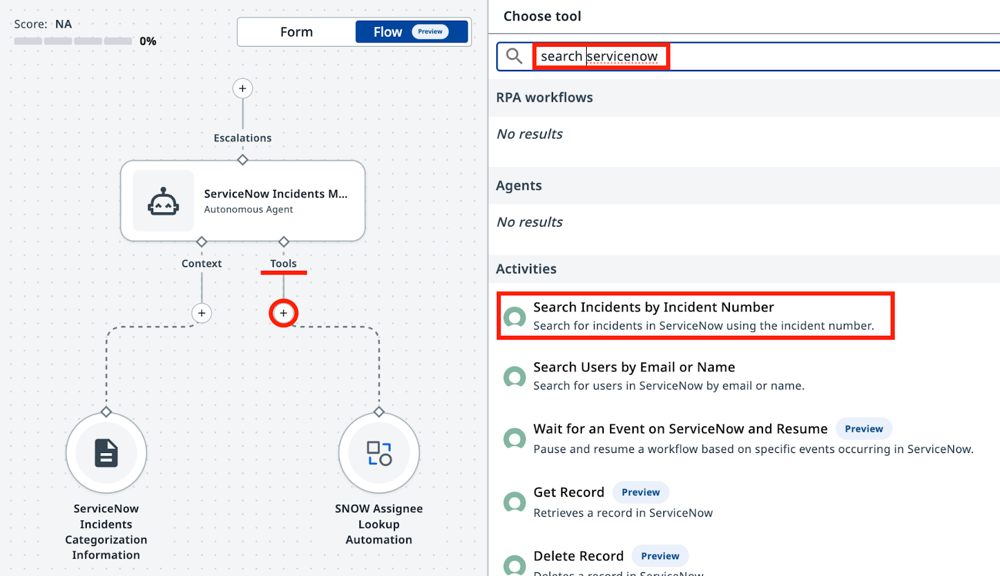
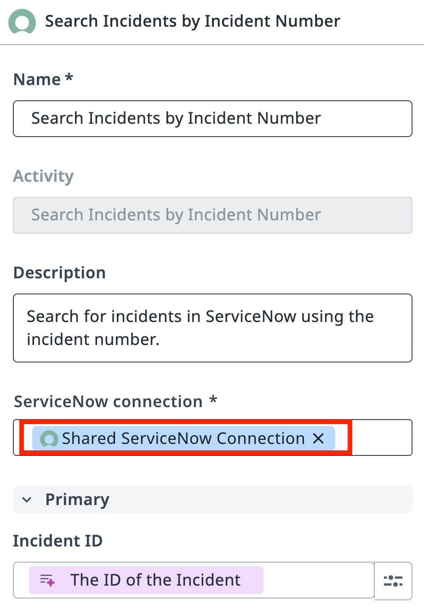
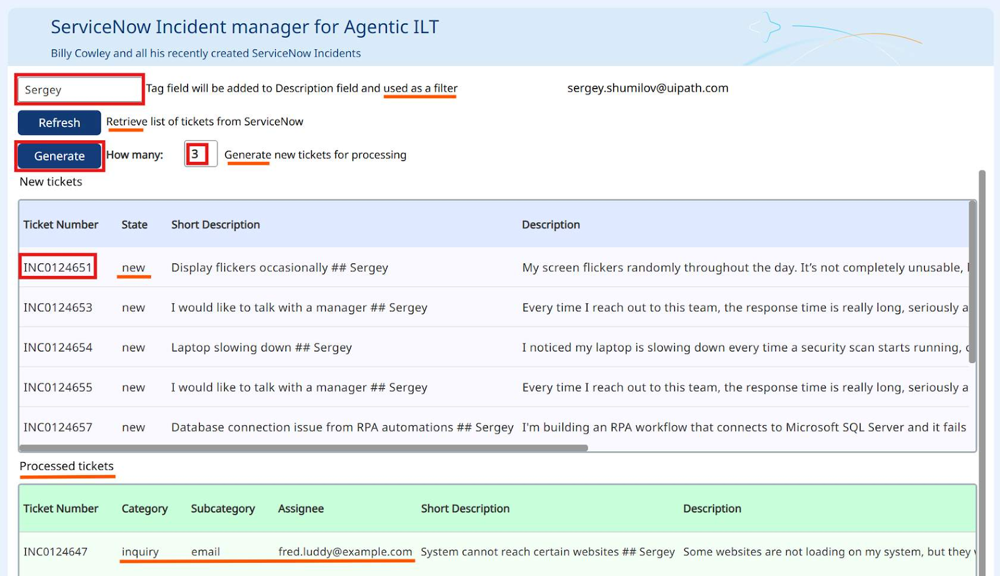
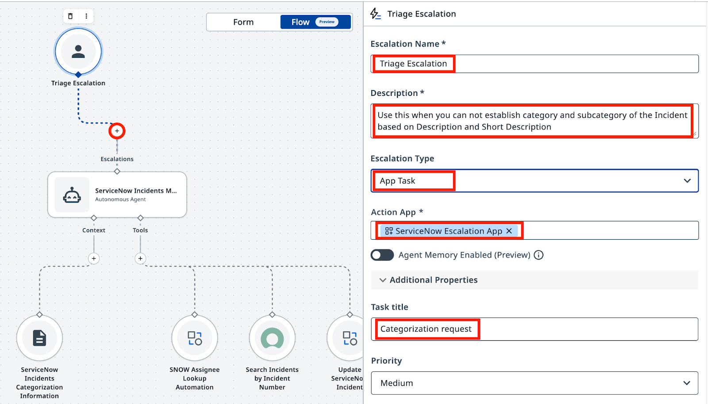

# 도구와 에스컬레이션

**에이전트를 ServiceNow에 연결하고 모호한 케이스를 사람에게 라우팅하기**

!!! tip "이번 레슨에서 할 일"
    1. 인시던트 데이터를 조회하고 분류 결과로 티켓을 업데이트하는 ServiceNow 도구를 추가합니다
    2. 에이전트가 확신 있게 분류하지 못하는 인시던트를 휴먼 리뷰어에게 라우팅하도록 에스컬레이션을 구성합니다
    3. 샘플 인시던트로 전체 워크플로를 테스트하고 Action Center에서 에스컬레이션을 확인합니다

## 목표

에이전트에 ServiceNow 도구를 추가해 외부 애플리케이션의 실제 인시던트 데이터를 API로 조회하고 업데이트할 수 있게 합니다. 그런 다음 에이전트가 확신 있게 분류하지 못하는 케이스를 **Action Center**를 통해 휴먼 리뷰어에게 전달하는 에스컬레이션 경로를 구성합니다.

## 도구의 동작 방식

지금까지의 에이전트는 의사 결정과 데이터 분석은 잘하지만, 데이터베이스나 애플리케이션과 직접 상호작용하지는 못합니다.. 아직은요! 도구는 에이전트가 할 수 있는 일을 확장합니다. 이제 에이전트는 텍스트 분석에 그치지 않고 외부 시스템을 호출할 수 있습니다 — ServiceNow에서 인시던트 데이터를 조회하고 분류 결과를 다시 써넣는 식으로요. 

에이전트가 외부 시스템과 상호작용할 수 있도록 필요한 도구를 추가합니다.

- **인시던트 상세 정보 조회**: 에이전트가 분석할 데이터는 ServiceNow 안에 있으므로, 먼저 가져와야 합니다.

- **인시던트 상세 정보 업데이트**: 분류가 끝나면 ServiceNow의 인시던트 데이터를 업데이트해야 합니다.

각 도구에는 에이전트가 언제, 어떻게 사용할지 알려 주는 설명이 있어야 합니다. 설명은 중요합니다!

## 언제 에스컬레이션할까

에스컬레이션은 실패가 아니라 설계상의 선택입니다. 에이전트가 인시던트 설명에서 명확한 카테고리와 하위 카테고리를 정하지 못할 때마다 사용하세요. 잘 구성된 에스컬레이션 경로가 어림짐작하는 에이전트보다 훨씬 가치 있습니다.

## 단계

### 1. 도구 추가: 인시던트 상세 정보 조회

UiPath 플랫폼에서는 다양한 종류의 도구를 사용할 수 있습니다. Integration Service 액티비티, RPA 프로세스, 다른 에이전트, MCP 서버까지..

첫 번째로 필요한 도구는 Integration Service 기반입니다. ServiceNow 카탈로그에서 "Search Incidents by Incident Number"를 찾으세요. 이 도구는 Incident Number로 인시던트 상세 정보 전체를 조회합니다.

**Agent Builder**에서 에이전트를 열고 **Tools** 탭으로 이동하거나, 캔버스 모드에서 "**+**"를 클릭합니다. ServiceNow 카탈로그에서 **Search Incidents by Incident Number** 도구를 추가합니다.

{ .screenshot width="900" }

[[[
도구가 사용할 ServiceNow **Connection**(연결)도 지정해야 합니다. Integration Service의 연결은 저장되고 승인된 인증 구성으로, UiPath 플랫폼의 서비스가 서드파티 애플리케이션에 안전하게 연결할 수 있게 해 줍니다. 

**ServiceNow Incidents** 폴더에서 공유 ServiceNow 연결을 선택합니다. 

|50|
{ .screenshot }
]]]

### 2. 도구 추가: ServiceNow 인시던트 업데이트 

같은 방법으로 **UpdateServiceNowIncident** 도구를 추가합니다. 이는 "**ServiceNow Incidents**" 폴더의 Orchestrator에 이미 게시되어 있는 기존 RPA 프로세스입니다. 에이전트는 분류가 끝난 뒤 이 도구로 ServiceNow 인시던트를 업데이트합니다.

[[[
인수 설명을 다음과 같이 구성합니다.

```css hl_lines="1" 
Assignee 
```
```
Assignee email address
```

```css hl_lines="1"
IncidentID
```
```
The ID of the ServiceNow incident — do not use the Incident Number
```

```css hl_lines="1"
Category
```
```
The Category of the ServiceNow incident
``` 
```css hl_lines="1"
Subcategory
```
```
The Subcategory of the ServiceNow incident
```
|50|

{ .screenshot }
]]]

!!! tip "주의!"
    ServiceNow 인시던트에는 두 가지 식별자가 있습니다. **ID**(`36155...53afb2` 같은 고유 문자열)와 **Number**(`INC0111888` 같은 사람이 읽기 쉬운 라벨)입니다. 업데이트 도구에는 **Number**가 아니라 **ID**가 필요합니다. 사람과 마찬가지로 LLM도 이 둘을 혼동할 수 있고, 그러면 원치 않는 오류가 발생합니다. LLM은 **이름과 설명**을 기준으로 인수를 매핑하므로, 이 점을 분명히 적어 둘 곳이 바로 설명입니다.

### 3. 시스템 프롬프트와 사용자 프롬프트 업데이트하기

이제 에이전트의 입력 인수를 단순화합니다. 도구를 추가했으니 에이전트가 ServiceNow에서 직접 인시던트 상세 정보를 가져올 수 있고, 설명을 인수로 전달할 필요가 없어졌습니다. 입력 인수가 Incident Number만 받도록 업데이트하세요.


[[[
이름:
```css hl_lines="1" 
IncidentNumber
```
|30|
설명:
```
ServiceNow Incident Number
```
]]]


이에 맞게 **User Prompt를 업데이트**합니다.

??? tip "변경 사항 확인"
    이제 에이전트는 인시던트 번호로 ServiceNow에서 인시던트를 가져옵니다. 바뀌는 내용은 다음과 같습니다.
    ```diff 
    --- Original
    +++ With Search Tool

    Analyze and categorize the following ServiceNow incident:

    -Incident Short Description: {{input.IncidentShortDescription}}
    -Incident Description: {{input.IncidentDescription}}
    +Incident Number:  {{input.IncidentNumber}}

    Determine the appropriate category, subcategory, and assignee email for this incident based on the provided information.
    ```

```markdown hl_lines="3" title="인시던트 번호로 조회하는 User Prompt:"
Analyze and categorize the following ServiceNow incident:

Incident Number:  {{input.IncidentNumber}}

Determine the appropriate category, subcategory, and assignee email for this incident based on the provided information.
```

다음으로, 이 도구들이 무엇을 위한 것이고 언제 사용해야 하는지 에이전트에게 설명해야 합니다. **System Prompt를 업데이트**하세요.

??? tip "변경 사항 확인"
    **Search Incidents**와 **UpdateServiceNowIncident** 도구가 추가되면서 시스템 프롬프트에 새 섹션 세 개가 생깁니다.
    ```diff 
    --- Original
    +++ With Search and Update Tools

    You are a ServiceNow Incidents categorization agent, an AI assistant tasked with managing newly created ServiceNow incidents. Your primary responsibility is to analyze incident details and determine the correct Category, Subcategory, and Assignee email address for each incident.

    +# Retrieve Incident details
    +-
    +- Use Search Incidents tool.
    +- Use IncidentNumber as Input.
    +- If ticket already has an Assignee, then stop processing.
    
    # Categorize the incident

        - Determine the Incident Category and Subcategory based on Description and Short Description from Categorization Information Context.
        - Context contains table with only possible Category-Subcategory pairs. Do not mix Category-Subcategory pairs if specific pair is not present in the context. Do not generate new categories if they are not present in the context.
        - Pick the Category-Subcategory pair that aligns well with Incident Descriptions. If you are not sure or no category pair is a clear match, return "Unknown" as category..
        - Once categories have been established, determine the on-duty Assignee email address who handles this type of requests by calling Assignee Lookup automation.

    +- If Category, Subcategory and Assignee have been successfully established, update the ticket by running UpdateServiceNowIncident tool.
    +- If Category, Subcategory or Assignee can not be established, do nothing.
    
    # Summarize the actions taken. 

    In the ExecutionDetails, provide:
        - Incident Category
        - Incident Subcategory
        - Assignee Email
        - Reasoning for your decisions
    ```

```markdown hl_lines="3 4 5 6 7 16 17" title="Search 및 Update 도구를 사용하는 System Prompt:"
You are a ServiceNow Incidents categorization agent, an AI assistant tasked with managing newly created ServiceNow incidents. Your primary responsibility is to analyze incident details and determine the correct Category, Subcategory, and Assignee email address for each incident.

# Retrieve Incident details

- Use Search Incidents tool.
- Use IncidentNumber as Input.
- If ticket already has an Assignee, then stop processing.

# Categorize the incident

- Determine the Incident Category and Subcategory based on Description and Short Description from Categorization Information Context.
- Context contains table with only possible Category-Subcategory pairs. Do not mix Category-Subcategory pairs if specific pair is not present in the context. Do not generate new categories if they are not present in the context.
- Pick the Category-Subcategory pair that aligns well with Incident Descriptions. If you are not sure or no category pair is a clear match, return "Unknown" as category..
- Once categories have been established, determine the on-duty Assignee email address who handles this type of requests by calling Assignee Lookup automation.

- If Category, Subcategory and Assignee have been successfully established, update the ticket by running UpdateServiceNowIncident tool.
- If Category, Subcategory or Assignee can not be established, do nothing.

# Summarize the actions taken. 

In the ExecutionDetails, provide:
- Incident Category
- Incident Subcategory
- Assignee Email
- Reasoning for your decisions
```

여기까지 구성했다면 에이전트에게 필요한 지침, 관련 도구, 분석용 컨텍스트를 모두 준 셈입니다. 이제 실제 ServiceNow 인시던트로 시험해 볼 시간입니다!

**[Ticket Management App](https://cloud.uipath.com/tpenlabs/apps_/default/run/production/ef96660c-6e95-4f8f-b8b6-b1c42f06edf1/80928442-e08c-4123-8b34-68577ed98704/ID771c3646cad34360806fde5bc13a47a3?el=VB&uts=true)**을 열고 Tag를 여러분의 이름으로 바꾸면, 앱이 최근 2일 동안 이 Tag로 생성된 티켓을 모두 보여 줍니다(있다면요). 새 티켓이 없다면 몇 개 생성해도 좋습니다. 단, "Generate"를 누르기 전에 Tag를 여러분의 이름으로 설정하는 것을 잊지 마세요.

{ .screenshot width="900" }

첫 번째 목록의 **Ticket Number** 열에 있는 **Incident Number**를 에이전트 입력으로 사용할 수 있습니다. 처리가 끝나면 분류된 인시던트가 아래쪽 목록으로 이동하므로 결과를 쉽게 확인할 수 있습니다.

{ .screenshot width="900" }

**Execution Trace**(실행 추적)에서 에이전트가 Search Incidents 도구를 호출하고, 분류 컨텍스트를 가져오고, Assignee Lookup 도구를 호출한 뒤, 마지막으로 ServiceNow 인시던트를 업데이트하는지 확인하세요. 모든 단계에 감사(audit)를 위한 상세 정보가 남고, 각 단계의 로직을 추적할 수 있습니다. 게다가 결과까지 정확합니다. 훌륭하네요!

### 4. 에스컬레이션으로 도움 받기

에이전트가 티켓을 확신 있게 분류하지 못하는 케이스는 언제나 존재합니다. 설명이 부실할 수도 있고, 여러 카테고리가 똑같이 그럴듯해 보일 수도 있습니다. 그런 경우에는 휴먼 리뷰어에게 에스컬레이션합니다.

에스컬레이션 경로를 추가해 봅시다. 분류할 수 없는 인시던트마다 Action Center 태스크를 생성할 것입니다.

**ServiceNow Incidents** 폴더의 **ServiceNow Agent Escalation App**을 사용해 에스컬레이션 경로를 추가합니다. 

{ .screenshot width="900" }

[[[
프롬프트와 인수 설정으로 에스컬레이션 도구를 구성합니다.

모든 티켓이 여러분에게 라우팅되도록 **Recipient**(수신자)로 자기 자신을 선택합니다.

다음 설명 프롬프트를 설정합니다.

```text
Use this when you cannot establish category and subcategory of the Incident based on Description and Short Description.
```

`in_Reasoning`에는 다음 설명을 추가합니다.

```text
Brief explanation of the steps taken before escalating
```

에스컬레이션 결과를 구성합니다.

- **Submit** → **Continue**(실행 계속)
- **Stop** → **End**(실행 종료)

!!! tip
    **in_Description** 같은 인수는 건드리지 않았다는 걸 눈치채셨을 겁니다. 이름이 이렇게 명확하고 컨텍스트도 충분하니, 에이전트가 무엇을 넣을지 스스로 알아낼 수 있습니다. 아닐 수도 있고요? 프로덕션 구현을 위한 조언: 조금 "미안"해지는 것보다 지나치게 "구체적"인 편이 낫습니다.
|50|
{ .screenshot }
]]]

도구 사용과 에스컬레이션 처리를 모두 포함하도록 **System Prompt**를 업데이트합니다. 이전 시스템 프롬프트를 아래 완성본으로 교체하세요.

??? tip "변경 사항 확인"
    에스컬레이션이 활성화되면서 시스템 프롬프트는 이제 불확실한 케이스를 사람에게 라우팅하고 그 피드백을 처리합니다. 바뀌는 내용은 다음과 같습니다.
    ```diff 
    --- With Search and Update Tools
    +++ With Escalation Handling

    # Categorize the incident.
     - Determine the Incident Category and Subcategory based on Description and Short Description from Categorization Information Context.
     - Context contains table with only possible Category-Subcategory pairs. Do not mix Category-Subcategory pairs if specific pair is not present in the context. Do not generate new categories if they are not present in the context.
     - Pick the Category-Subcategory pair that aligns well with Incident Descriptions. 
    -- If you are not sure or no category pair is a clear match, return "Unknown" as category.
    +- If you are not sure or no category pair is a clear match, use escalation.

    # Once categories have been established, determine the on-duty Assignee email address who handles this type of requests by calling Assignee Lookup automation.

    # If Category, Subcategory and Assignee have been successfully established, update the ticket by running UpdateServiceNowIncident tool.

    -# If Category, Subcategory or Assignee can not be established, do nothing.
    +# If Category, Subcategory or Assignee can not be established, use the Escalation.
    
    +# If Category and Subcategory have been selected by the user as part of escalation, look up Assignee based on selected Category and Subcategory, and then update ticket. Only use email addresses retrieved from the lookup tool, do not generate email addresses.

    # Summarize the actions taken.
    ```

```markdown hl_lines="14 19" title="에스컬레이션 처리가 포함된 System Prompt:"
You are a ServiceNow Incidents categorization agent, an AI assistant tasked with managing newly created ServiceNow incidents. Your primary responsibility is to analyze incident details and determine the correct Category, Subcategory, and Assignee email address for each incident.

# Retrieve Incident details

- Use Search Incidents tool.
- Use IncidentNumber as Input.
- If ticket already has an Assignee, then stop processing.

# Categorize the incident

- Determine the Incident Category and Subcategory based on Description and Short Description from Categorization Information Context.
- Context contains table with only possible Category-Subcategory pairs. Do not mix Category-Subcategory pairs if specific pair is not present in the context. Do not generate new categories if they are not present in the context.
- Pick the Category-Subcategory pair that aligns well with Incident Descriptions. 
- If you are not sure or no category pair is a clear match, use escalation.

- Once categories have been established, determine the on-duty Assignee email address who handles this type of requests by calling Assignee Lookup automation.

- If Category, Subcategory and Assignee have been successfully established, update the ticket by running UpdateServiceNowIncident tool.
- If Category and Subcategory have been selected by the user as part of escalation, look up Assignee based on selected Category and Subcategory, and then update ticket. Only use email addresses retrieved from the lookup tool, do not generate email addresses.

# Summarize the actions taken. 

In the ExecutionDetails, provide:
- Incident Category
- Incident Subcategory
- Assignee Email
- Reasoning for your decisions
```
이제 에이전트가 이전에 분류하지 못했던 인시던트를 사용해 에스컬레이션을 발동시켜 봅시다. 좋은 예는 다음과 같습니다.

- **Short Description:** `I would like to talk with a manager`
- **Description:** `Every time I reach out to this team, the response time is really long, seriously affecting my productivity. I would like to talk with a manager please.`

이 텍스트는 어떤 카테고리에도 매핑할 방법이 없으니, 에이전트는 에스컬레이션해야 합니다. 

이런 인시던트 번호가 있다면 그걸로 에이전트를 실행하고, 없다면 티켓을 몇 개 더 생성해 확보하세요. 에이전트는 이 인시던트를 확신 있게 분류할 수 없다는 것을 인식하고 에스컬레이션을 발동해, 휴먼 리뷰어를 위한 태스크를 **Action Center**에 생성해야 합니다.


*(힌트: 에스컬레이션이 일어나지 않는다면, 프롬프트에 에스컬레이션 지침이 들어 있는지 다시 한번 확인하세요)*
{ .screenshot width="900" }


**Action Center**에서 휴먼 리뷰어는 인시던트 상세 정보와 카테고리/하위 카테고리 옵션을 보게 됩니다. 리뷰어가 카테고리를 선택하고 제출하면, 에이전트는 Assignee Lookup 자동화로 담당자 지정을 마무리하고 ServiceNow의 티켓을 업데이트합니다.

{ .screenshot width="900" }

카테고리를 지정할 때 에이전트의 확신도에 영향을 주는 매개변수는 무엇일까요? 직접 조정해 보고, 이전에는 잘 분류되던 인시던트가 에스컬레이션으로 이어지는지 확인해 보세요. *힌트: Context 설정입니다.*

이제 에이전트를 사용할 준비가 끝났습니다. UiPath Agent Builder로 첫 번째 에이전트를 완성한 것입니다! 이 에이전트는 ServiceNow에서 인시던트 상세 정보를 가져오고, 근거 있는 컨텍스트로 분류하고, 티켓을 업데이트하며, 명확한 카테고리를 정할 수 없을 때는 에스컬레이션합니다.

**축하합니다. 정말 잘하셨습니다!**