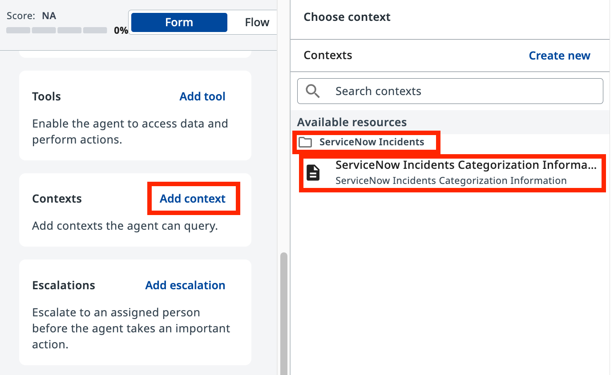
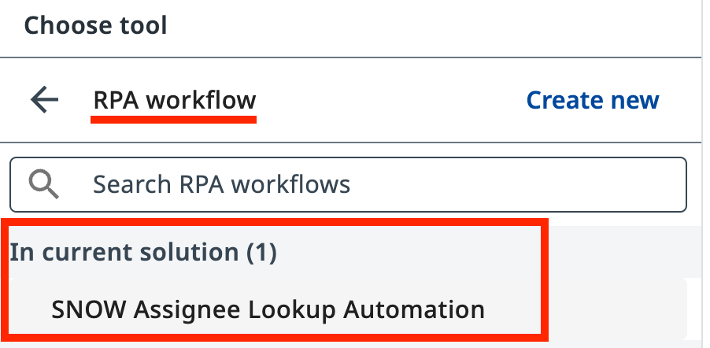
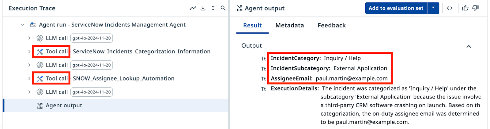

# LLM with Context

**Build a context-grounded ServiceNow incident categorization agent**

---

!!! tip "What you'll do"
    1. Create and configure a new agent with input and output arguments
    2. Write system and user prompts, then test the agent with sample incidents
    3. Add Context Grounding to prevent hallucinations, and configure an Assignee Lookup tool
    4. Validate the agent's performance using Evaluations

## Goal

Create a ServiceNow incident categorization agent in **Agent Builder**, configure its prompts, ground it in real data using Context Grounding, and validate its performance with Evaluations.

## How Context Grounding Works

Without grounding, an LLM may produce plausible-sounding but incorrect category–subcategory pairs — combinations that don't exist in your system. Context Grounding anchors the agent to a real data source, so every decision traces back to valid entries in your context.

When the agent categorizes an incident, it references actual category and subcategory combinations from your data, eliminating the risk of inventing new ones.

## What the Evaluations Step Adds

Evaluations let you run a batch of test cases against your agent before deploying it. You define expected outputs for a set of sample incidents, run the evaluation, and measure how well the agent performs across edge cases. This is a form of regression testing — it helps ensure that prompt changes or model upgrades don't break existing functionality.

---

## Steps

### Part 1: Create and configure the agent

1. In **Studio Web**, create a new **Agent Solution**.

    { .screenshot }

2. Rename the solution to **ServiceNow Incidents Management Solution**, and name the agent **ServiceNow Incidents Management Agent**.

    { .screenshot }

    !!! tip
        When you create an agent, Studio Web may suggest using Autopilot to auto-generate a solution. You can dismiss it and build manually (as we're doing here), or experiment with Autopilot later for practice.

3. Open the **Data Manager** panel. Add the following **Input Arguments** (type: String):

    | Argument | Description |
    |----------|-------------|
    | `IncidentShortDescription` | Short description of the ServiceNow incident |
    | `IncidentDescription` | Full description of the ServiceNow incident |

    { .screenshot }

4. Add the following **Output Arguments**. You can do this manually, or switch to JSON editor mode and paste the schema below:

    ```json
    {
      "type": "object",
      "properties": {
        "IncidentCategory": {
          "type": "string",
          "description": "The category of the ServiceNow incident"
        },
        "IncidentSubcategory": {
          "type": "string",
          "description": "The subcategory of the ServiceNow incident"
        },
        "AssigneeEmail": {
          "type": "string",
          "description": "The assignee email for the ServiceNow incident"
        },
        "ExecutionDetails": {
          "type": "string",
          "description": "Details and results of classification"
        }
      },
      "title": "Outputs"
    }
    ```

    { .screenshot }

### Part 2: Configure the agent prompts

5. Enter the following text in the **System Prompt** field:

    ```text
    You are a ServiceNow Incidents categorization agent, an AI assistant tasked with managing newly created ServiceNow incidents. Your primary responsibility is to analyze incident details and determine the correct Category, Subcategory, and Assignee email address for each incident.

    # Categorize the incident

    - Determine the Incident Category and Subcategory based on Description and Short Description.

    # Once categories have been established, determine the on-duty Assignee email address who handles this type of requests.

    # Summarize the actions taken. In the ExecutionDetails, provide:
    a. Incident Category
    b. Incident Subcategory
    c. Assignee Email
    d. Reasoning for your decisions
    ```

6. Enter the following text in the **User Prompt** field:

    ```text
    Analyze and categorize the following ServiceNow incident:

    Incident Short Description: {{IncidentShortDescription}}

    Incident Description: {{IncidentDescription}}

    Determine the appropriate category, subcategory, and assignee email for this incident based on the provided information.
    ```

7. Test the agent with these sample incident details to observe how it behaves without grounding:

    - **Short Description:** `CRM software crashes on launch`
    - **Description:** `Every time I try to open the CRM software, it crashes immediately. I've already tried reinstalling it.`

    !!! warning "Expected behavior without grounding"
        Without context grounding, the agent will return plausible-sounding category and assignee information, but these may not exist in your actual system. This is the hallucination problem — the agent sounds confident but is inventing categories. We'll fix this in Part 3.

### Part 3: Add Context Grounding

8. Click **Add context** in the **Contexts** section of the agent configuration.

    { .screenshot }

    Context Grounding provides the agent with a structured data source. The context is named **ServiceNow Incidents Categorization Information** and contains the valid Category–Subcategory pairs used in your organization.

9. Select **ServiceNow Incidents Categorization Information** from the available resources under the **ServiceNow Incidents** folder.

10. Now, import the **SNOW Assignee Lookup Automation** project. Click the **+** button in the Explorer and choose **Import existing**.

    { .screenshot }

11. Search for "SNOW Assignee" and select **SNOW Assignee Lookup Automation**.

    { .screenshot }

12. Add this automation as a tool to your agent. Click **Add tool** in the **Tools** section, then select **RPA workflow**.

    { .screenshot }

13. Select **SNOW Assignee Lookup Automation** from the list of available workflows in your solution.

    { .screenshot }

14. Add a description for the tool so the agent knows when to use it:

    ```text
    Use this tool to determine the email address of the current on-duty expert for a given Category and Subcategory.
    ```

15. Update the **System Prompt** to reference both the context and the tool:

    ```text
    You are a ServiceNow Incidents categorization agent, an AI assistant tasked with managing newly created ServiceNow incidents. Your primary responsibility is to analyze incident details and determine the correct Category, Subcategory, and Assignee email address for each incident.

    # Categorize the incident.

    - Determine the Incident Category and Subcategory based on Description and Short Description from Categorization Information Context.
    - Context contains table with only possible Category-Subcategory pairs. Do not mix Category-Subcategory pairs if specific pair is not present in the context. Do not generate new categories if they are not present in the context.
    - Pick the Category-Subcategory pair that aligns well with Incident Descriptions. If you are not sure or no category pair is a clear match, return "Unknown" as category.

    # Once categories have been established, determine the on-duty Assignee email address who handles this type of requests by calling Assignee Lookup automation.

    # Summarize the actions taken. In the ExecutionDetails, provide:
    a. Incident Category
    b. Incident Subcategory
    c. Assignee Email
    d. Reasoning for your decisions
    ```

16. Test the agent again with the same CRM crash sample incident. Now review the **Execution Trace** to observe:

    - The agent's LLM call to analyze the incident
    - The agent querying the Context Grounding data
    - The agent calling the Assignee Lookup tool
    - The final categorization in the Result tab

    { .screenshot }

    The output should now show only valid categories and an assignee email retrieved from the lookup tool — no hallucinations.

### Part 4: Test with Evaluations

17. Go to the **Evaluation Sets** tab in your agent.

18. Click **Import** and paste the following JSON evaluation set. This set contains 8 test cases covering different incident types:

    ```json
    {
      "fileName": "evaluation-set-1761459564848.json",
      "id": "18c3387f-00ed-4deb-b4e8-886f1164f517",
      "name": "SNOW Categorization Evaluation",
      "batchSize": 10,
      "evaluatorRefs": [
        "33c47b32-563b-4d16-b323-11e187f954be"
      ],
      "evaluations": [
        {
          "id": "811adc0e-aff0-434f-99fa-f32ed562bf1d",
          "name": "Database_MSSQL",
          "inputs": {
            "IncidentShortDescription": "Database connection issue from RPA automations",
            "IncidentDescription": "I'm building an RPA workflow that connects to production instance of Microsoft SQL Server and it fails with error \"IP Address not authorized to perform this query\". Could you authorize my IP address: 123.23.41.165"
          },
          "expectedOutput": {
            "IncidentCategory": "Database",
            "IncidentSubcategory": "MS SQL Server",
            "AssigneeEmail": "bud.richman@example.com",
            "ExecutionDetails": ""
          }
        },
        {
          "id": "789d90ad-fca8-44f3-8179-d1ca95317a1f",
          "name": "Software_Email",
          "inputs": {
            "IncidentShortDescription": "I can't send emails to external addresses",
            "IncidentDescription": "I can receive emails just fine, but every time I try to send one to anyone outside the company domain, it fails. I'm not sure if it's an issue with my email client or something on the server side. Could you assist me with this?"
          },
          "expectedOutput": {
            "IncidentCategory": "Software",
            "IncidentSubcategory": "Email",
            "AssigneeEmail": "savannah.kesich@example.com",
            "ExecutionDetails": ""
          }
        },
        {
          "id": "97bc068e-8394-40c8-ad31-e0832e93f697",
          "name": "Inquiry_Antivirus",
          "inputs": {
            "IncidentShortDescription": "Laptop slowing down",
            "IncidentDescription": "I noticed my laptop is slowing down every time a security scan starts running, can you please look into this?"
          },
          "expectedOutput": {
            "IncidentCategory": "Inquiry / Help",
            "IncidentSubcategory": "Antivirus",
            "AssigneeEmail": "paul.martin@example.com",
            "ExecutionDetails": ""
          }
        },
        {
          "id": "754cf068-5e59-4436-8733-f92ebca7fa55",
          "name": "Inquiry_ExternalApplication",
          "inputs": {
            "IncidentShortDescription": "CRM software crashes on launch",
            "IncidentDescription": "Every time I try to open the CRM software, it crashes immediately. I've already tried reinstalling it."
          },
          "expectedOutput": {
            "IncidentCategory": "Inquiry / Help",
            "IncidentSubcategory": "External Application",
            "AssigneeEmail": "paul.martin@example.com",
            "ExecutionDetails": ""
          }
        },
        {
          "id": "adc73bed-75e6-45b3-801c-5919df70ec6d",
          "name": "Hardware_Monitor",
          "inputs": {
            "IncidentShortDescription": "Display flickers occasionally",
            "IncidentDescription": "My screen flickers randomly throughout the day. It's not completely unusable, but it's very distracting."
          },
          "expectedOutput": {
            "IncidentCategory": "Hardware",
            "IncidentSubcategory": "Monitor",
            "AssigneeEmail": "aqib.mushtaq@example.com",
            "ExecutionDetails": ""
          }
        },
        {
          "id": "3d139ef0-05df-488c-b56f-4165258900dc",
          "name": "Network_DNS",
          "inputs": {
            "IncidentShortDescription": "System cannot reach certain websites",
            "IncidentDescription": "Some websites are not loading on my system, but they work fine on my phone. I suspect there's an issue with my network settings."
          },
          "expectedOutput": {
            "IncidentCategory": "Network",
            "IncidentSubcategory": "DNS",
            "AssigneeEmail": "david.dan@example.com",
            "ExecutionDetails": ""
          }
        },
        {
          "id": "9c7e9e2a-8e3f-453d-894d-d5ba12a80932",
          "name": "Network_VPN",
          "inputs": {
            "IncidentShortDescription": "VPN connection drops frequently",
            "IncidentDescription": "My VPN keeps disconnecting randomly, making it hard for me to work remotely."
          },
          "expectedOutput": {
            "IncidentCategory": "Network",
            "IncidentSubcategory": "VPN",
            "AssigneeEmail": "bud.richman@example.com",
            "ExecutionDetails": ""
          }
        },
        {
          "id": "3d114888-f0b0-400b-82f3-ed20aa300df3",
          "name": "Software_OS",
          "inputs": {
            "IncidentShortDescription": "Windows update failure",
            "IncidentDescription": "I tried to install the latest Windows update, but it keeps failing with error code 0x80070002"
          },
          "expectedOutput": {
            "IncidentCategory": "Software",
            "IncidentSubcategory": "Operating System",
            "AssigneeEmail": "savannah.kesich@example.com",
            "ExecutionDetails": ""
          }
        }
      ],
      "modelSettings": [],
      "createdAt": "2025-10-26T06:19:24.848Z",
      "updatedAt": "2025-10-26T06:19:24.848Z"
    }
    ```

    { .screenshot }

19. Click **Evaluate set** and review the results. Each test case will run through your agent, and you'll see whether the outputs match the expected values.

Evaluations help you maintain quality and catch regressions when you update your prompts or change models. A well-grounded, well-evaluated agent is ready for production use.
