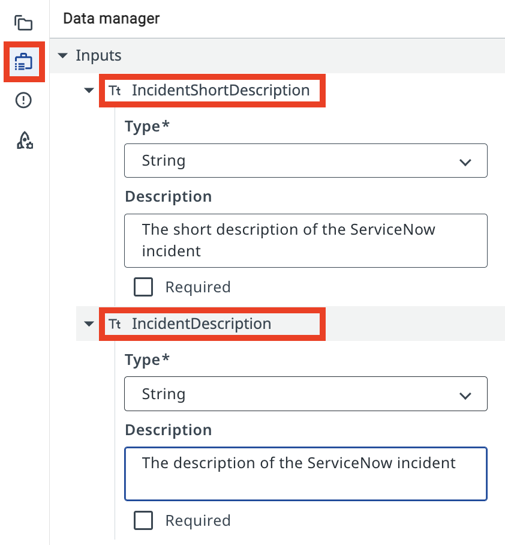
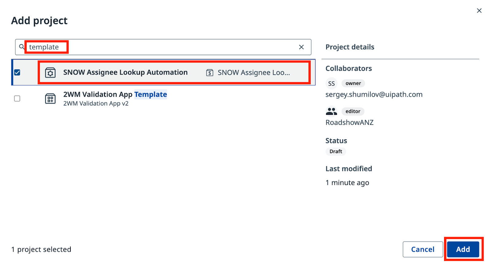
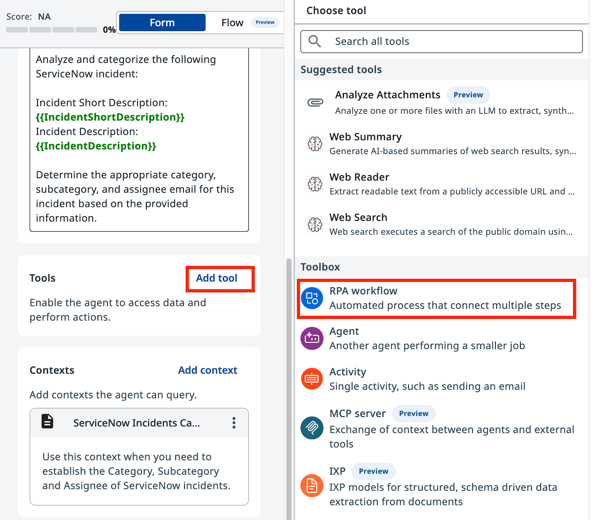

# LLM with Context

**Build a context-grounded ServiceNow incident categorization agent**

---

## Goal

Create a ServiceNow incident categorization agent in **Agent Builder**, configure its prompts, ground it in real data using Context Grounding, and validate its performance with Evaluations.

## How Context Grounding Works

Without grounding, an LLM may produce plausible-sounding but incorrect category–subcategory pairs — combinations that don't exist in your system. Context Grounding anchors the agent to a real data source, so every decision traces back to valid entries in your context.

## What the Evaluations Step Adds

Evaluations let you run a batch of test cases against your agent before deploying it. You define expected outputs, run the set, and measure how well the agent performs across edge cases.

## Steps

### Part 1: Create and configure the agent

1. In **Studio Web**, create a new **Agent Solution**.

    { .screenshot }

2. Rename the solution to **ServiceNow Incidents Management Solution**.

3. Name the agent **ServiceNow Incidents Management Agent**.

    { .screenshot }

4. Open the **Data Manager** panel and add the following **Input Arguments** (type: String):

    | Argument | Description |
    |----------|-------------|
    | `IncidentShortDescription` | Short description of the ServiceNow incident |
    | `IncidentDescription` | Full description of the ServiceNow incident |

    { .screenshot }

5. Add the following **Output Arguments**:

    | Argument | Description |
    |----------|-------------|
    | `IncidentCategory` | Category assigned to the incident |
    | `IncidentSubcategory` | Subcategory assigned to the incident |
    | `AssigneeEmail` | Email address of the assigned expert |
    | `ExecutionDetails` | Summary of the classification steps taken |

    { .screenshot }

### Part 2: Configure the agent prompts

The agent uses two prompts: a **System Prompt** that defines its role and rules, and a **User Prompt** that structures how your inputs are passed in.

6. Enter the following text in the **System Prompt** field:

    ```text
    You are a ServiceNow Incidents categorization agent. Analyze incident details and determine the correct Category, Subcategory, and Assignee email address.
    ```

    { .screenshot }

7. Enter the following text in the **User Prompt** field:

    ```text
    Analyze and categorize the following ServiceNow incident:
    Incident Short Description: {{IncidentShortDescription}}
    Incident Description: {{IncidentDescription}}
    ```

8. Test the agent with these sample values:

    - **Short Description:** `CRM software crashes on launch`
    - **Description:** `Every time I try to open the CRM software, it crashes immediately after the splash screen. This has been happening for the past week and is affecting my ability to manage customer interactions.`

    { .screenshot }

### Part 3: Add Context Grounding

9. Enable **Context Grounding** in the agent configuration.

    { .screenshot }

10. Select **ServiceNow Incidents Categorization Information** as the context source.

    The context contains only valid Category–Subcategory pairs. The agent must select from this list — it must not generate combinations that are not present.

    { .screenshot }

11. Import the **SNOW Assignee Lookup Automation** project.

12. Add the imported automation as a tool. Use this description:

    ```text
    Use this tool to determine the email address of the on-duty expert for a given incident category and subcategory.
    ```

    { .screenshot }

### Part 4: Test with Evaluations

13. Go to the **Evaluation Sets** tab.

14. Import the provided JSON evaluation set. It contains 8 test cases:

    | # | Short Description | Expected Category |
    |---|-------------------|-------------------|
    | 1 | Database connection issue | Database_MSSQL |
    | 2 | Email sending failure | Software_Email |
    | 3 | Laptop slowdown | Inquiry_Antivirus |
    | 4 | CRM software crash | Inquiry_ExternalApplication |
    | 5 | Display flicker | Hardware_Monitor |
    | 6 | Website access issue | Network_DNS |
    | 7 | VPN disconnection | Network_VPN |
    | 8 | Windows update failure | Software_OS |

    { .screenshot }

15. Run the evaluation set and review the results.

    { .screenshot }

[← Back to Overview](index.md) | [Next: Tools and Escalations →](tools-and-escalations.md)
