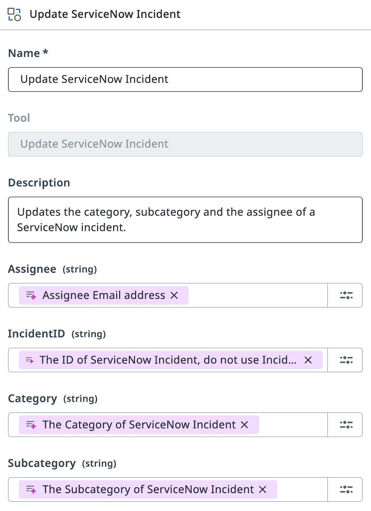
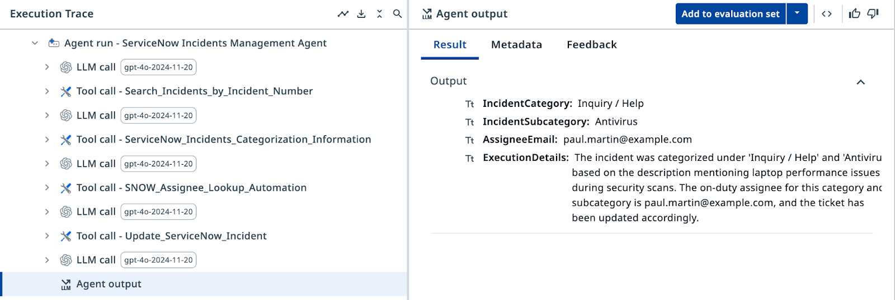
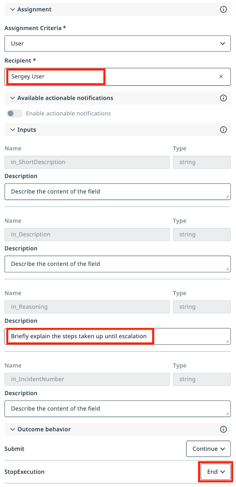

# Tools and Escalations

**Connect your agent to ServiceNow and route ambiguous cases to humans**

---

## Goal

Add two ServiceNow tools to your agent so it can retrieve and update live incident data. Then configure an escalation path that routes cases the agent cannot confidently categorize to a human reviewer via **Action Center**.

## How Tools Work

Tools extend what your agent can do. Instead of only analyzing text, the agent can now call external systems — querying ServiceNow for incident data and writing the categorization result back. Each tool has a description that tells the agent when and how to use it.

## When to Escalate

Escalation is not a failure — it is a design choice. Use it whenever the agent cannot establish a clear category and subcategory from the incident description. A well-configured escalation path is more valuable than an agent that guesses.

## Steps

### Part 1: Add ServiceNow tools

1. Open your agent in **Agent Builder** and go to the **Tools** tab.

2. Add the **Search Incidents by Incident Number** tool from the ServiceNow catalog.

    { .screenshot }

3. Select the shared ServiceNow connection from the **ServiceNow Incidents** folder.

    { .screenshot }

4. Add the **UpdateServiceNowIncident** tool. Configure its argument descriptions exactly as follows:

    | Argument | Description |
    |----------|-------------|
    | Assignee | Assignee email address |
    | Incident ID | The ID of the ServiceNow incident — do not use the Incident Number |
    | Category | The Category of the ServiceNow incident |
    | Subcategory | The Subcategory of the ServiceNow incident |

    !!! tip
        A ServiceNow incident has two identifiers: **ID** (a unique string like `36155...53afb2`) and **Number** (a human-readable label like `INC0111888`). The update tool requires the ID, not the Number.

    { .screenshot }

5. Update the agent's input arguments. Remove all existing input arguments and add a single one:

    | Argument | Type | Description |
    |----------|------|-------------|
    | `IncidentNumber` | String | The Number of the ServiceNow incident to categorize |

6. Update the **User Prompt** to include the incident number:

    ```text
    Analyze and categorize the following ServiceNow incident:
    Incident Short Description: {{IncidentShortDescription}}
    Incident Description: {{IncidentDescription}}
    Incident Number: {{IncidentNumber}}
    Determine the appropriate category, subcategory, and assignee email for this incident based on the provided information.
    ```

    { .screenshot }

7. Update the **System Prompt** to instruct the agent how to use the tools:

    ```text
    Determine the Incident Category and Subcategory based on Description and Short Description from Categorization Information Context. Context contains table with only possible Category-Subcategory pairs. Do not mix Category-Subcategory pairs if specific pair is not present in the context. Pick the Category-Subcategory pair that aligns well with Incident Descriptions. If you are not sure or no category pair is a clear match, use escalation.
    ```

    Use the Search Incidents tool with `IncidentNumber` as input to retrieve incident details. Stop if an assignee already exists. After categorizing, determine the on-duty assignee using the Assignee Lookup automation. Update the ticket using the UpdateServiceNowIncident tool. Take no action if category, subcategory, or assignee cannot be established.

    { .screenshot }

8. Test the updated agent using the **Ticket Management App** with a sample incident number. Categorized incidents move to the bottom list after processing.

### Part 2: Add escalations

9. Add an escalation path using the **ServiceNow Agent Escalation App** from the **ServiceNow Incidents** folder.

    { .screenshot }

10. Configure the escalation tool with this prompt:

    ```text
    Use this when you cannot establish category and subcategory of the Incident based on Description and Short Description.
    ```

11. Add the `in_Reasoning` argument with this description:

    ```text
    Brief explanation of the steps taken before escalating
    ```

    Configure the escalation outcomes:
    - **Submit** → Continue execution
    - **Stop** → End execution

    { .screenshot }

12. Update the **System Prompt** to add the escalation handling instructions:

    ```text
    If Category and Subcategory have been selected by the user as part of escalation, look up Assignee based on selected Category and Subcategory, and then update ticket. Only use email addresses retrieved from the lookup tool, do not generate email addresses.
    ```

    { .screenshot }

13. Test the escalation path with this sample incident:

    - **Short Description:** `I would like to talk with a manager`
    - **Description:** `Every time I reach out to this team, the response time is really long, seriously affecting my productivity. I would like to talk with a manager please.`

    The agent should recognize it cannot categorize this incident and trigger the escalation, creating a task in **Action Center** for a human reviewer.

Your agent is now complete. It retrieves incident details from ServiceNow, categorizes them using grounded context, updates the ticket, and escalates when it cannot determine a clear category.

[← Back to Overview](index.md)
