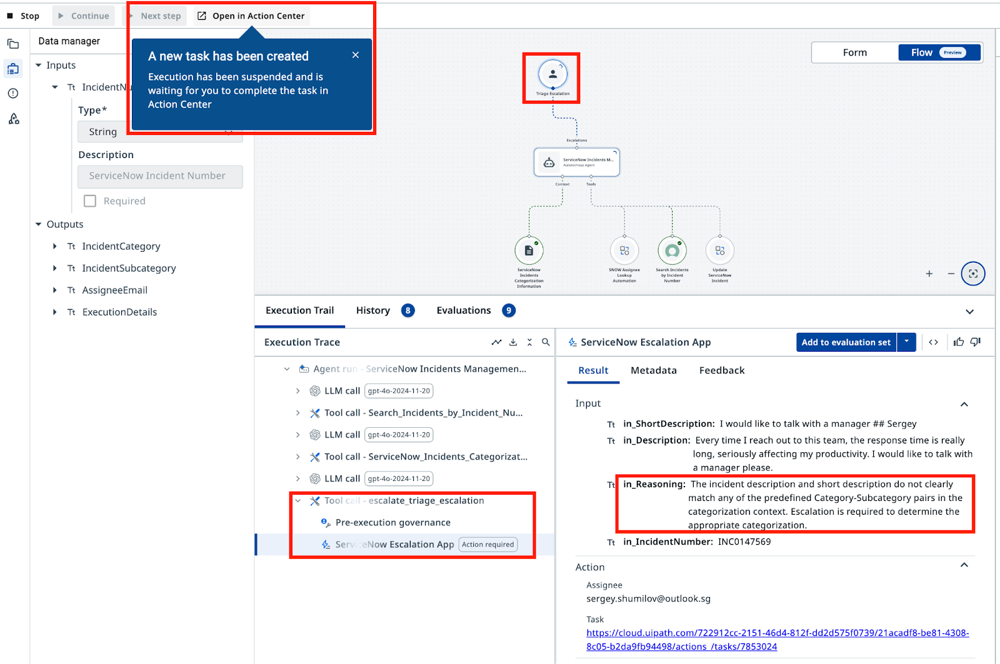
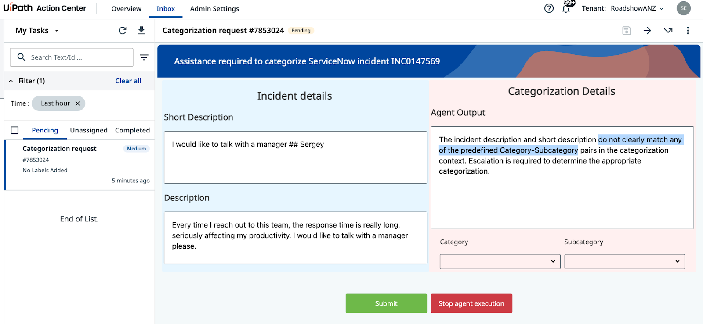

# Tools and Escalations

**Connect your agent to ServiceNow and route ambiguous cases to humans**

---

!!! tip "What you'll do"
    1. Add ServiceNow tools to retrieve incident data and update tickets with categorization results
    2. Configure escalations to route incidents the agent cannot confidently categorize to human reviewers
    3. Test the complete workflow with sample incidents and review escalations in Action Center

## Goal

Add ServiceNow tools to your agent so it can retrieve and update live incident data in external applications via their APIs. Then configure an escalation path that routes cases the agent cannot confidently categorize to a human reviewer via **Action Center**.

## How Tools Work

Current version of Agent is good at making decisions and analyzing data. But it can't go and interact with databases and applications.. at least not yet! Tools extend what your agent can do. Instead of only analyzing text, the agent can now call external systems — querying ServiceNow for incident data and writing the categorization result back. 

In order for Agent to interact with external systems we will add necessary Tools:

- **Retrieve Incident details**: the data that we want the Agent to analyze is inside ServiceNow and we need to retrieve it.

- **Update Incident details**: after categorization, we need to update Incident data in ServiceNow.

Each tool must have a description that tells the agent when and how to use it. Descriptions are important!

## When to Escalate

Escalation is not a failure — it is a design choice. Use it whenever the agent cannot establish a clear category and subcategory from the incident description. A well-configured escalation path is more valuable than an agent that guesses.

## Steps

### 1. Add tool: Retrieve Incident Details

There are various kinds of Tools available in UiPath platform - Integration Service activities, RPA Processes, other Agents, MCP servers..

First tool we will need is based on Integration Service - find "Search Incidents by Incident Number" in ServiceNow catalog. This tool will look up complete Incident Details by Incident Number.

Open your agent in **Agent Builder** and go to the **Tools** tab, or click "**+**" in canvas mode. Add the **Search Incidents by Incident Number** tool from the ServiceNow catalog:

{ .screenshot width="900" }

[[[
We also need to specify which ServiceNow **Connection** the tool is going to use. Integration Service Connection is a saved, authorized authentication configuration that allows services in UiPath platform to securely connect to third-party applications. 

Select the shared ServiceNow connection from the **ServiceNow Incidents** folder. 

|50|
{ .screenshot }
]]]

### 2. Add tool: Update ServiceNow Incident 

Add the **UpdateServiceNowIncident** tool same way. Note that's an existing RPA process that should be already published to Orchestrator in folder "**ServiceNow Incidents**". This tool is going to be used by the agent to update the ServiceNow incidents, after categorization is done.

[[[
Configure its argument descriptions as follows:

```css hl_lines="1" 
Assignee 
```
```
Assignee email address
```

```css hl_lines="1"
IncidentID
```
```
The ID of the ServiceNow incident — do not use the Incident Number
```

```css hl_lines="1"
Category
```
```
The Category of the ServiceNow incident
``` 
```css hl_lines="1"
Subcategory
```
```
The Subcategory of the ServiceNow incident
```
|50|

{ .screenshot }
]]]

!!! tip "Note!"
    A ServiceNow incident has two identifiers: **ID** (a unique string like `36155...53afb2`) and **Number** (a human-readable label like `INC0111888`). The update tool requires the **ID**, not the **Number**. Just like humans, LLM can confuse those and this will result in errors, which we don't want. LLM will map arguments based on **names and descriptions**, so description is the right place to add this clarification.

### 3. Update system and user prompts

You'll now simplify the agent's input arguments. With the tools you've added, the agent can retrieve incident details from ServiceNow directly, so you no longer need to pass descriptions as arguments. Update the input arguments to accept only the Incident Number instead:


[[[
Name:
```css hl_lines="1" 
IncidentNumber
```
|30|
Description:
```
ServiceNow Incident Number
```
]]]


**Update the User Prompt** accordingly:

??? tip "Review the changes"
    The agent now retrieves the incident from ServiceNow using the incident number. Here's what changes:
    ```diff 
    --- Original
    +++ With Search Tool

    Analyze and categorize the following ServiceNow incident:

    -Incident Short Description: {{IncidentShortDescription}}
    -Incident Description: {{IncidentDescription}}
    +Incident Number: {{IncidentNumber}}

    Determine the appropriate category, subcategory, and assignee email for this incident based on the provided information.
    ```

```markdown hl_lines="3" title="User Prompt that uses incident number for retrieval:"
Analyze and categorize the following ServiceNow incident:

Incident Number: {{IncidentNumber}}

Determine the appropriate category, subcategory, and assignee email for this incident based on the provided information.
```

Next, we need to explain to the Agent what these tools are for and when to use them. **Update System Prompt**:

??? tip "Review the changes"
    With the **Search Incidents** and **UpdateServiceNowIncident** tools added, the system prompt gains three new sections:
    ```diff 
    --- Original
    +++ With Search and Update Tools

    You are a ServiceNow Incidents categorization agent, an AI assistant tasked with managing newly created ServiceNow incidents. Your primary responsibility is to analyze incident details and determine the correct Category, Subcategory, and Assignee email address for each incident.

    +# Retrieve Incident details
    +- Use Search Incidents tool.
    +- Use IncidentNumber as Input.
    +- If ticket already has an Assignee, then stop processing.
    
    # Categorize the incident.
    
     - Determine the Incident Category and Subcategory based on Description and Short Description from Categorization Information Context.
     - Context contains table with only possible Category-Subcategory pairs. Do not mix Category-Subcategory pairs if specific pair is not present in the context. Do not generate new categories if they are not present in the context.
     - Pick the Category-Subcategory pair that aligns well with Incident Descriptions. If you are not sure or no category pair is a clear match, return "Unknown" as category.

    # Once categories have been established, determine the on-duty Assignee email address who handles this type of requests by calling Assignee Lookup automation.

    +# If Category, Subcategory and Assignee have been successfully established, update the ticket by running UpdateServiceNowIncident tool.
    
    +# If Category, Subcategory or Assignee can not be established, do nothing.
    
    # Summarize the actions taken. In the ExecutionDetails, provide:
    a. Incident Category
    b. Incident Subcategory
    c. Assignee Email
    d. Reasoning for your decisions
    ```

```markdown hl_lines="3 4 5 6 15 17" title="System Prompt to use Search and Update tools:"
You are a ServiceNow Incidents categorization agent, an AI assistant tasked with managing newly created ServiceNow incidents. Your primary responsibility is to analyze incident details and determine the correct Category, Subcategory, and Assignee email address for each incident.

# Retrieve Incident details
- Use Search Incidents tool.
- Use IncidentNumber as Input.
- If ticket already has an Assignee, then stop processing.

# Categorize the incident.
- Determine the Incident Category and Subcategory based on Description and Short Description from Categorization Information Context.
- Context contains table with only possible Category-Subcategory pairs. Do not mix Category-Subcategory pairs if specific pair is not present in the context. Do not generate new categories if they are not present in the context.
- Pick the Category-Subcategory pair that aligns well with Incident Descriptions. If you are not sure or no category pair is a clear match, return "Unknown" as category.

# Once categories have been established, determine the on-duty Assignee email address who handles this type of requests by calling Assignee Lookup automation.

# If Category, Subcategory and Assignee have been successfully established, update the ticket by running UpdateServiceNowIncident tool.

# If Category, Subcategory or Assignee can not be established, do nothing.

# Summarize the actions taken. In the ExecutionDetails, provide:
a. Incident Category
b. Incident Subcategory
c. Assignee Email
d. Reasoning for your decisions
```

With this setup we should have given agent necessary instructions, related tools, and context for analysis. Time to give it a try using some ServiceNow incidents!

Open **[Ticket Management App](https://cloud.uipath.com/tpenlabs/apps_/default/run/production/ef96660c-6e95-4f8f-b8b6-b1c42f06edf1/80928442-e08c-4123-8b34-68577ed98704/ID771c3646cad34360806fde5bc13a47a3?el=VB&uts=true)**, update Tag with your name and app will show you all tickets generated with this Tag within last 2 days, if any. If you have no new tickets, feel free to generate few, but don't forget to set your name as Tag before hitting "Generate".

{ .screenshot width="900" }

You can use **Incident Number** from the **Ticket Number** column of the first list as Agent's input. After processing, categorized Incidents will move to the bottom list so that you can easily validate the results.

{ .screenshot width="900" }

In the **Execution Trace**, verify that the agent calls the Search Incidents tool, retrieves categorization context, calls the Assignee Lookup tool, and finally updates the ServiceNow incident. Every step has details for audit, and you can trace the logic of each step. And results are correct - outstanding!

### 4. Using escalations to get help

There will always be cases where the agent cannot confidently categorize a ticket. Maybe the description lacks detail, or multiple categories seem equally valid. In those cases, escalate to a human reviewer.

Let's add an escalation path - we will create an Action Center task for every Incident that can't be classified.

Add an escalation path using the **ServiceNow Agent Escalation App** from the **ServiceNow Incidents** folder. 

{ .screenshot width="900" }

[[[
Configure the escalation tool with prompt and argument settings.

Select yourself as **Recipient**, so that all tickets are routed to you.

Set this description prompt:

```text
Use this when you cannot establish category and subcategory of the Incident based on Description and Short Description.
```

Add this description for `in_Reasoning`:

```text
Brief explanation of the steps taken before escalating
```

Configure the escalation outcomes:

- **Submit** → **Continue** execution
- **Stop** → **End** execution

!!! tip
    You probably noticed that we didn't touch arguments like **in_Description**. With this unambigous name and given all the context, agent will be able to figure out what to put there. Or maybe not? Our advise for production implementation: better be too "specific" than a little bit "sorry".
|50|
{ .screenshot }
]]]

Update the **System Prompt** to include both tool usage and escalation handling. Replace the previous system prompt with this complete version:

??? tip "Review the changes"
    With escalations enabled, the system prompt now routes uncertain cases to humans and handles their feedback. Here's what changes:
    ```diff 
    --- With Search and Update Tools
    +++ With Escalation Handling

    # Categorize the incident.
     - Determine the Incident Category and Subcategory based on Description and Short Description from Categorization Information Context.
     - Context contains table with only possible Category-Subcategory pairs. Do not mix Category-Subcategory pairs if specific pair is not present in the context. Do not generate new categories if they are not present in the context.
     - Pick the Category-Subcategory pair that aligns well with Incident Descriptions. 
    -- If you are not sure or no category pair is a clear match, return "Unknown" as category.
    +- If you are not sure or no category pair is a clear match, use escalation.

    # Once categories have been established, determine the on-duty Assignee email address who handles this type of requests by calling Assignee Lookup automation.

    # If Category, Subcategory and Assignee have been successfully established, update the ticket by running UpdateServiceNowIncident tool.

    -# If Category, Subcategory or Assignee can not be established, do nothing.
    +# If Category, Subcategory or Assignee can not be established, use the Escalation.
    
    +# If Category and Subcategory have been selected by the user as part of escalation, look up Assignee based on selected Category and Subcategory, and then update ticket. Only use email addresses retrieved from the lookup tool, do not generate email addresses.

    # Summarize the actions taken.
    ```

```markdown hl_lines="12 18 20" title="System Prompt with escalation handling:"
You are a ServiceNow Incidents categorization agent, an AI assistant tasked with managing newly created ServiceNow incidents. Your primary responsibility is to analyze incident details and determine the correct Category, Subcategory, and Assignee email address for each incident.

# Retrieve Incident details
- Use Search Incidents tool.
- Use IncidentNumber as Input.
- If ticket already has an Assignee, then stop processing.

# Categorize the incident.
- Determine the Incident Category and Subcategory based on Description and Short Description from Categorization Information Context.
- Context contains table with only possible Category-Subcategory pairs. Do not mix Category-Subcategory pairs if specific pair is not present in the context. Do not generate new categories if they are not present in the context.
- Pick the Category-Subcategory pair that aligns well with Incident Descriptions.
- If you are not sure or no category pair is a clear match, use escalation.

# Once categories have been established, determine the on-duty Assignee email address who handles this type of requests by calling Assignee Lookup automation.

# If Category, Subcategory and Assignee have been successfully established, update the ticket by running UpdateServiceNowIncident tool.

# If Category, Subcategory or Assignee can not be established, use the Escalation.

# If Category and Subcategory have been selected by the user as part of escalation, look up Assignee based on selected Category and Subcategory, and then update ticket. Only use email addresses retrieved from the lookup tool, do not generate email addresses.

# Summarize the actions taken.
a. Incident Category
b. Incident Subcategory
c. Assignee Email
d. Reasoning for your decisions
```
Now use any incident that Agent was unable to classify before in order to trigger an escalation. Good example is this one:

- **Short Description:** `I would like to talk with a manager`
- **Description:** `Every time I reach out to this team, the response time is really long, seriously affecting my productivity. I would like to talk with a manager please.`

Definitely there is no way to map this text to any category, so Agent should escalate. 

Run the agent with this incident number if you have it, or generate few more tickets to get one. The agent should recognize it cannot confidently categorize this incident and trigger the escalation, creating a task in **Action Center** for a human reviewer.


*(Hint: If it doesn't escalate - validate your prompt once again to include escalation instructions)*
{ .screenshot width="900" }


In **Action Center**, the human reviewer will see the incident details and category/subcategory options. After they select a category and submit, the agent will complete the assignment using the Assignee Lookup automation and update the ticket in ServiceNow.

{ .screenshot width="900" }

Guess, which parameter affects Agent's confidence when assigning categories? Try to tune it and see if incidents that were successfully categorized previously can lead to Escalation. *Hint: it's the Context settings.*

Agent is now ready to use, so you have completed your first Agent with UiPath Agent Builder! It retrieves incident details from ServiceNow, categorizes them using grounded context, updates the ticket, and escalates when it cannot determine a clear category.

**Congratulations and well done!**