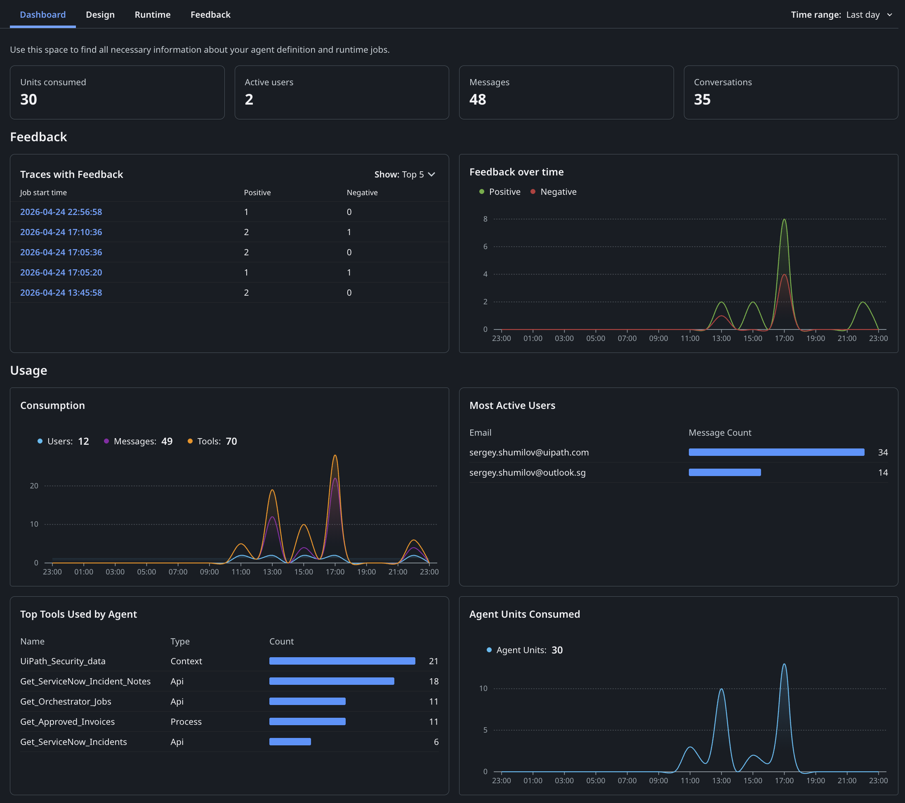

# 직접 사용해 보기

!!! tip "이번 레슨의 계획입니다:"

    1. 디버그 모드에서 에이전트를 실행하고 여러 각도에서 테스트하기
    2. 각 응답 평가하기 — 에이전트가 올바른 도구를 사용했는지, 출처를 인용했는지, 쓰기 작업이 실제로 반영되었는지 확인하기
    3. 평가 옵션을 이해하고 에이전트를 실서비스로 게시하기

## 목표

이 레슨을 마치면 네 가지 유형의 대화 — 데이터 조회, 인시던트 조회, 코멘트 게시 작업, 컨텍스트 소스에 근거한 지식 질문 — 로 에이전트를 검증하게 됩니다. 디버그 인터페이스로 각 도구 호출을 실시간으로 지켜보고, 응답이 정확하고 신뢰할 만한지 직접 판단합니다.

## 대화로 테스트하기

자동화된 테스트는 회귀(regression)를 잡아냅니다. 수동 대화 테스트는 다른 것을 잡아냅니다. 에이전트가 실제로 *말이 되는지*, 원하는 것을 주는지 말입니다. 뭔가 잘못되었다면 — 돌아가서 프롬프트를 다시 검토하세요.

대화 테스트를 실행할 때는 네 가지를 살펴보세요.

- **도구 사용** - 에이전트가 올바른 도구를 호출했나요? 합리적인 인수를 전달했나요?
- **응답 품질** - 답변이 정확하고, 형식이 좋고, 적절한 수준으로 상세한가요?
- **쓰기 작업** - 에이전트가 데이터를 변경할 때, 그 변경이 실제로 반영되나요?
- **그라운딩** - 답변이 문서에서 나올 때, 출처가 제대로 인용되나요?

이 네 가지 범주에 걸쳐 잘 고른 몇 개의 대화만 있으면 에이전트 품질을 탄탄하게 가늠할 수 있습니다.

## 단계

### 1. 채팅 세션 시작하기

**Debug**(디버그)를 클릭해 디버그 구성 대화 상자를 엽니다. **Context**와 **Processes** 아래에 나열된 리소스를 검토하세요 — 세션 동안 에이전트가 접근할 수 있는 대상입니다.

{ .screenshot width="900" }

테스트하려는 도구와 컨텍스트 소스가 모두 체크되어 있는지 확인한 다음 **Save & Debug**를 클릭합니다.

### 2. 채팅 인터페이스 확인하기

시작 프롬프트 칩이 준비된 채로 채팅 화면이 로드됩니다.

[[[
칩 중 하나를 클릭하거나 직접 메시지를 입력하세요. 에이전트는 항상 짧은 표시 텍스트가 아니라 전체 실제 프롬프트를 받습니다.
|30|
{ .screenshot }
]]]

### 3. 데이터 조회 테스트: 인보이스 지출

**How much did we spend last month?**(지난달에 얼마나 썼나요?)를 클릭하세요. 에이전트에 전송되는 실제 프롬프트는 다음과 같습니다.

```text
Calculate total sum of all invoices during last 30 days.
```

실행 트레이스를 지켜보세요. 에이전트가 `in_DaysAgo: 30`으로 **Get Approved Invoices**를 호출하고, 그 결과로 Data Fabric에서 전체 인보이스 목록을 받습니다.

{ .screenshot width="900" }

이어서 에이전트가 데이터를 처리해 깔끔한 요약을 돌려줍니다.

[[[
숫자와 통화별 내역이, 시스템에 있다고 알고 있는 인보이스 규모에 비추어 그럴듯한지 확인하세요.
|30|
{ .screenshot }
]]]

### 4. 인시던트 조회 테스트와 노트 작성

**How many things break recently?**(최근에 뭐가 얼마나 고장 났나요?)를 클릭하세요. 실제 프롬프트는 다음과 같습니다.

```text
In the last 7 days, what were top 5 support incidents, who was the assignee?
```

에이전트가 `in_TicketAgeDays: 7`로 **Get ServiceNow Incidents**를 호출해 최근 티켓 목록을 받고, 이를 분석해 상위 다섯 건으로 응답합니다.

{ .screenshot width="900" }

첫 결과에 담당자 정보가 없을 때 에이전트가 데이터를 지어내지 않고 그 사실을 짚고 넘어간다는 점에 주목하세요. 좋은 신호입니다.

이제 조금 더 까다로운 것을 해 봅시다. 다음을 입력하세요.

```text
Add an internal note to first ticket, say "This is critical to address it with highest priority! Fix it asap!". Validate that the note is added because it's important!
```

에이전트가 **Post ServiceNow Incident Note**를 호출한 뒤, 곧바로 **Get ServiceNow Incident Notes**를 실행해 변경 사항을 검증합니다.

{ .screenshot width="900" }

에이전트는 쓰기 작업을 던져 놓고 잘 되었겠거니 하지 않습니다 — 직접 검증합니다. 바로 이런 동작을 눈여겨봐야 합니다.

[[[
확실히 하고 싶다면, 트레이너에게 **ServiceNow**에서 해당 인시던트를 직접 조회해 활동 타임라인을 확인해 달라고 요청해 보세요. 에이전트가 실제 운영 시스템에 진짜 변경을 만들었습니다 — 노트가 작성한 그대로 나타납니다.
|30|
{ .screenshot }
]]]


### 5. 컨텍스트 그라운딩 테스트

마지막으로 **Is UiPath platform Secure?**(UiPath 플랫폼은 안전한가요?)를 클릭하세요. 실제 프롬프트는 AI 안전 기능에 대해 구체적으로 묻습니다.

에이전트가 **UiPath Security data** 컨텍스트 소스를 검색해 구조화된 답변을 돌려줍니다. 인용 마커(`1`)를 클릭해 출처를 확인하세요.

{ .screenshot width="900" }

인용은 그라운딩된 지식 베이스의 정확한 페이지로 연결됩니다. 클릭할 때마다 원본 문서/파일로 이동합니다. 인용이 없는 답변 — 또는 엉뚱한 문서를 가리키는 인용 — 은 컨텍스트 소스를 다시 손봐야 한다는 신호입니다.

### 6. 에이전트 평가하기

에이전트를 프로덕션으로 보내기 전에 두 가지 방식으로 테스트할 수 있습니다.

**Debug Chat**

- **Studio Web**에서 실시간 실행 로그와 함께 진행하는 인터랙티브 테스트입니다.
- 좋아요/싫어요 피드백으로 결과를 평가 세트에 추가하고, 출처 추적을 위해 인용을 확인할 수 있습니다.
- 개발 중 빠른 반복에 좋습니다 — 변경 사항을 즉시 테스트하고 엣지 케이스를 발견하는 대로 담아 두세요.

**Evaluation Sets**

- 싱글턴 평가는 개별 프롬프트에 대한 도구 선택, 어조, 응답을 테스트합니다.
- 멀티턴 평가는 전체 대화 이력을 갖고 테스트하며 현실적인 사용자 여정을 시뮬레이션합니다.
- 두 유형 모두 궤적 기반(trajectory-based) 평가기와 기대 응답(expected-response) 평가기를 지원합니다. 여러 동급 모델 간 벤치마크도 가능합니다.
- **Autopilot**으로 자연어 설명만 가지고 평가 세트를 자동 생성할 수 있습니다.

### 7. 실서비스로 내보내기

다른 UiPath 솔루션과 마찬가지로 에이전트도 게시하고 폴더에 배포해야 합니다.

사본이 너무 많아지는 것을 피하려면, 모두를 위해 Conversational Agent 폴더에 게시해 둔 이 에이전트를 사용해도 됩니다: [직접 링크](https://cloud.uipath.com/tpenlabs/AgenticPractice/autopilotforeveryone_/conversational-agents/?agentId=418563&mode=embedded). 에이전트는 Deployed Agents 목록에 나타나며 통계와 사용 데이터를 모니터링할 수 있습니다. 사용자가 보낸 피드백도 여기에 쌓입니다.

{ .screenshot }

옵저버빌리티 대시보드는 에이전트의 성능을 상세히 들여다볼 수 있게 해 줍니다. 예를 들면 다음과 같습니다.

- **Business Intelligence**(비즈니스 인텔리전스) — 소비 지표, 활성 사용자, 메시지, 대화, 피드백 추이를 시간에 따라 추적할 수 있습니다. 가장 많이 쓰인 도구와 가장 활발한 사용자를 확인해 도입 패턴과 최적화 기회를 찾아보세요.
- **Compliance and Auditability**(컴플라이언스와 감사 가능성): 전체 실행 트레이스로 에이전트 동작을 상세히 파악할 수 있습니다. AI Trust Layer Audit는 모든 LLM 호출을 모델 유형, 데이터 레지던시, PII 마스킹 상태와 함께 기록해 완전한 컴플라이언스 가시성을 제공합니다.
- **Feedback**(피드백): 사용자는 좋아요/싫어요로 응답을 평가할 수 있습니다. 관리자는 Instance Management에서 그 피드백을 검토하고, 얻은 인사이트를 평가 세트에 반영해 지속적으로 개선합니다.

그리고 마지막으로:

<details ontoggle="if(this.open) { this.querySelector('iframe').src = this.querySelector('iframe').getAttribute('data-src'); }">
  <summary>대화형 에이전트를 여러분의 애플리케이션에 임베드할 수도 있습니다!</summary>
  <div class="iframe-container">
    <iframe 
        data-src="https://cloud.uipath.com/tpenlabs/AgenticPractice/autopilotforeveryone_/conversational-agents/?agentId=418563&mode=embedded" 
        src="about:blank"
        width="100%" 
        height="500" 
        frameborder="0"
        allowfullscreen>
    </iframe>
  </div>
</details>

UiPath 대화형 에이전트는 곧 음성과 IVR 기능, 클라이언트 사이드 도구 지원, WhatsApp 통합을 갖추게 됩니다. 하지만 이 실습은 여기서 완료입니다! 요약 페이지로 이동해 무엇을 만들었는지 확인해 보세요.
