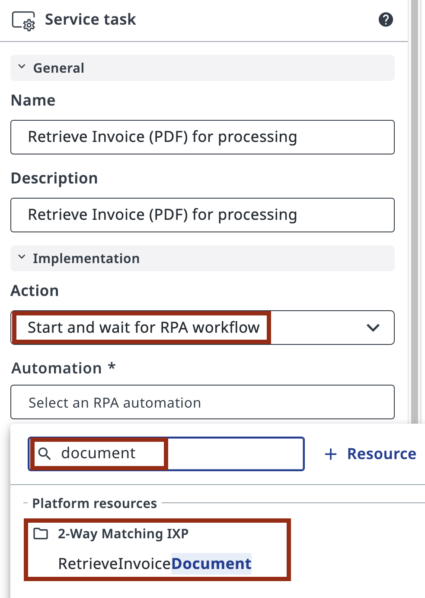
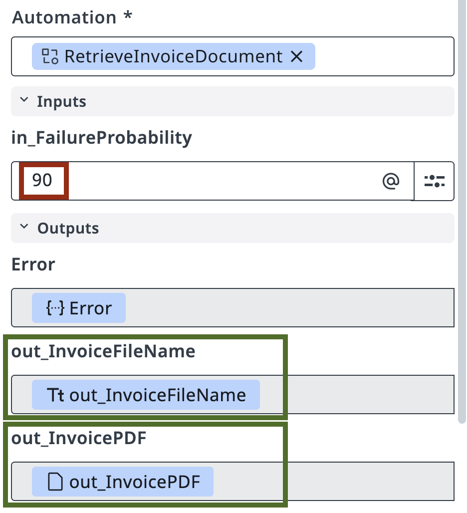

# Automating Tasks using Robots

!!! tip "Here is our plan for this lesson:"

    1. Create a **Maestro** agentic process in **Studio Web** and import your BPMN diagram

    2. Connect the RPA robotic task to the **RetrieveInvoiceDocument** process

    3. Run a debug session to verify the robot's output

    4. Learn how process inputs and outputs work

## Goal

Create a Maestro Agentic Process, import your BPMN diagram, and connect the first task to the **RetrieveInvoiceDocument** RPA process. The robot simulates retrieving an invoice PDF and outputs the file name stored in a Storage Bucket. The agent in the next step will extract structured data from that PDF using IXP.

## About the Robot Process

In this simulated scenario, the company processes hundreds of invoices per day. Data is stored in ERP and Accounts Payable systems that don't always have APIs or direct database access. RPA automation using UI interaction is often the only way to extract that data, and this is where UiPath shines.

There's a queue of invoices waiting to be processed, and an external transaction handling mechanism that lets the automation pick up the next one. The robot retrieves the invoice, extracts data from the PDF, then finds and retrieves the original Purchase Order sent to the supplier. It outputs details of both documents in JSON format for the agent to process.

The **RetrieveInvoiceDocument** process simulates this retrieval and outputs a sample invoice as a PDF file, along with the file location in Orchestrator's Storage Bucket. The process has already been configured in Orchestrator in the **2-Way Matching IXP** folder — you will not need to write it.

Get familiar with it before configuring it in Studio Web — open the **2-Way Matching IXP** folder in Orchestrator and give it a run to explore its inputs and outputs.

## Steps

### 1. Create the Agentic Process

In [**Studio Web**](https://cloud.uipath.com/tpenlabs/studio_/projects), make sure you are building in the right Tenant (**AgenticPractice**), click **Create New** and select **Agentic Process**. This will create a new project for our Agentic Orchestration workflow that will perform Invoice and PO matching:

{ .screenshot }

[[[
Now let's import our BPMN diagram.

Open **Project Explorer**, right-click on the Agentic Process, and select **Import BPMN**.

Select the `.bpmn` file you exported in the previous step or use this **[sample BPMN file](dependencies/2-Way%20Matching%20Process.bpmn)**. The diagram will be added to your project.
|50|
{ .screenshot }
]]]

[[[
{ .screenshot }
|30|
> ***The art of keeping your projects organized is rooted in habits — and habits are nurtured through consistent practice.***
<div align=right><i>
Generated by a wise ancient LLM
</i></div>
]]]


[[[
So, don't forget to reinforce your good habits and clean up your project:

- delete the automatically generated empty process ("Process.bpmn")

- rename your solution and process into **2-Way Matching Solution** and **2-Way Matching Process**
|70|
```
2-Way Matching Solution
```
```
2-Way Matching Process
```
]]]

---

Unlike static BPMN tools, Maestro allows modeling our diagram, which means you can execute it by following connections and decisions.

Try to run it by clicking "**Debug**" button in the upper left corner, and then understand why it went the way it went. It should look like this:

{ .screenshot }


### 2. Configure the robot task

In our scenario, company processes hundreds of Invoices per day, ranging from Office Supplies and Computer Equipment. Data is stored in ERP and Accounts Payable or billing systems that unfortunately not always have APIs or database access, and therefore **RPA automation** using UI interaction is the only way to extract that data.

Let's assume that there is a queue of Invoices for processing and an external transaction handling mechanism which allows to wait and extract the next Invoice for processing. Automation retrieves Invoice, extracts data from PDF, then finds and retrieves associated original Purchase Order that was sent to Supplier originally. It outputs details of both documents in JSON format for our Agentic Automation to process.

[[[
{ .screenshot }
|70|
RPA Process called "**RetrieveInvoiceDocument**" will simulate retrieving data and output sample Invoice as a PDF File. It will also point to file name in Storage Bucket.
]]]

[[[
Here is a sample invoice document that you might get from the **RetrieveInvoiceDocument** automation. Quite standard.
|30|
{ .screenshot }
]]]

The process has already been configured in Orchestrator in the **2-Way Matching IXP** folder. Get familiar by giving it a run and explore its inputs and outputs:

{ .screenshot }

Once you have validated that the process has everything it needs, go back to **Studio Web** and update your task:

- Open the properties panel by clicking on the task.
- Select **Start and wait for RPA workflow** as the action type.

{ .screenshot }


[[[
In the task properties, search for **RetrieveInvoiceDocument** from the **2-Way Matching IXP** folder and select it.
|70|
{ .screenshot }
]]]


[[[
Maestro will load the inputs and outputs for this RPA automation right away.

- Don't forget to set a value for **in_FailureProbability** — this is the probability, in percent, that the invoice won't match the PO. A value of **90** works well, so you can go through the validation path often while testing. You can change it any time before publishing the final version.
|70|
{ .screenshot }
]]]


### 3. Test the process

Next, try launching the Maestro Orchestration Process from Studio Web by clicking the "**Debug**" button. Observe provisioning and execution, then validate that the task generates correct output. At this step we don't need to worry about configuring any input/output parameters — variables will be automatically created for subsequent steps.

{ .screenshot }

Have a look at the execution details: if you see a file name in outputs, you have completed this lesson and it's time to move to the **[next one](3-configure-agent.md)**.

!!! tip "Check out the PDF file structure"
    You can find the PDF file by it's name in Storage Bucket: **InvoicesStorage** located in **2-Way Matching IXP** folder.
