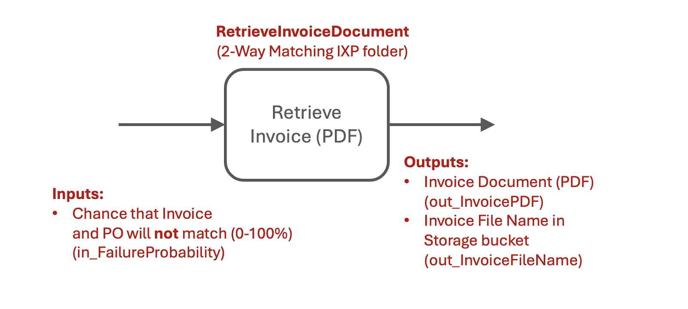
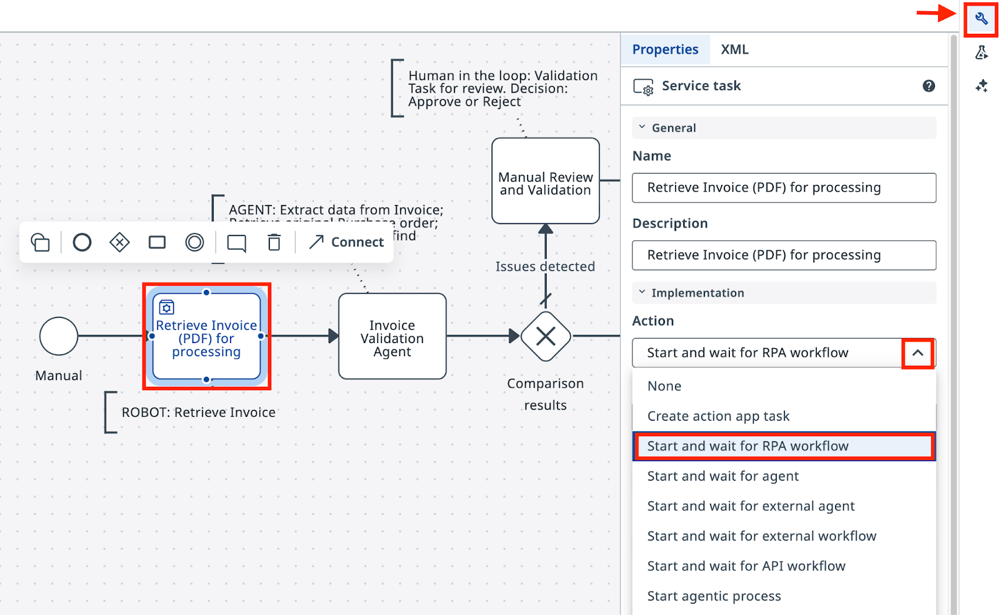

# 使用机器人自动化任务

!!! tip "本课的计划如下："

    1. 在 **Studio Web** 中创建一个 **Maestro** 智能体流程，并导入你的 BPMN 图

    2. 把 RPA 机器人任务连接到 **RetrieveInvoiceDocument** 流程

    3. 运行一次调试会话，验证机器人的输出

    4. 了解流程的输入和输出是如何工作的

## 目标

创建一个 Maestro 智能体流程（Agentic Process），导入你的 BPMN 图，并把第一个任务连接到 **RetrieveInvoiceDocument** RPA 流程。这个机器人会模拟获取一张发票 PDF，并输出它在 Storage Bucket 中的文件名。下一步的智能体会用 IXP 从这份 PDF 中提取结构化数据。

## 关于机器人流程

在这个模拟场景中，公司每天要处理数百张发票。数据存放在 ERP 和应付账款系统里，而这些系统并不总是提供 API 或直接的数据库访问。通过 UI 交互的 RPA 自动化往往是提取这些数据的唯一方式，而这正是 UiPath 的强项。

有一个等待处理的发票队列，以及一个外部事务处理机制，让自动化可以取出下一张发票。机器人获取发票，从 PDF 中提取数据，然后找到并取回当初发给供应商的原始采购订单。它会把两份单据的详细信息以 JSON 格式输出，交给智能体处理。

**RetrieveInvoiceDocument** 流程会模拟这一获取过程，输出一张示例发票的 PDF 文件，以及该文件在 Orchestrator Storage Bucket 中的位置。这个流程已经在 Orchestrator 的 **2-Way Matching IXP** 文件夹中配置好了——你不需要自己编写。

在 Studio Web 中配置它之前先熟悉一下——在 Orchestrator 中打开 **2-Way Matching IXP** 文件夹，运行一次，看看它的输入和输出。

## 步骤

### 1. 创建智能体流程

在 [**Studio Web**](https://cloud.uipath.com/tpenlabs/studio_/projects) 中，确认你在正确的租户（**AgenticPractice**）下构建，点击 **Create New**（新建）并选择 **Agentic Process**（智能体流程）。这会创建一个新项目，用于承载我们执行发票与 PO 匹配的智能体编排工作流：

{ .screenshot }

[[[
现在来导入我们的 BPMN 图。

打开 **Project Explorer**（项目资源管理器），右键点击这个智能体流程，选择 **Import BPMN**（导入 BPMN）。

选择你在上一步导出的 `.bpmn` 文件，或者使用这个**[示例 BPMN 文件](dependencies/2-Way%20Matching%20Process.bpmn)**。这张图会被添加到你的项目中。
|50|
{ .screenshot }
]]]

[[[
{ .screenshot }
|30|
> ***保持项目井井有条的艺术，根植于习惯——而习惯，源自持续的练习。***
<div align=right><i>
由一位睿智的上古 LLM 生成
</i></div>
]]]


[[[
所以，别忘了巩固好习惯，清理一下你的项目：

- 删除自动生成的空流程（"Process.bpmn"）

- 把你的解决方案和流程分别重命名为 **2-Way Matching Solution** 和 **2-Way Matching Process**
|70|
```
2-Way Matching Solution
```
```
2-Way Matching Process
```
]]]

---

与静态的 BPMN 工具不同，Maestro 支持对图进行建模，也就是说你可以让它沿着连线和决策实际执行。

点击左上角的 **Debug**（调试）按钮试着运行一下，然后想想它为什么会走这条路径。运行结果应该是这样的：

{ .screenshot }


### 2. 配置机器人任务

在我们的场景中，公司每天要处理数百张发票，从办公用品到电脑设备都有。数据存放在 ERP、应付账款或计费系统里，遗憾的是这些系统并不总是提供 API 或数据库访问，因此通过 UI 交互的 **RPA 自动化**就成了提取数据的唯一方式。

假设有一个待处理的发票队列，以及一个外部事务处理机制，可以等待并取出下一张待处理的发票。自动化获取发票，从 PDF 中提取数据，然后找到并取回当初发给供应商的原始采购订单。它会把两份单据的详细信息以 JSON 格式输出，交给我们的智能体自动化处理。

[[[
{ .screenshot }
|70|
名为 **RetrieveInvoiceDocument** 的 RPA 流程会模拟数据获取，输出一张示例发票的 PDF 文件。它同时会给出该文件在 Storage Bucket 中的文件名。
]]]

[[[
这是一张你可能会从 **RetrieveInvoiceDocument** 自动化拿到的示例发票。相当标准。
|30|
{ .screenshot }
]]]

这个流程已经在 Orchestrator 的 **2-Way Matching IXP** 文件夹中配置好了。先运行一次熟悉熟悉，看看它的输入和输出：

{ .screenshot }

确认流程一切就绪后，回到 **Studio Web** 更新你的任务：

- 点击任务，打开属性面板。
- 把操作类型选为 **Start and wait for RPA workflow**（启动并等待 RPA 工作流）。

{ .screenshot }


[[[
在任务属性中，从 **2-Way Matching IXP** 文件夹里搜索 **RetrieveInvoiceDocument** 并选中它。
|70|
{ .screenshot }
]]]


[[[
Maestro 会立刻加载这个 RPA 自动化的输入和输出。

- 别忘了给 **in_FailureProbability** 设置一个值——它表示发票与 PO 匹配失败的概率（百分比）。设为 **90** 很合适，这样测试时你会经常走到验证路径。在发布最终版本之前，你随时可以修改它。
|70|
{ .screenshot }
]]]


### 3. 测试流程

接下来，点击 **Debug** 按钮，从 Studio Web 启动这个 Maestro 编排流程。观察资源准备和执行过程，然后确认任务生成了正确的输出。这一步我们不需要操心任何输入/输出参数的配置——变量会自动创建，供后续步骤使用。

{ .screenshot }

看一眼执行详情：如果你在输出中看到了一个文件名，这节课就完成了，可以进入**[下一课](3-configure-agent.md)**了。

!!! tip "看看 PDF 文件的结构"
    你可以在 **2-Way Matching IXP** 文件夹下名为 **InvoicesStorage** 的 Storage Bucket 中，按文件名找到这份 PDF 文件。
