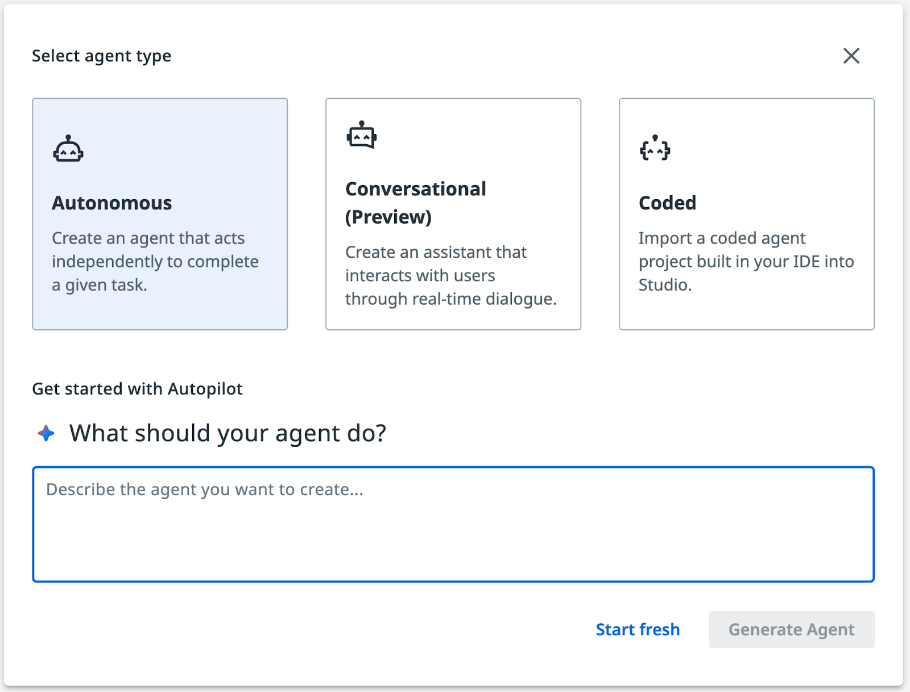
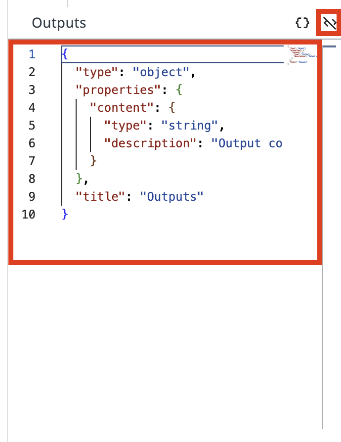
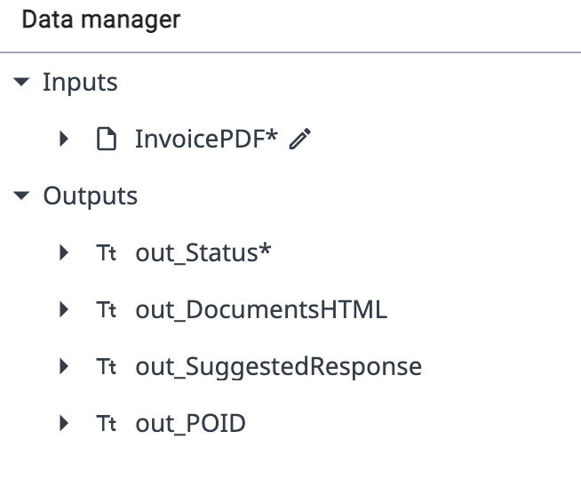
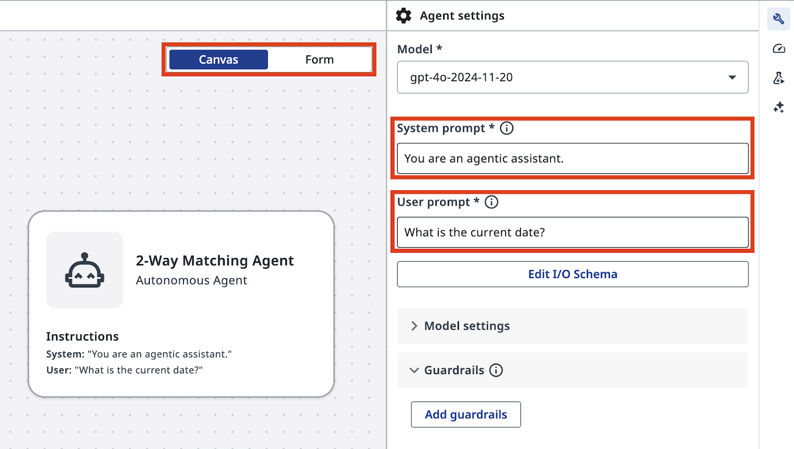
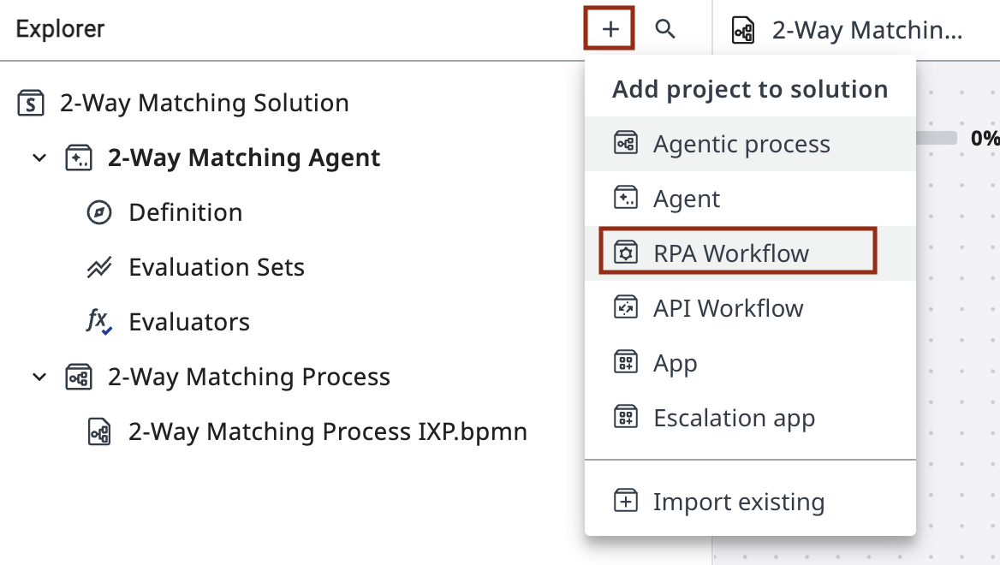
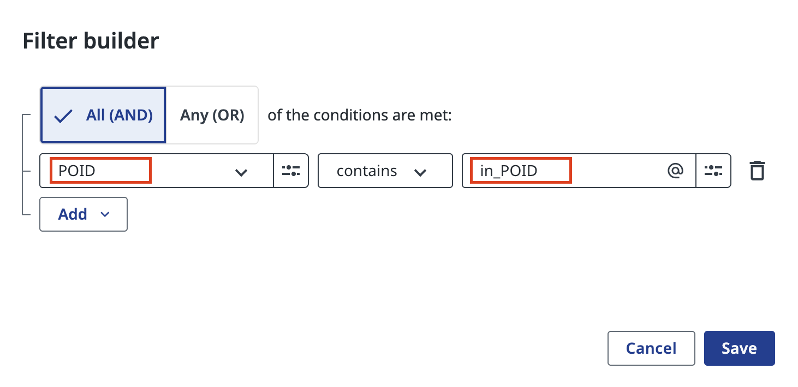
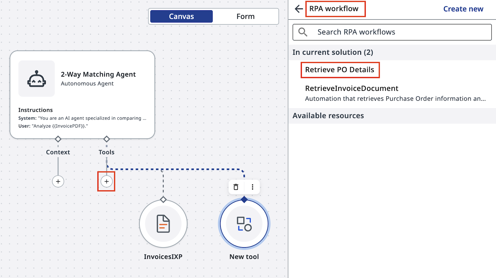
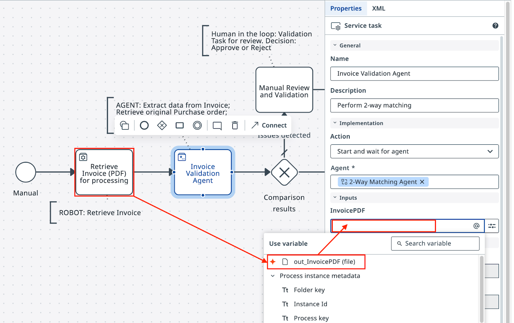

# 에이전트로 인지 작업 자동화하기

!!! tip "이번 레슨의 계획입니다:"

    1. 2-Way Matching AI 에이전트를 처음부터 만듭니다.
        - 에이전트는 로봇의 PDF 출력을 입력으로 사용하고, 검증 결과를 반환합니다.
        - 인보이스에 문제가 있으면 휴먼 검증 작업에 쓸 데이터도 준비합니다.

    2. 에이전트 품질을 보장하기 위해 테스트를 구성하고 평가 데이터셋을 만듭니다 *(선택 사항)*.

    3. Maestro 워크플로에서 에이전트를 구성합니다.

    4. 에이전트의 출력에 따라 분기하는 결정 Gateway를 구성합니다.

    5. 시뮬레이션으로 결정이 올바른 방향으로 흘러가는지 확인합니다.

## 목표

두 가지 도구를 갖춘 **2-Way Matching Agent**를 만듭니다: 

- IXP 데이터 추출 도구 

- 구매 주문(PO) 데이터베이스를 조회하는 RPA 워크플로 도구. 

에이전트는 PDF 인보이스를 받아 구조화된 데이터(PO 상세 정보 포함)를 추출하고, 해당 PO를 조회한 뒤, 근거 자료와 함께 매칭 결정을 반환합니다.

## 매칭에 왜 LLM을 사용하나요

이 프로세스의 단계 중 하나는 구매 주문(PO)과 인보이스를 비교하는 일입니다.

인보이스 데이터와 라인 아이템을 비교·분석하는 전통적인 코드를 작성할 수도 있지만, 꽤 어려운 일이 될 수 있습니다. "규칙"이 대개 유연하기 때문입니다. 예를 들어 표에는 의미는 비슷하지만 완전히 같지는 않은 설명이 담긴 라인이 있을 수 있고, 그 밖에도 허용 가능한 변형이 있을 수 있습니다. 이런 엣지 케이스 하나하나가 코드 복잡도와 구현 시간을 늘립니다.

또한 불일치가 발견되면, 보통 다음 단계는 발신자에게 인보이스를 수정해 달라고 요청하는 메일을 쓰는 것입니다.

LLM은 이 일에 안성맞춤입니다. 어떤 형식이든 대량의 텍스트를 분석하고, 불일치와 예외를 식별한 다음, 프롬프트의 지침에 따라 요구된 형식과 언어로 검증 요약이나 이메일 답장을 생성할 수 있습니다.

[[[
에이전트의 입력과 출력 구조, 그리고 작업을 수행하기 위해 에이전트에게 필요한 도구는 다음과 같습니다:
|30|
{ .screenshot }
]]]


## 단계

### 1. 에이전트 만들고 인수 구성하기


[[[
**Studio Web**에서 솔루션에 새 에이전트를 추가합니다.

솔루션에는 앱, 자동화, 워크플로, 에이전트 같은 여러 구성 요소가 들어갈 수 있다는 점을 기억하세요. 이름은 다음과 같이 지정합니다
```
2-Way Matching Agent
```
|30|
{ .screenshot }
]]]

[[[
새 에이전트를 생성하겠냐는 프롬프트가 보이면 Autopilot 화면을 닫으세요.

Autopilot은 나중에 살펴봐도 됩니다. 지금은 프롬프트와 설정을 직접 구성할 것이므로 **Start fresh**를 클릭하세요.
|30|
{ .screenshot }
]]]


[[[
로봇과 마찬가지로 에이전트에도 Arguments(인수)라고 부르는 입력과 출력이 있습니다. 왼쪽 리본에서 **Data Manager** 아이콘을 클릭한 다음 "**+**"를 클릭해 새 Input 인수를 추가합니다:

| 필드 | 값 |
|-------|-------|
| Name | ```in_InvoicePDF``` |
| Type | File |
| Description | ```Invoice File``` |

Output 인수는 "**Editor mode**"로 전환한 뒤 아래 JSON을 에디터에 복사해 붙여 넣습니다:
|50|
{ .screenshot }
]]]


[[[
{ .screenshot }

{ .screenshot }
|30|
**Output** JSON 스키마:
```json
{
  "type": "object",
  "required": [
    "out_Status"
  ],
  "properties": {
    "out_Status": {
      "type": "string",
      "description": "Status of matching - either 'Full Match' or 'Failed Match'"
    },
    "out_DocumentsHTML": {
      "type": "string",
      "description": "HTML code containing side by side comparison of Purchase Order and Invoice"
    },
    "out_SuggestedResponse": {
      "type": "string",
      "description": "Suggested response to Invoice Supplier with description and request to mitigate issues"
    },
    "out_POID": {
      "type": "string",
      "description": "Purchase Order ID extracted from Invoice PDF"
    },
    "out_InvoiceJSON": {
      "type": "string",
      "description": "JSON document containing Invoice data extracted by IXP"
    }
  },
  "title": "Outputs"
}
```
]]]


### 2. 프롬프트 구성하기

[[[
{ .screenshot }
|30|
> ***"프롬프트의 정밀함은 코딩에서와 마찬가지로 강력하고 예측 가능한 결과로 이어집니다. 프롬프트가 엉망이면 출력도 엉망일 수밖에 없습니다. 프롬프트를 코드처럼 다루고, 한 단어 한 단어를 목적을 갖고 쓰세요!"*** — gpt-4o가 전하는 또 하나의 조언
]]]


[[[
프롬프트는 에이전트 설정에서 구성합니다(렌치 아이콘을 클릭해 여세요).

이전 실습에서 기억하시겠지만:

- **System prompt**는 사람의 업무 지침서, 즉 "어떻게"에 해당합니다.

- **User Prompt**는 최종 사용자가 입력하는 구체적인 요청이나 작업, 즉 "무엇"에 해당합니다.
|30|
{ .screenshot }
]]]

[[[
다음 **System Prompt**를 입력하세요:
|50|

]]]

```cpp
You are an AI agent specialized in comparing Invoice PDFs with Purchase Orders. Your primary responsibilities are:

1. Analyze the contents of an Invoice PDF file using the InvoicesIXP tool. Extract all relevant information including company details, line items, totals, and tax information. Trigger Escalation if confidence falls beyond 60%.

2. Use the Retrieve PO Data tool to fetch Purchase Order data from the Data Fabric. The Purchase Order ID should be extracted from the Invoice. If the PO data cannot be retrieved, use Escalation.

3. Compare the Invoice details with the Purchase Order information. Identify and list any mismatches or discrepancies between the two documents. Pay special attention to:
  - Company names and details
  - Line items (product names, quantities, prices)
  - Totals and subtotals
  - Tax information
  - Dates (order date, delivery date, payment due date)

4. Handle any unexpected data formats or missing information gracefully. If crucial information is missing from either document, note this in your analysis and use Escalation.

5. Provide a clear, concise report of your findings, highlighting any issues that require attention.

You should be thorough in your analysis, checking for discrepancies in items, quantities, prices, dates, and any other relevant fields. Always maintain a professional and objective tone in your reports.

out_Status: Status of comparison should be:
  - "Full Match" - if Invoice and Purchase order match fully. Every line item in PO matched to Invoice line items, company name and details match, total and tax information matches.
  - "Failed Match" - if there are items that cannot be matched or other details do not align.

out_DocumentsHTML: If match is not successful, generate HTML code containing side by side comparison of Purchase Order and Invoice, including Company details, document Line Items, Total and Tax information.
  - Use a table structure with three columns: Field, Purchase Order, Invoice.
  - Field titles should be placed in the leftmost column.
  - Tax value should include tax rate and tax name, if available.
  - Line items should be displayed as sub-tables inside the main table cell, aligned top.
  - Cells with discrepancies should have a light red background, both in the main table and in cells of line items sub-tables.
  - Set the table width property to 100%.
  - Use appropriate HTML tags for headers, rows, and data cells.

out_SuggestedResponse: If match is not successful, draft the invoice rejection email to the supplier.
  - The email should have HTML formatting.
  - Start with "Dear Supplier" and do not include a Subject line or placeholders. Sign the email as "Payments Team".
  - Display product names, prices, and other data from documents in bold text.
  - Include a bullet list with reasons for rejection, i.e., discrepancies that can't be matched, and a request to adjust the invoice and resend.
  - In the bullet list, do not include items if that individual item is considered a match. Only list items that do not follow the rules.
  - Maintain a professional and courteous tone throughout the email.

out_InvoiceJSON: JSON document containing Invoice data extracted by IXP. Exclude confidence score, only include datapoints as they appear on the invoice. This will be uploaded to finance system for processing.

Always double-check your analysis and outputs for accuracy before finalizing your response.
```


[[[
다음 **User Prompt**를 입력하세요:
|30|
```
Analyze {{input.in_InvoicePDF}}.
```
]]]

### 3. IXP 및 PO 조회 도구 추가하기

다음으로, 시스템 프롬프트에서 언급한 도구가 에이전트에 필요합니다:

- **InvoicesIXP** 도구 — 기존 Invoice IXP 프로젝트로 데이터를 추출합니다
- **Retrieve PO Data** 도구 — 추출된 PO ID로 구매 주문(PO) 상세 정보를 조회합니다

[[[
캔버스 모드에서 에이전트를 선택하고 "**+**"를 클릭해 새 Tool을 추가합니다.

IXP 구성은 UiPath Cloud의 IXP 섹션에서 확인할 수 있습니다. 이번 실습에서는 IXP 구성을 깊이 파고들지는 않겠습니다.
|30|
{ .screenshot }
]]]

[[[
툴박스에서 **IXP**를 선택하고 **InvoicesIXP** 프로젝트를 선택합니다.

의미 있는 설명을 추가하세요. 예를 들면: 
```
Invoice Data extraction tool.
```
**InvoicesIXP**는 표준 인보이스 분류 체계가 미리 정의된 기본 제공 추출 모델입니다. 추출 데이터를 담은 **JSON object**를 반환합니다.
|30|
{ .screenshot }
]]]

인보이스 추출을 활성화하는 데 필요한 일은 이게 전부입니다!

### 4. PO 조회 도구 만들어 추가하기

다음으로 **Retrieve PO Data** 도구를 새 RPA 워크플로로 만들어 봅시다. PO 데이터는 Data Fabric에 저장되어 있고, POID로 레코드를 조회할 수 있습니다.

[[[
솔루션에 새 RPA Workflow를 추가합니다. 언제나 그렇듯 의미 있는 이름을 지어 주세요:

{ .screenshot }

그다음 워크플로의 입력과 출력 인수를 구성합니다:

- 구매 주문(PO) ID를 **in_POID**로 받습니다. 
- 엔티티의 **PODATA** 필드를 **out_POJSON**으로 반환합니다.

|70|

{ .screenshot }

]]]

**Data Fabric**에서 데이터를 가져오려면 **PurchaseOrdersDatabase**를 대상으로 **Query Entity Records**를 실행하도록 액티비티를 구성합니다. 


{ .screenshot }


[[[
**Main.xaml** 워크플로 안에 **PurchaseOrdersDatabase** 엔티티를 조회하도록 구성한 **Query Entity Records** 액티비티(**Data Service** 소속)를 추가합니다. 

|30|

{ .screenshot }
]]]


[[[

필터를 적용합니다: **POID equals in_POID**.

!!! tip "중요"
    워크플로가 아무 레코드도 반환하지 않으면, POID가 정적 텍스트 "*in_POID*"가 아니라 입력 인수 `in_POID`의 값과 일치하도록 설정되어 있는지 확인하세요

|30|

{ .screenshot }

]]]

최종 결과는 다음과 같아야 합니다. 인보이스에서 가져온 PO ID가 있다면 직접 실행해 보세요.

{ .screenshot }

!!! warning "이 RPA 워크플로에는 입력 검증도 예외 처리도 없으므로 이 실습에서만 쓰기에 적합합니다"

[[[
에이전트 정의로 돌아가 이 RPA Workflow를 Tool로 추가합니다. 반드시 "In current solution"에 있는 것을 선택하세요.

만약을 위해 **in_POID** 입력 인수에 대한 힌트를 에이전트에게 남겨 주세요:
```
Purchase Order ID. it starts with "PO-" followed by few digits, for example: "PO-123456"
```

끝났습니다. 

|30|
{ .screenshot }
]]]

실제 환경이라면 보통 SAP나 NetSuite 같은 시스템에서 PO 데이터를 가져오고, 그 과정에서 예외도 처리해야 합니다. 이 단순화된 버전은 에이전트 구성에 집중할 수 있게 해 줍니다.


### 5. 품질 관리와 평가

이 에이전트를 테스트하는 올바른 방법은 무엇일지, 그리고 앞으로 프롬프트나 LLM 모델이 바뀌어도 결과가 흔들리지 않게 하려면 어떻게 해야 할지 생각해 보세요.

### 6. 에이전트를 Maestro 워크플로에 통합하기

방금 만든 에이전트를 사용하도록 두 번째 작업을 구성하고, 에이전트의 출력에 따라 워크플로를 분기시키는 게이트웨이를 설정해 봅시다.

[[[
**Studio Web**에서 **Maestro Agentic Process**로 돌아가 두 번째 작업을 구성합니다. 액션을 **Start and wait for agent**로 설정한 다음, 솔루션(Defined Resources)에서 에이전트를 검색해 선택합니다.
|30|
{ .screenshot }
]]]

이전 RPA 작업(**Retrieve Invoice PDF**)의 출력을 골라 에이전트의 입력으로 추가합니다. 에이전트 작업의 Settings에서 이렇게 하면 됩니다:

{ .screenshot }

[[[
에이전트의 출력도 워크플로에 자동으로 추가되었으므로, **Exclusive Gateway**를 구성할 때 바로 사용할 수 있습니다.
|50|
{ .screenshot }
]]]

에이전트의 Status(`out_Status`)를 사용해 프로세스를 다음 단계로 보내 봅시다. 인보이스를 지불 처리로 보내거나, 수동 검토로 보내는 두 갈래입니다. 

이미지대로 조건을 구성하세요. 필요하다면 조건식에서 복잡한 계산도 쓸 수 있습니다. 예를 들어 **ToLower** 함수를 쓰면 조금 더 안정적으로 동작합니다.

```css
vars.outStatus.ToLower()=="full match"
```

{ .screenshot }

다양한 예상 입력을 표현식 편집기에서 바로 테스트할 수 있습니다. 기본 경로를 **Failed Match**로 설정하는 것을 잊지 마세요!

프로세스를 테스트할 준비가 되었습니다. 그 Debug 버튼을 다시 클릭하세요! 

{ .screenshot }

!!! tip "게이트웨이가 에이전트의 출력에 따라 올바르게 분기하는지 확인하세요" 
    이번에는 에이전트가 실행되는 모습과, 에이전트의 출력이 실행 흐름의 방향을 기본 경로에서 어떻게 바꾸는지 확인하려고 합니다.

{ .screenshot }

에이전트가 준비되었습니다. 다만 대부분의 경우 여러 번 다시 돌아와 프롬프트를 다듬으면서 더 유연하게 만들어야 합니다. 그래야 사용자의 수동 검증이 줄어들고 더 안정적으로 동작합니다.
