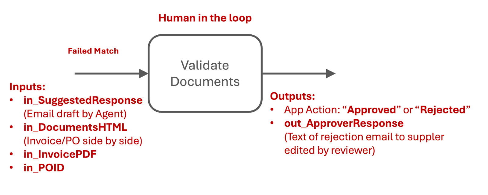
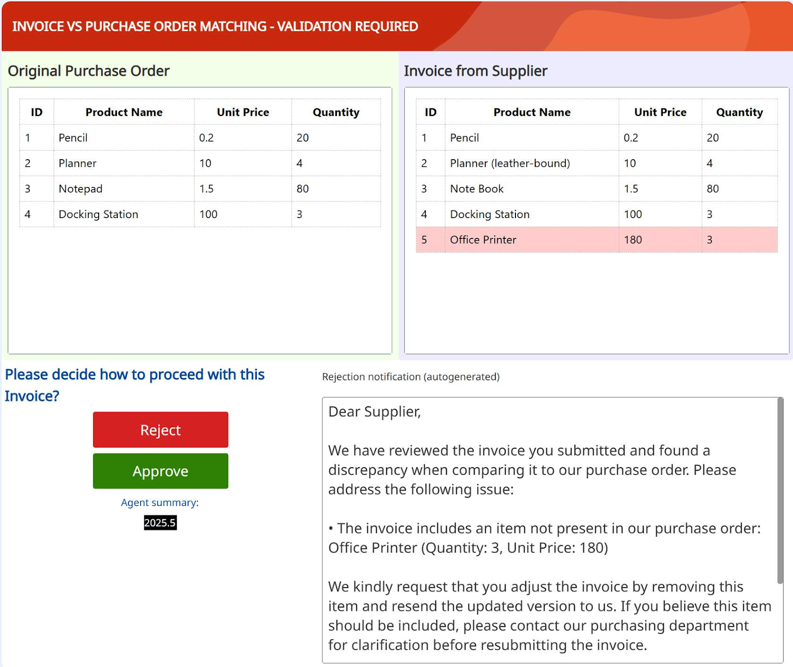
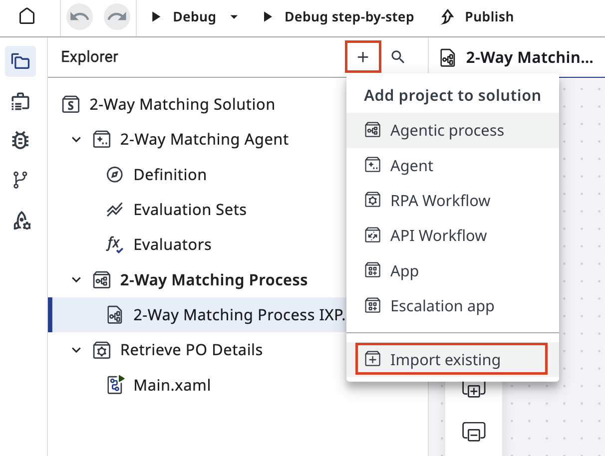
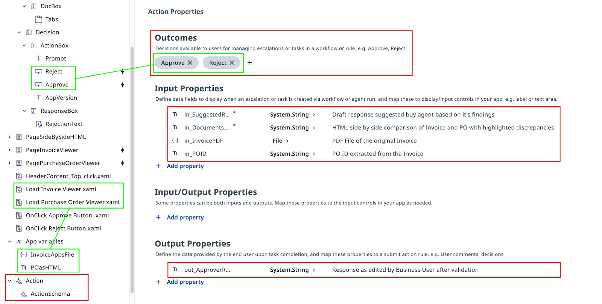
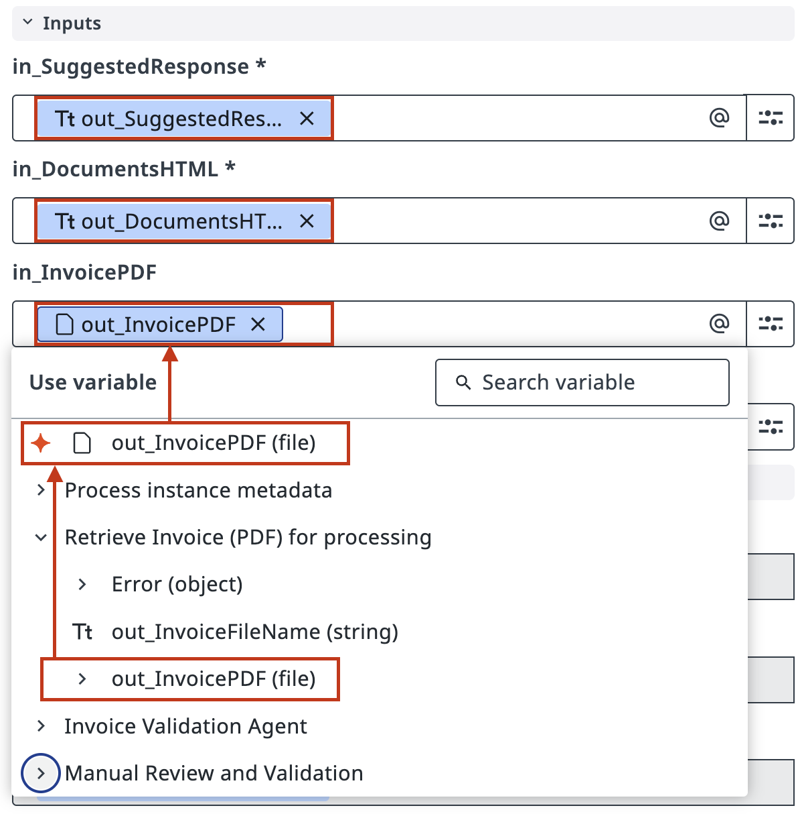
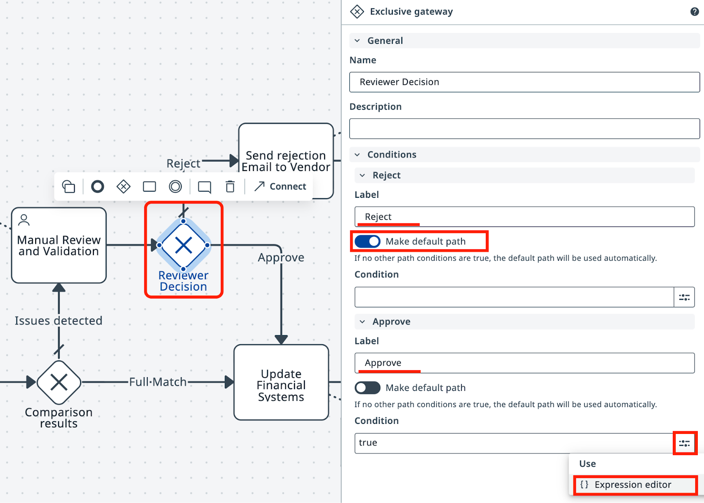
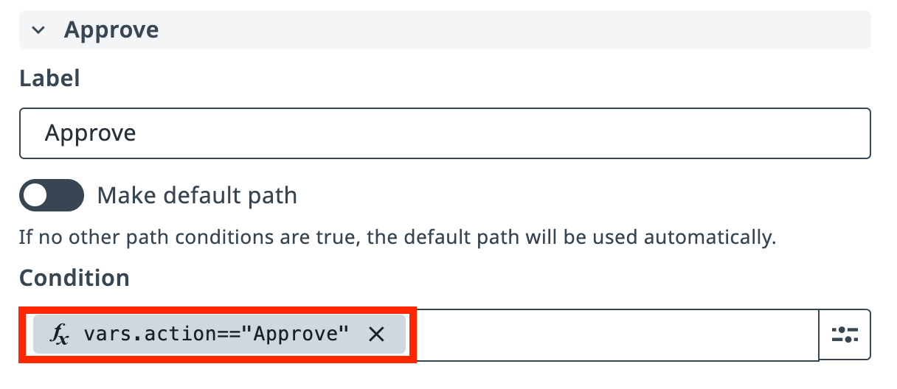
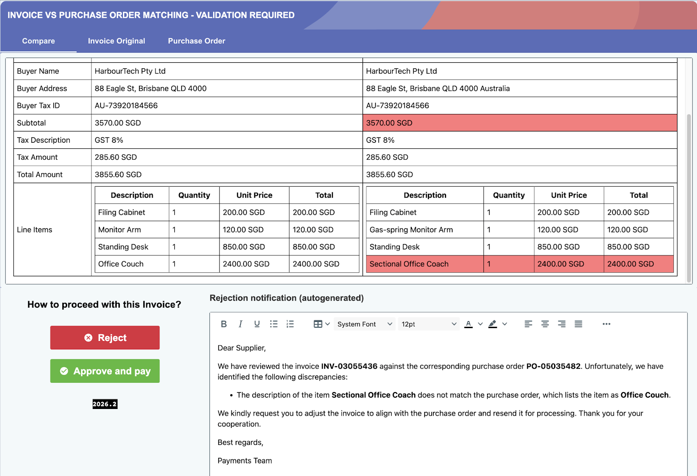

# Involving humans only when necessary

!!! tip "Here is our plan for this lesson:"

    1. Import validation Action App into our project.

    2. Configure the process flow so that if the Agent fails to match Invoice and PO, an Action Center Task is created allowing a human to make a decision.

    3. Based on the App Action (Approve or Reject), direct the flow further.

    4. *(Optional)* Improve the Agent's prompt to handle some edge cases.

## Goal

Add a human validation step on the **Failed Match** path. When the agent flags a mismatch, a reviewer in **Action Center** sees a summary with both documents and chooses to approve or reject the invoice. The workflow resumes based on their decision.

## Humans in the Loop

In many cases where the Agent cannot determine the exact course of action, human involvement is required. Humans process tasks in **Action Center** using conveniently summarized inputs from Robots and Agents:

- All inputs required to make a decision should be presented on one screen — ideally we don't want business users to open applications or go back and review the execution flow.
- The agent's job is to prepare all inputs in the right format, so that when the time comes to ask for user inputs, the data is ready.
- Once the decision is made, the process execution continues to the next steps.

{ .screenshot width="700" }

!!! note "Note on approvals"
    In real life, it is absolutely not ok to approve an invoice and send it for payment if the Purchase Order was for something different — in some countries it's a crime. But for this practice, assume that humans can do whatever they want when it comes to this decision, with no consequences.

To build a nice validation interface, we need a frontend that presents the problem along with the necessary information to make a decision:

- The invoice and Purchase Order should be presented side by side — ideally with discrepancies highlighted in red.
- The problem should be described to the human in a couple of sentences.
- If the decision is to reject the Invoice and send an email to the Supplier, a draft email helps save time. We already have it generated by the Agent!

Instead of building this from scratch, we'll reuse an existing Action App template.

{ .screenshot width="900"}

## Steps

### 1. Import the validation app


[[[
In your solution, click the **+** icon in the Explorer to add a project, then select **Import existing** to add a new project to the solution. Find and import the validation app template.
|50|
{ .screenshot }
]]]


[[[
Find the **2WM Validation App IXP Template** in the list, select it, and click **Add**.
|30|
{ .screenshot }
]]]

After the app appears in your solution, review its structure to understand the design approach. 

- Structure of the App **UI elements** - this is how validation task appears in front of the user.

- App Actions and **Action Schema** - this covers possible outcomes of the user decision or action.

- App **Inputs and Outputs**: where data comes from, where it is used, what comes out.


Open the **MainPage** in the app designer:

{ .screenshot width="900" }

Review the app's **input** and **output** configuration. This shows what data the Agent will send in, and what the reviewer's decision will produce.

{ .screenshot width="900" }

### 2. Configure the human task in Maestro

Go back to your **Agentic Process** in Maestro and configure the validation task on the **Failed Match** path as an Action App Task.


[[[
Select the human task node on the **Failed Match** path and set its action type to **Create action app task**. 

Then select the **2WM Validation App IXP** you just imported from the Defined resources list .

|30|
{ .screenshot }
]]]


[[[
Customize the task title so it's easy to identify in **Action Center** later — for example: **Invoice Validation (Your Name)**. 

In **Advanced Options**, assign the task to yourself so you don't have to search for it among unassigned tasks.

|50|
{ .screenshot }
]]]


[[[

Map the Agent's outputs to the App's inputs, same way we did with agent.

In the Inputs section, connect `out_DocumentsHTML` and `out_SuggestedResponse` from your Agent to the corresponding app input fields.

Here you might again see the true value of following naming conventions!

|30|
{ .screenshot }
]]]

Save the task configuration.

### 3. Configure the gateway decision

Now configure the downstream flow based on the validation decision.

Select the **Exclusive Gateway** that routes the process after the human task.

{ .screenshot width="800" }

Set **Reject** as the default path, keeping in mind that a real business process might have a different approach.

For the **Approve** path, click the Expression Editor button to configure the condition.

[[[
In the Expression editor, insert the Action output variable from the human task.

Enter the condition for the Approve path:

```css
vars.action=="Approve"
```

|30|
{ .screenshot }
]]]


[[[
This routes the process to the Approve path when the reviewer approves the invoice.
|30|
{ .screenshot }
]]]

### 4. Test the human validation flow

Now test the complete human validation flow. Click **Debug** and monitor the execution. With `in_FailureProbability` set to a high value (like 90), the invoice will frequently fail to match, triggering the human validation task.

Click **Debug** to start the process. The execution will pause at the **Manual Review and Validation** task when a mismatch is detected.

{ .screenshot width="900" }

Open the action task by clicking **Open app task** in the Details panel. Review the side-by-side invoice and PO comparison, and make a decision.

{ .screenshot width="900" }

Looks like Agent did a fine job. But should this invoice be approved or rejected? Click **Approve and pay** or **Reject**. As soon as you submit your decision, Maestro continues the execution down the appropriate path.

Review the end-to-end process to confirm the human validation step is correctly integrated and routes based on your decision.

{ .screenshot width="900" }

Run a few more tests — try both Approve and Reject — to confirm both paths route correctly.

Let's agree that the App could use a better design, but all in all — it does the job well enough.

Run a couple more tests and move on to the **[next lesson](5-configure-api.md)**. We are almost done!