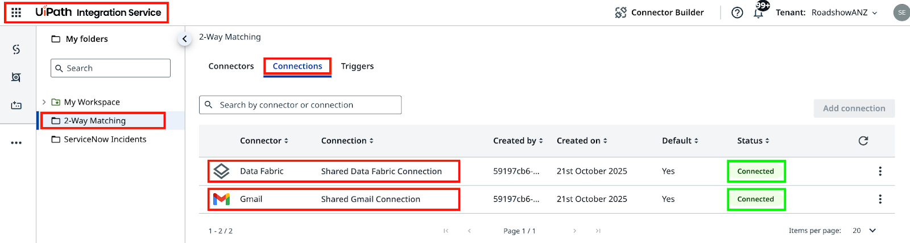
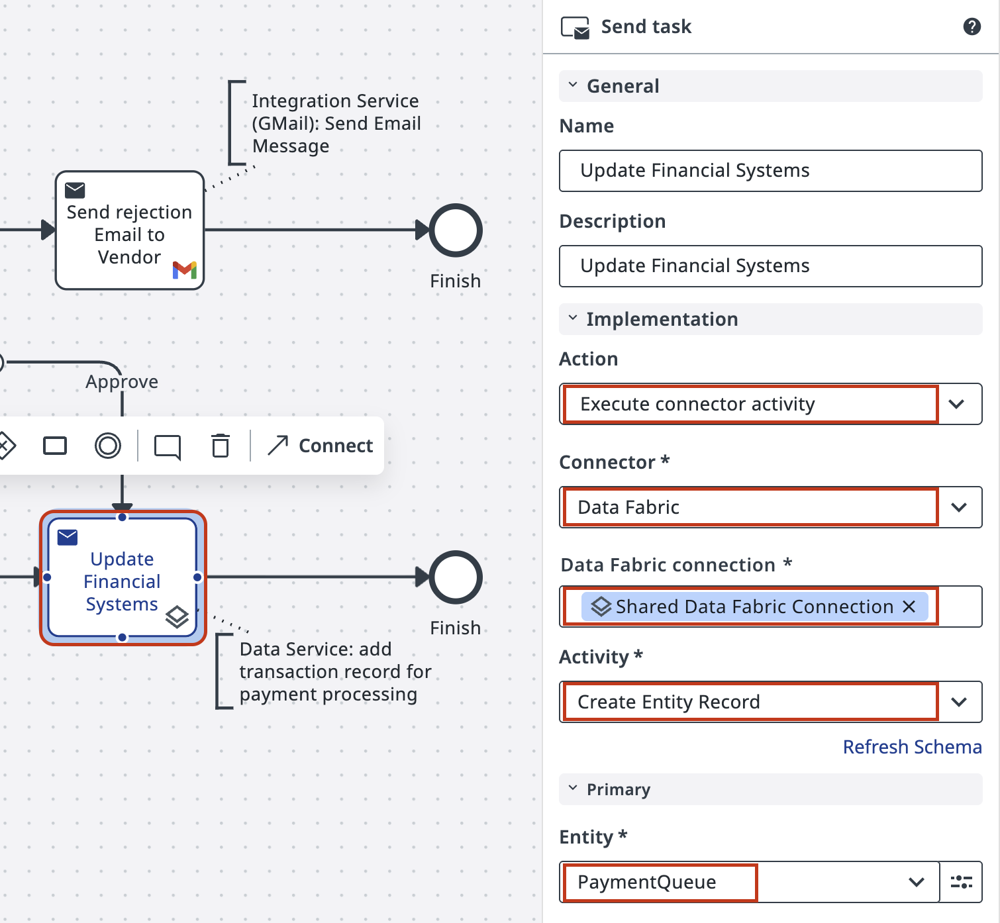
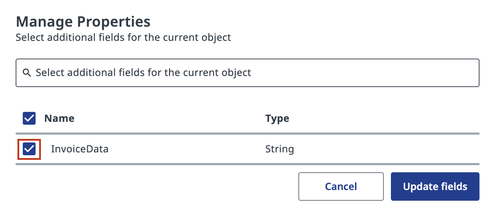
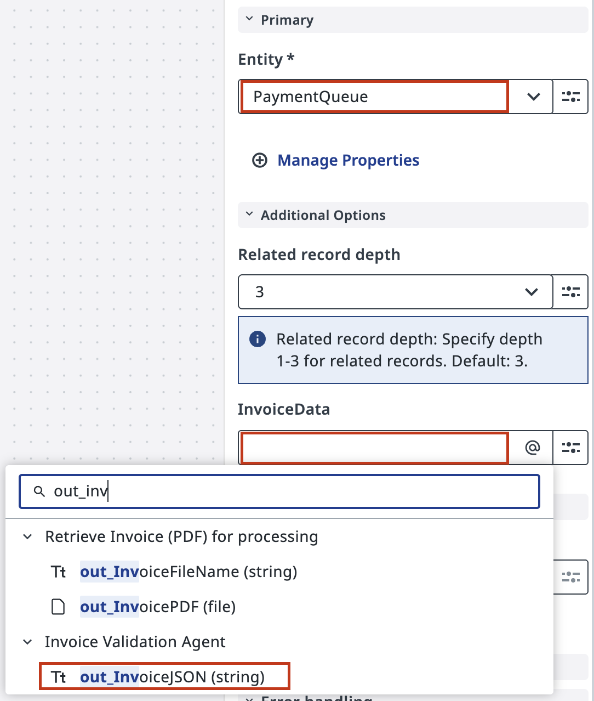

# Talking to external services

!!! tip "Here is our plan for this lesson:"

    1. Send a message to the supplier whenever an invoice is rejected, using the response text from validation step and **Gmail Connector**.
    2. Store approved invoice data in **Data Fabric** so the finance team can process payments using their own automation.

## Goal

Complete the end-to-end process by adding two final tasks: a rejection email connector on the **Reject** path, and a data storage connector on the **Approve** path. Both use **Integration Service** connectors already configured in **AgenticPractice** tenant.

## Integration Service and Data Fabric

UiPath **Integration Service** is the fastest and most convenient way to automate API-enabled applications. It handles authorization and authentication, centralizing API connection management and enabling faster SaaS platform integration.

Two connections are already configured in your tenant:

- **Gmail** — a shared mailbox for sending automated emails
- **Data Fabric** — shared data storage for structured records (tables, files, etc.)

Your platform administrators have prepared these connections. You don't need to configure authentication.

{ .screenshot width="900" }

!!! note "Tenant check"
    Make sure you're using the correct tenant. Contact your trainer if there are issues with connections.

## Steps

### 1. Configure the rejection email task

The process should send a rejection email when an invoice fails validation. The email uses the draft response that the Agent generated and the reviewer had a chance to edit.

[[[
In your **Maestro Agentic Process**, select the task on the **Reject** path and set the action type to **Execute Connector Activity**.

Use the "**Shared Gmail Connection**" and pick "**Send Email**" activity.
|30|
{ .screenshot }
]]]

[[[

Configure the **Send Email** activity: enter your email address as the recipient address, suitable subject line, and map the email body to the reviewer's edited version, `out_ApproverResponse`.

|50|
{ .screenshot }
]]]

### 2. Configure the Data Fabric storage task

Now we know what would happen with the rejected Invoices. For approved invoices, pass the invoice data to **Data Fabric** so the finance team's own UiPath automation can pick it up and process payments. They are using their own UiPath Automation connected to same data source, so all we need to do is to push our data there.

[[[
Select the task on the **Approve** path and set the action type to **Execute Connector Activity**.

Configure the task to use the **Data Fabric** connector with the shared connection and **Create Entity Record** activity for the **Payments Queue** object.

|30|
{ .screenshot }
]]]

[[[
Click **Manage Properties** to add the invoice data field to the Payments Queue entity. Check the **InvoiceData** field to map your invoice data.

|50|
{ .screenshot }
]]]

[[[
Map the invoice JSON data from Agent's output to the **InvoiceData** input field. This passes information about every approved invoice to the payments queue for downstream processing.

|50|
{ .screenshot }
]]]

### 3. Test both paths

Click **Debug** and let the process run. Remember that with `in_FailureProbability` parameter of RPA automation you can control how often you'll see rejected and approved invoices.

Check **Data Fabric** to see approved invoices accumulating in the Payments Queue:

{ .screenshot width="900" }

Check your inbox for rejection emails from the shared Gmail account. Each email contains the discrepancies identified by the Agent and reviewed by the human validator:

{ .screenshot width="600" }
