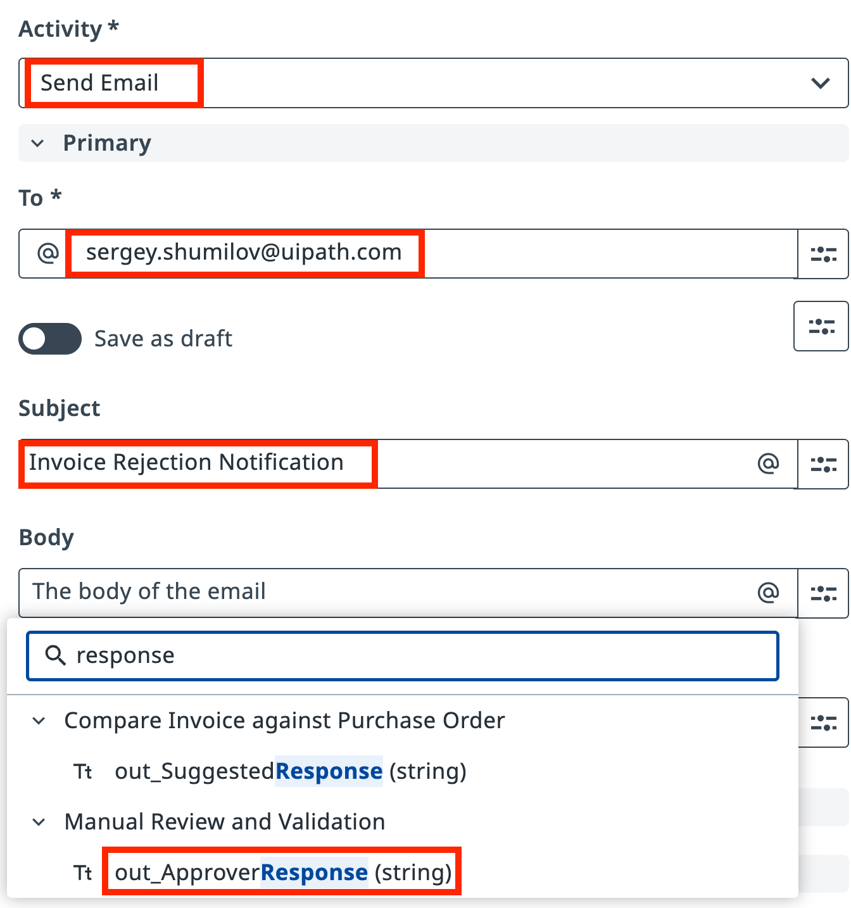
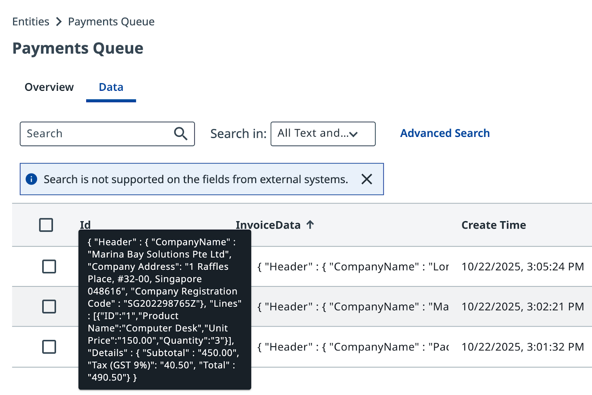

# Talking to external services

!!! tip "Here is our plan for this lesson:"

    1. Send a message to the supplier whenever an invoice is rejected, using the response text from validation step and **Gmail Connector**.
    2. Store approved invoice data in **Data Fabric** so the finance team can process payments using their own automation.

## Goal

Complete the end-to-end process by adding two final tasks: a rejection email connector on the **Reject** path, and a data storage connector on the **Approve** path. Both use **Integration Service** connectors already configured in **AgenticPracrtice** tenant.

## Integration Service and Data Fabric

UiPath **Integration Service** is the fastest and most convenient way to automate API-enabled applications. It handles authorization and authentication, centralizing API connection management and enabling faster SaaS platform integration.

Two connections are already configured in your tenant:

- **Gmail** — a shared mailbox for sending automated emails
- **Data Fabric** — shared data storage for structured records

Your platform administrators have prepared these connections. You don't need to configure authentication.

{ .screenshot width="900" }

!!! note "Tenant check"
    Make sure you're using the correct tenant. Contact your trainer if there are issues with connections.

## Steps

### 1. Configure the rejection email task

The process should send a rejection email when an invoice fails validation. The email uses the draft response that the Agent generated and the reviewer had a chance to edit.

In your **Maestro Agentic Process**, select the task on the **Reject** path and set the action type to **Execute Connector Activity**.

[[[
Configure the task to use the Gmail connector with the shared Gmail connection and Send Email activity.
|30|
{ .screenshot }
]]]

Configure the **Send Email** activity: enter the recipient address, subject, and map the email body to the Agent's `out_SuggestedResponse` variable (or the reviewer's edited version, `out_ApproverResponse`).

[[[
In the Send Email activity, enter the recipient email address, a suitable subject line, and select the response variable from the Agent or reviewer as the email body.
|30|
{ .screenshot }
]]]

Save the task configuration.

### 2. Configure the data storage task

For approved invoices, pass the invoice data to **Data Fabric** so the finance team's own UiPath automation can pick it up and process payments.

Select the task on the **Approve** path and set the action type to **Execute Connector Activity**.

[[[
Configure the task to use the Data Fabric connector with the shared connection and Create Entity Record activity for the Payments Queue object.
|30|
{ .screenshot }
]]]

Map the invoice data output to the `InvoiceData` input field. This passes all approved invoice information to the payments queue.

Save the task configuration.

### 3. Test both paths

Now run the process several times to trigger both scenarios.

Click **Debug** and let the process run. With `in_FailureProbability` set high, you'll see both rejected and approved invoices.

Check **Data Fabric** to see approved invoices accumulating in the Payments Queue:

{ .screenshot width="800" }

Check your inbox for rejection emails from the shared Gmail account. Each email contains the discrepancies identified by the Agent and reviewed by the human validator:

{ .screenshot width="600" }

Everything works as planned! The process is now complete — it retrieves invoice PDFs, extracts and validates data using IXP, routes exceptions to human review, sends rejection emails, and stores approved records for payment processing. All orchestrated by Maestro.
