# Step 3 — Configure an Agent

---

***Build the 2-Way Matching Agent and connect it to your Maestro workflow***

---

## Goal

Create the **2-Way Matching Agent** with two tools: an IXP data extraction tool and an RPA workflow tool that queries the Purchase Order database. The agent receives a PDF invoice, extracts structured data, looks up the corresponding PO, and returns a matching decision with supporting outputs.

## Why Use an LLM for Matching

You could write traditional code to compare invoice data and line items. But the rules are flexible: tables may include lines with semantically similar descriptions, or variations that are difficult to codify. Every edge case increases code complexity.

When discrepancies are found, you also need to draft a response to the supplier — which requires generating natural language. LLMs handle both jobs well. They can analyze large amounts of text in any format, identify discrepancies, and generate validation summaries or email responses in required formats and languages.

## Steps

### Part 1: Create the agent and configure arguments

1. In **Studio Web**, add a new Agent to your solution. Name it **2-Way Matching Agent**.

    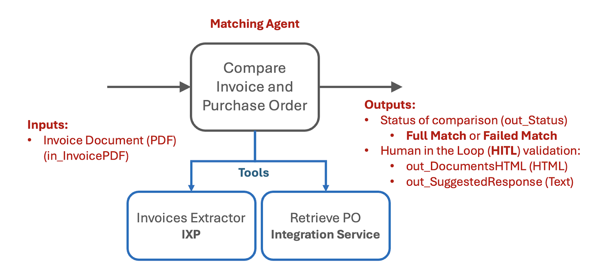{ .screenshot }

    When prompted, dismiss the Autopilot screen and click **Start fresh**. You can explore Autopilot later, but here you'll configure prompts and settings manually.

2. Open **Data Manager** from the left ribbon and add a new Input argument:

    | Field | Value |
    |-------|-------|
    | Name | `InvoicePDF` |
    | Type | File |
    | Description | Invoice File |

    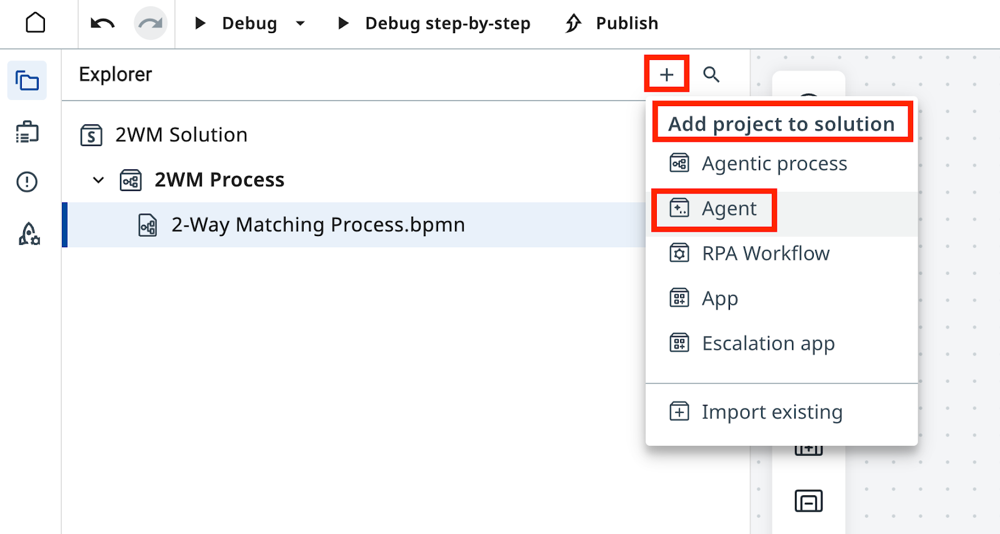{ .screenshot }

3. For Output arguments, switch to editor mode.

    { .screenshot }

4. Paste the following JSON into the editor:

    ```json
    {
      "type": "object",
      "required": ["out_Status"],
      "properties": {
        "out_Status": {
          "type": "string",
          "description": "Status of matching - either 'Full Match' or 'Failed Match'"
        },
        "out_DocumentsHTML": {
          "type": "string",
          "description": "HTML code containing side by side comparison of Purchase Order and Invoice"
        },
        "out_SuggestedResponse": {
          "type": "string",
          "description": "Suggested response to Invoice Supplier with description and request to mitigate issues"
        },
        "out_POID": {
          "type": "string",
          "description": "Purchase Order ID extracted from Invoice PDF"
        }
      },
      "title": "Outputs"
    }
    ```

    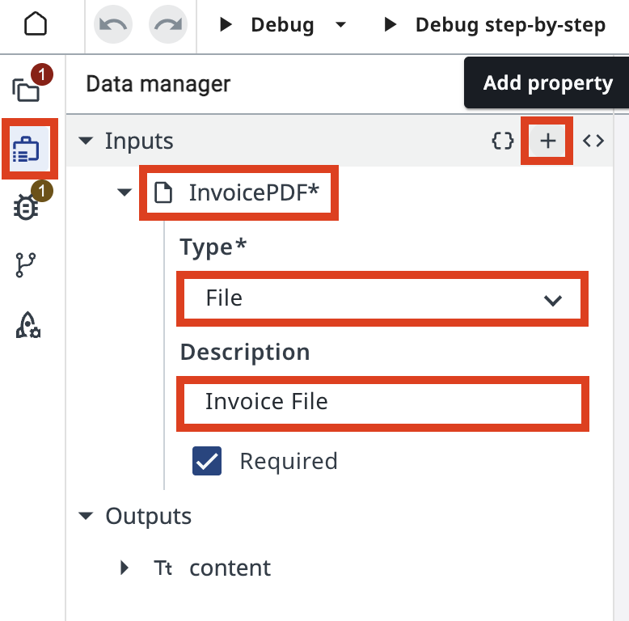{ .screenshot }

5. Confirm all four output arguments are configured correctly.

    { .screenshot }

### Part 2: Configure the prompts

6. Enter the following **User Prompt**:

    ```text
    Analyze {{InvoicePDF}}.
    ```

    { .screenshot }

7. Enter the following **System Prompt**:

    ```text
    You are an AI agent specialized in comparing Invoice PDFs with Purchase Orders. Your primary responsibilities are:

    1. Analyze the contents of an Invoice PDF file using the InvoicesIXP tool. Extract all relevant information including company details, line items, totals, and tax information. Trigger Escalation if confidence falls below 60%.

    2. Use the Retrieve PO Data tool to fetch Purchase Order data from the Data Fabric. The Purchase Order ID should be extracted from the Invoice. If the PO data cannot be retrieved, use Escalation.

    3. Compare the Invoice details with the Purchase Order information. Identify and list any mismatches or discrepancies between the two documents. Pay special attention to:
       - Company names and details
       - Line items (product names, quantities, prices)
       - Totals and subtotals
       - Tax information
       - Dates (order date, delivery date, payment due date)

    4. Handle any unexpected data formats or missing information gracefully. If crucial information is missing from either document, note this in your analysis and use Escalation.

    5. Provide a clear, concise report of your findings, highlighting any issues that require attention.

    You should be thorough in your analysis, checking for discrepancies in items, quantities, prices, dates, and any other relevant fields. Always maintain a professional and objective tone in your reports.

    out_Status: Status of comparison should be:
    - "Full Match" - if Invoice and Purchase order match fully. Every line item in PO matched to Invoice line items, company name and details match, total and tax information matches.
    - "Failed Match" - if there are items that cannot be matched or other details do not align.

    out_DocumentsHTML: If match is not successful, generate HTML code containing a side-by-side comparison of Purchase Order and Invoice, including company details, document line items, total and tax information.
    - Use a table structure with three columns: Field, Purchase Order, Invoice.
    - Field titles should be placed in the leftmost column.
    - Tax value should include tax rate and tax name, if available.
    - Line items should be displayed as sub-tables inside the main table cell, aligned top.
    - Cells with discrepancies should have a light red background, both in the main table and in cells of line items sub-tables.
    - Set the table width property to 100%.
    - Use appropriate HTML tags for headers, rows, and data cells.

    out_SuggestedResponse: If match is not successful, draft the invoice rejection email to the supplier.
    - The email should have HTML formatting.
    - Start with "Dear Supplier" and do not include a Subject line or placeholders. Sign the email as "Payments Team".
    - Display product names, prices, and other data from documents in bold text.
    - Include a bullet list with reasons for rejection, i.e., discrepancies that can't be matched, and a request to adjust the invoice and resend.
    - In the bullet list, do not include items if that individual item is considered a match. Only list items that do not follow the rules.
    - Maintain a professional and courteous tone throughout the email.

    Always double-check your analysis and outputs for accuracy before finalizing your response.
    ```

    { .screenshot }

### Part 3: Add the IXP tool

8. In canvas mode, select your agent and add a new Tool.

    { .screenshot }

9. Select **IXP** from the toolbox and choose the **InvoicesIXP** project.

    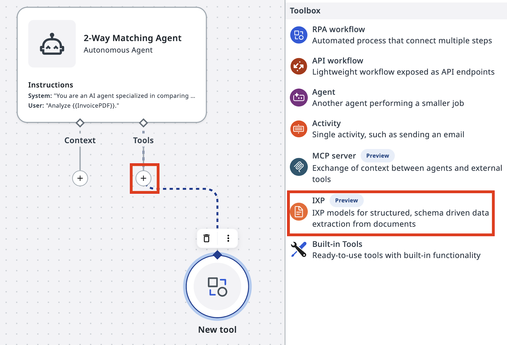{ .screenshot }

    This is an out-of-the-box invoice extraction model with standard taxonomy. It returns a JSON object containing the extracted data.

10. Add a meaningful description, for example: **Invoice Data extraction tool**.

    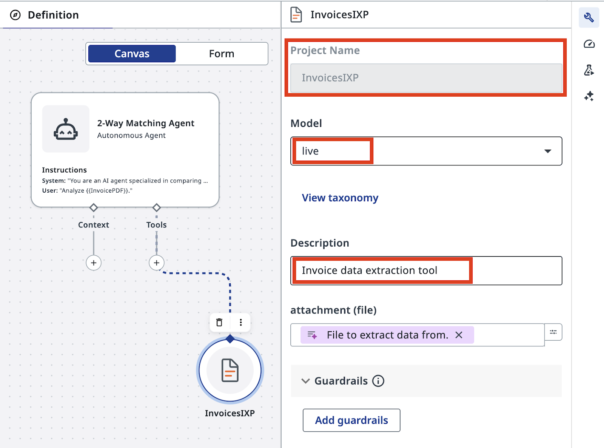{ .screenshot }

11. Save the IXP tool configuration.

    { .screenshot }

### Part 4: Build and add the PO lookup tool

PO data is stored in Data Fabric. You'll build a small RPA workflow to query it, then add that workflow as a tool for the agent.

12. Add a new RPA workflow to your solution. Give it a meaningful name.

    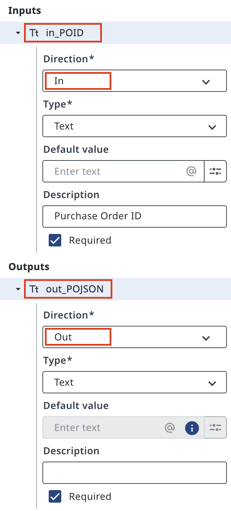{ .screenshot }

13. Configure the input and output variables for the workflow.

    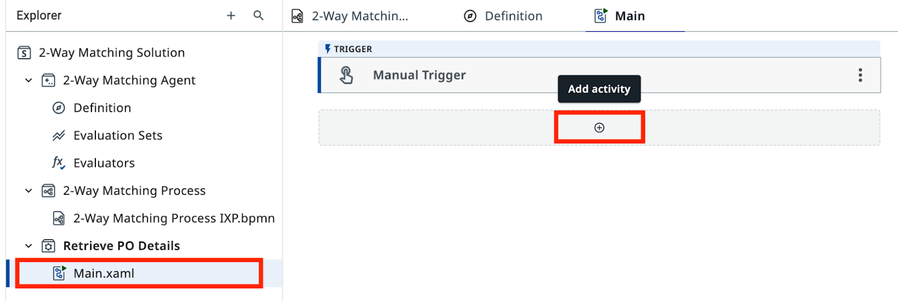{ .screenshot }

14. Add a **Query Entity Records** activity configured to query the **PurchaseOrdersDatabase** entity. Apply the filter: **POID equals in_POID**. Return the PODATA field as the output.

    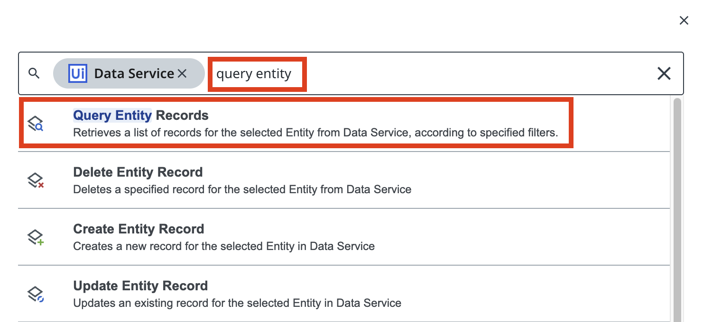{ .screenshot }

15. Back in your agent's canvas, add this RPA workflow as a tool.

    { .screenshot }

16. Configure the input hint for the **in_POID** argument so the agent knows the expected format:

    ```text
    Purchase Order ID. It starts with 'PO-' followed by a few digits, for example: 'PO-123456'.
    ```

    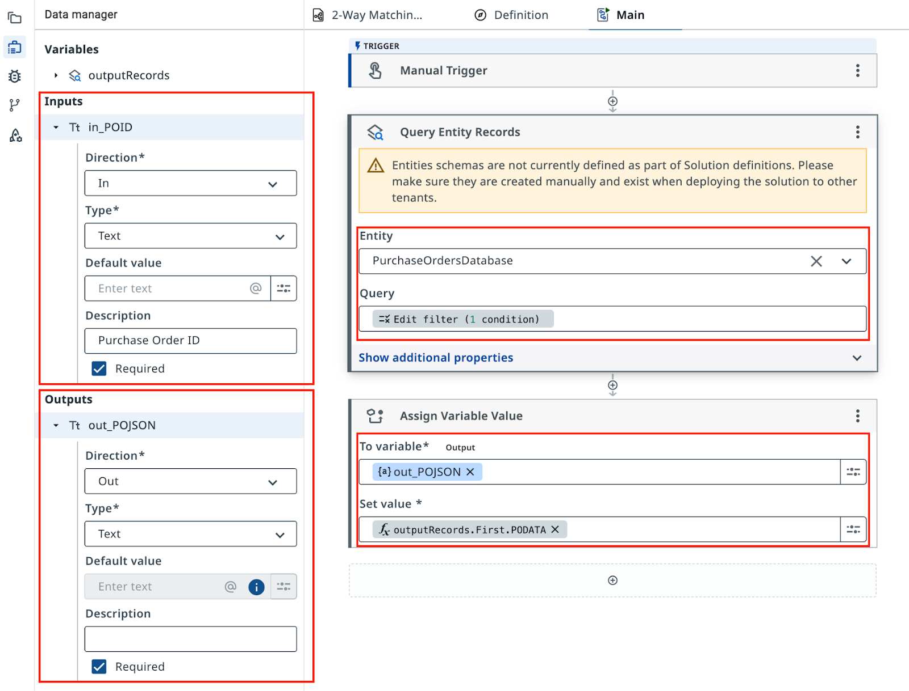{ .screenshot }

### Part 5: Test the agent

17. Test the agent with a sample PDF invoice. Confirm the agent calls the IXP tool first.

    { .screenshot }

18. Review the IXP extraction results and verify the agent identified the PO ID correctly.

    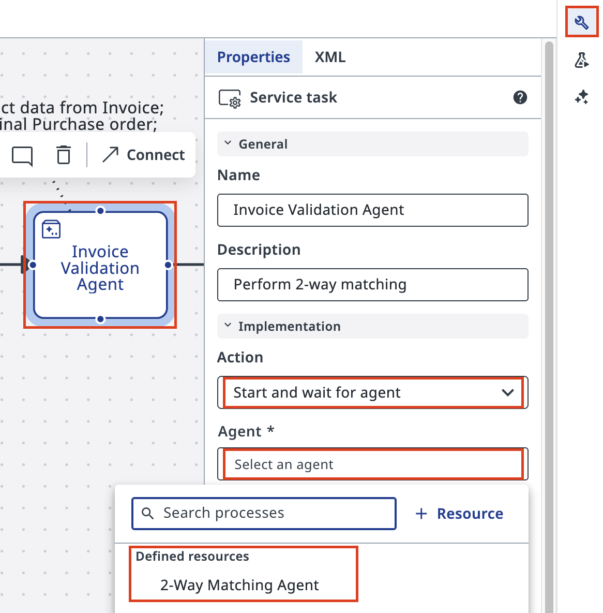{ .screenshot }

19. Confirm the agent called the PO lookup tool with the extracted PO ID.

    { .screenshot }

20. Review the final output. Verify `out_Status`, `out_DocumentsHTML`, `out_SuggestedResponse`, and `out_POID` are all populated.

    { .screenshot }

    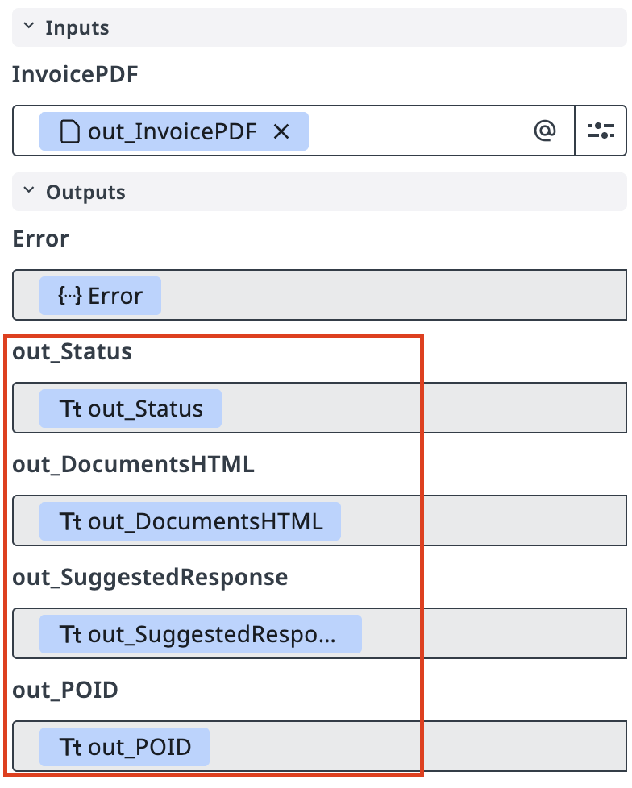{ .screenshot }

    Notice how the JSON formats of the invoice (returned by IXP) and the Purchase Order are different. The agent understands the meaning of both documents and correctly detects discrepancies regardless of format differences.

### Part 6: Connect the agent to Maestro

21. Return to your **Maestro Agentic Process** and configure the agent task. Set the action to **Start and wait for agent**, then select **2-Way Matching Agent**.

    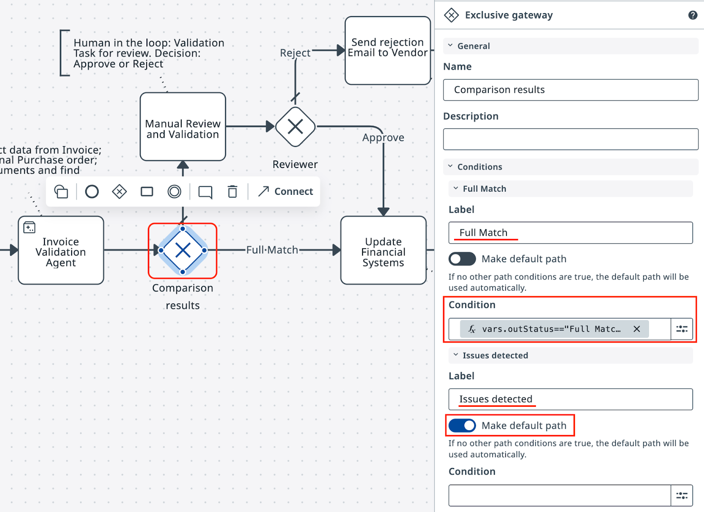{ .screenshot }

22. Map the robot output to the agent input. Agent outputs are automatically added to the workflow variables.

    | Robot output | Agent input |
    |-------------|-------------|
    | `out_FileName` | `InvoicePDF` |

    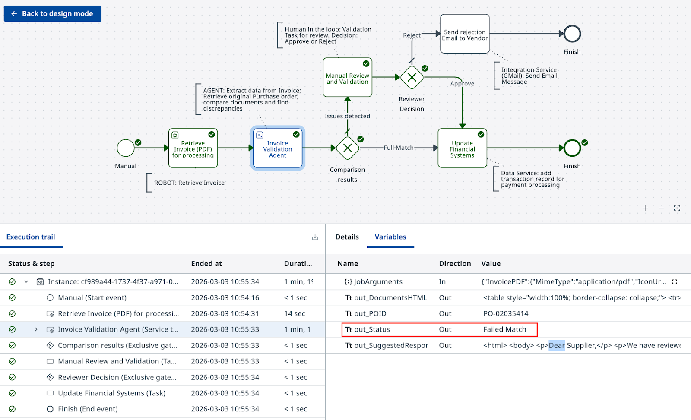{ .screenshot }

23. Configure the **Exclusive Gateway** after the agent task. Set the expression for the **Full Match** path:

    ```text
    vars.outStatus.ToLower()=="full match"
    ```

    You can test expected inputs directly in the expression editor. Set **Failed Match** as the default path.

24. Click **Debug** and confirm the gateway routes correctly based on the agent's output.

    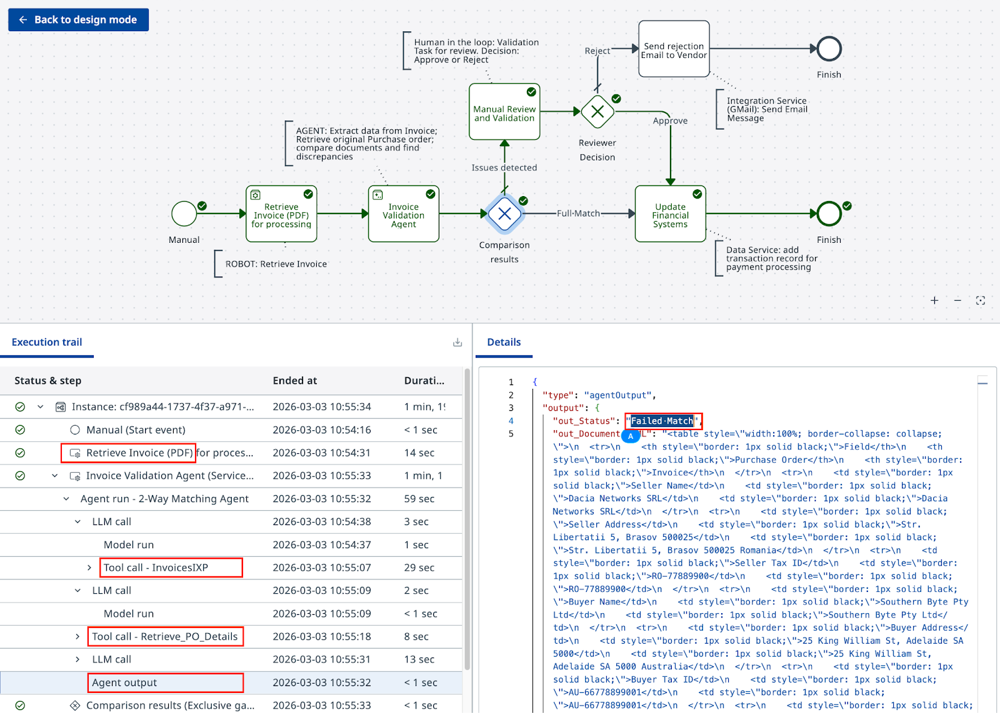{ .screenshot }

Your agent is ready. In most cases, you'll need to return and refine the prompt to cover more edge cases — for example, allowing semantically similar descriptions, or splitting a single PO line item across multiple invoice lines.

[← Step 2: Configure a Robot](configure-robot.md) | [Next: Configure Human Validation →](configure-human-validation.md)
