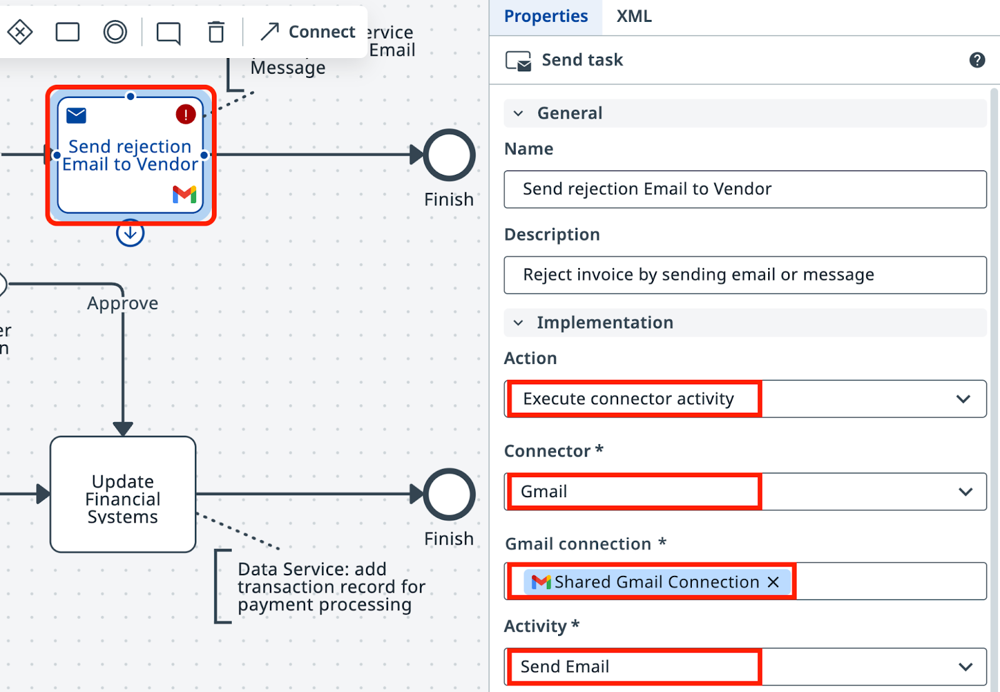
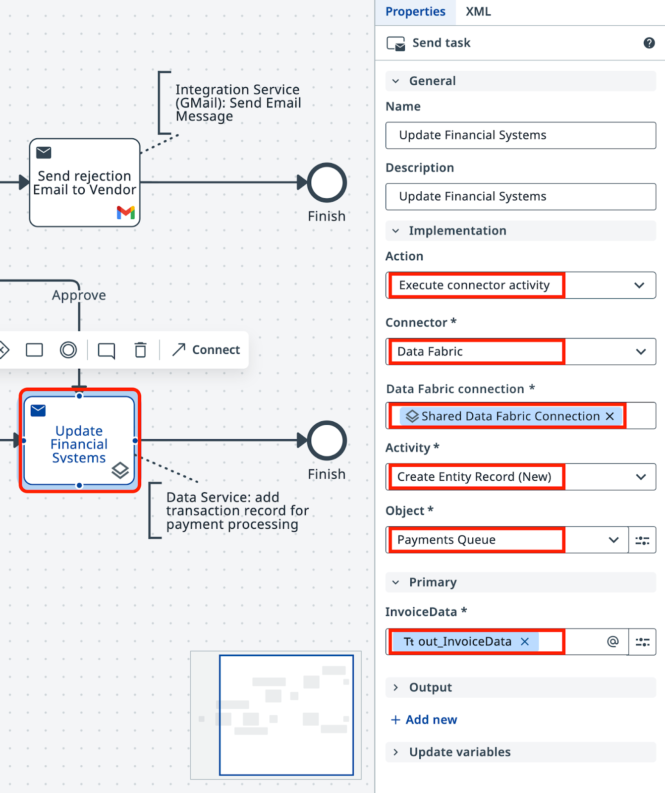
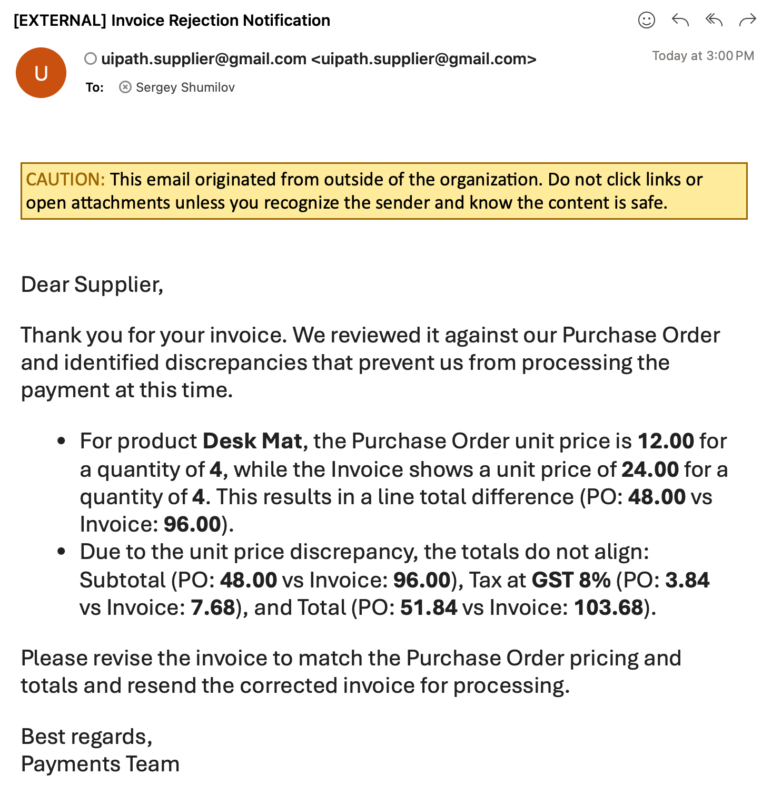

# Step 5 — Configure API Integration

---

***Send rejection emails and store approved invoices to complete the process***

---

## Goal

Add the final two tasks to the workflow: send a rejection email to the supplier when an invoice is rejected, and store approved invoice data in **Data Fabric** for payment processing. Both use **Integration Service** connectors already configured in your tenant.

## Integration Service

**Integration Service** is UiPath's centralized way to integrate with API-enabled applications. It handles authorization and authentication, centralizes connection management, and simplifies integration with SaaS platforms.

Two connections are available in this tenant:
- **Gmail** — a shared mailbox for sending emails
- **Data Fabric** — shared data storage for tables, files, and other structured data

Credentials and permissions are managed by the platform administrators. You don't need to configure authentication.

!!! note "Tenant check"
    Make sure you're using the correct tenant. Contact your trainer if there are issues with connections.

## Steps

### Part 1: Configure the rejection email

1. In your **Maestro Agentic Process**, select the task on the **Reject** path.

2. Set the action type to **Execute Connector Activity**.

    { .screenshot }

3. Select the **Gmail Connector** and configure the shared Gmail connection.

    { .screenshot }

4. Configure the **Send Email** activity:
   - **To:** send it to yourself or a colleague.
   - **Subject:** generate a suitable subject.
   - **Body:** use `out_SuggestedResponse` — the HTML rejection email drafted by the agent and reviewed during human validation.

    { .screenshot }

5. Save the task.

### Part 2: Store approved invoice data in Data Fabric

6. Select the task on the **Approve** path.

7. Set the action type to **Execute Connector Activity**.

    { .screenshot }

8. Select the **Data Fabric connector** and configure it to write the approved invoice record. The payments team's automation reads from Data Fabric to process payments.

    { .screenshot }

### Part 3: Test the complete process

9. Run the process several times. After a few runs:
   - Check **Data Fabric** — approved invoices accumulate as records.
   - Check the inbox — HTML-formatted rejection emails arrive for rejected invoices.

    { .screenshot }

The process is complete. It retrieves invoice PDFs, extracts and validates data using IXP, routes exceptions to human review, sends rejection emails, and stores approved records — all orchestrated by Maestro.

[← Step 4: Configure Human Validation](configure-human-validation.md) | [Back to Overview](index.md)
