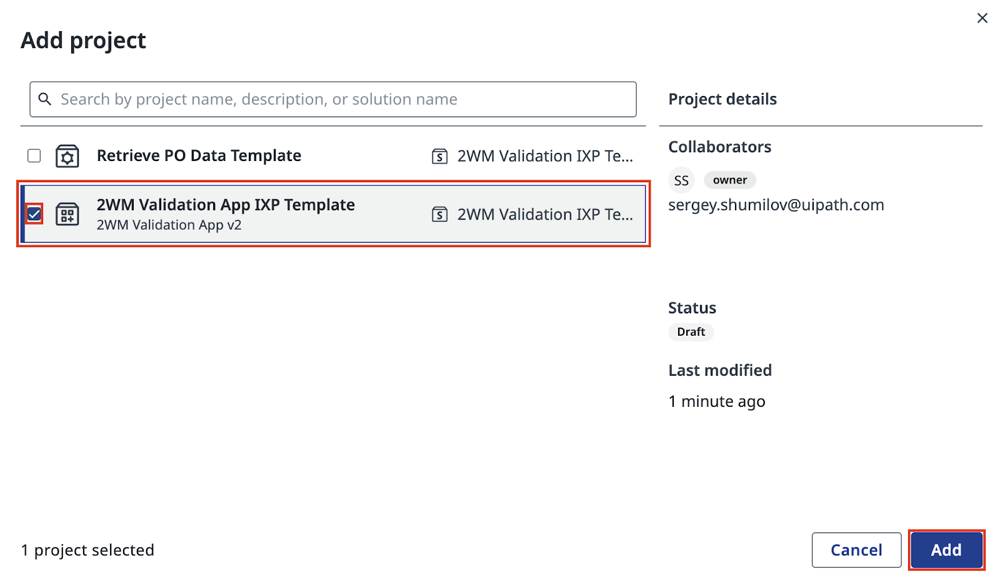
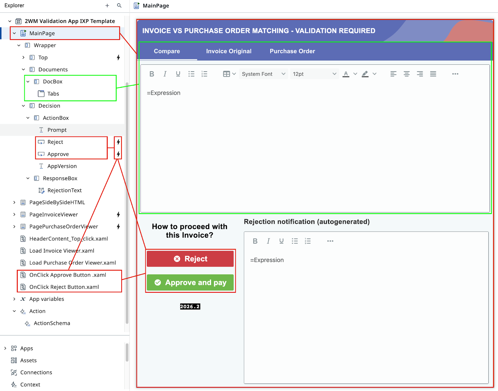
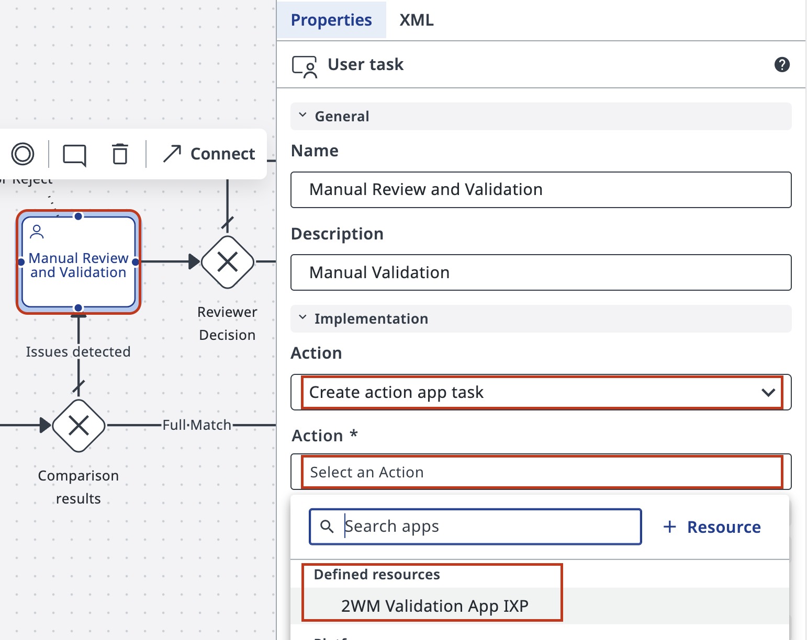
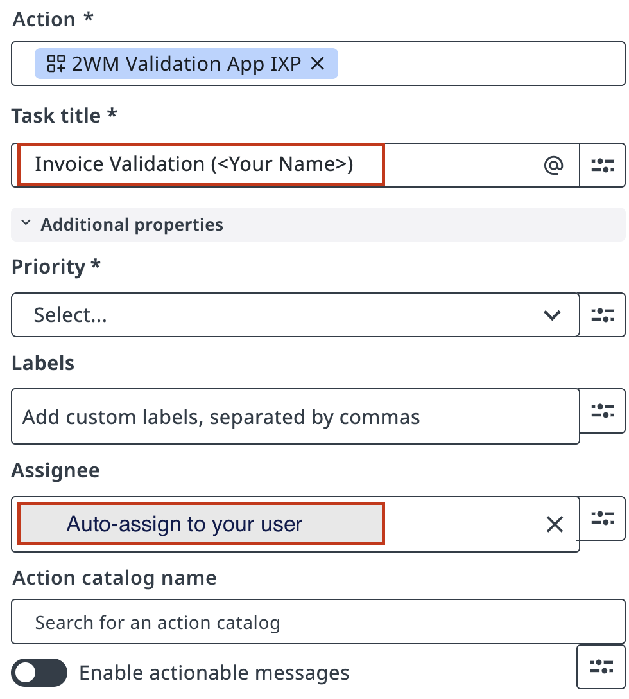
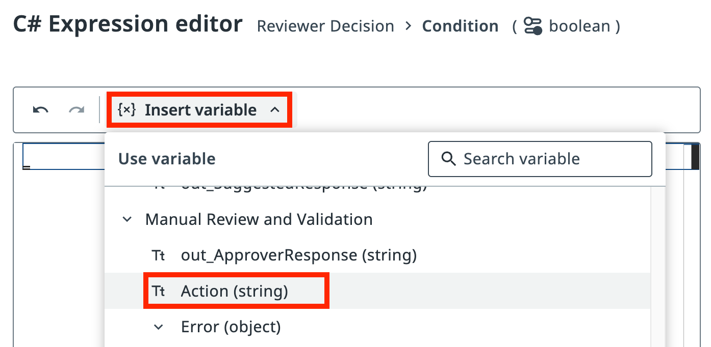
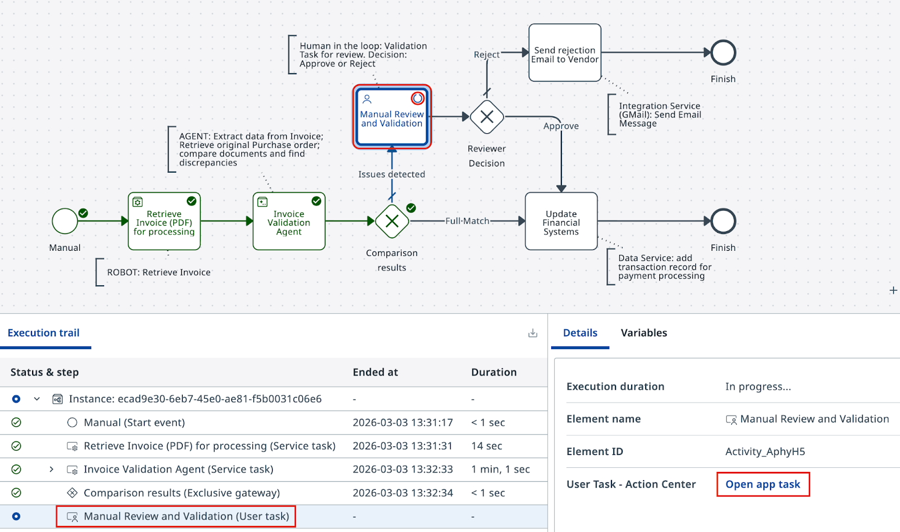
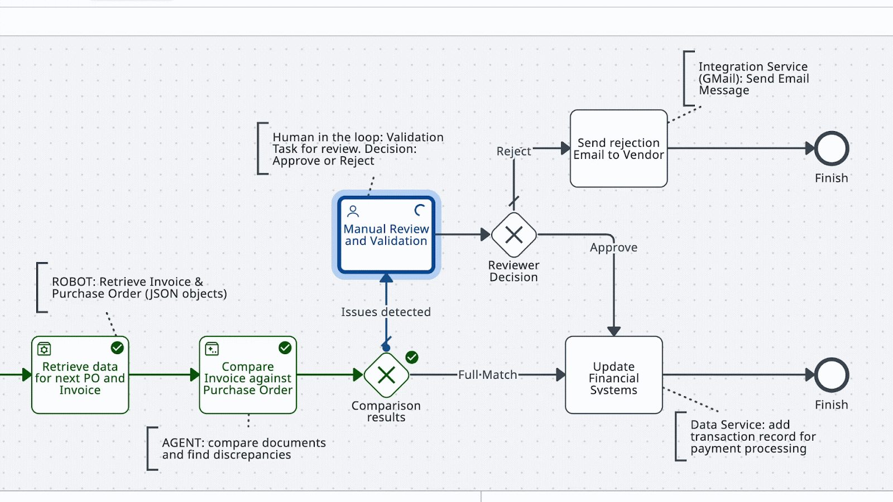

# Step 4 — Configure Human Validation

**Import the IXP validation app and configure the human review task**

---

## Goal

Add a human validation step on the **Failed Match** path. When the agent flags a mismatch, a reviewer in **Action Center** sees the comparison and approves or rejects it. The workflow resumes based on their decision.

## The IXP Validation App

This exercise uses a different template than the standard exercise:

| Exercise | App Template |
|----------|-------------|
| Standard (JSON) | `2WM Validation App Template` |
| IXP (PDF) | `2WM Validation App IXP Template` |

The IXP template is adapted to work with data extracted from PDFs via IXP.

## Steps

### Part 1: Import the validation app

1. Navigate to **Apps** in your workspace.

2. Import the **2WM Validation App IXP Template** from the shared templates library.

    { .screenshot }

3. Review the imported app. It displays the agent's HTML comparison output and provides **Approve** and **Reject** buttons.

    { .screenshot }

### Part 2: Configure the human task in Maestro

4. In your **2-Way Matching IXP Process**, select the human task node on the **Failed Match** path.

5. Set the action type to **Action App Task**.

    { .screenshot }

6. Select the **2WM Validation App IXP** you imported.

7. Set the task title, for example: **Invoice Review Required**.

8. Assign the task to yourself.

    { .screenshot }

9. Map the agent outputs to the app inputs:

    | Agent Output | App Input |
    |-------------|-----------|
    | `out_DocumentsHTML` | Comparison display field |
    | `out_SuggestedResponse` | Suggested rejection email field |

    { .screenshot }

10. Save the task configuration.

    { .screenshot }

### Part 3: Configure the gateway decision logic

11. Add an **Exclusive Gateway** after the human task.

    { .screenshot }

12. Set **Reject** as the default path (it will be taken if the expression on the Approve path is not met).

13. Configure the expression for the **Approve** path using the Expression Editor:

    ```text
    vars.actionOutput == "Approve"
    ```

    { .screenshot }

14. Connect the **Approve** path to the payment task and the **Reject** path to the supplier notification task.

### Part 4: Test the human validation flow

15. Run the process in debug mode. Trigger a **Failed Match** so the human task activates.

    { .screenshot }

16. Open **Action Center** and find your task. Review the comparison and click **Approve** or **Reject**.

    { .screenshot }

17. Confirm the process resumed and routed correctly.

    { .screenshot }

18. Review the execution trace in Maestro to verify the correct path was taken.

    { .screenshot }

19. Run additional test scenarios — one Approve and one Reject — to confirm both paths work.

    { .screenshot }

    { .screenshot }

20. Review the end-to-end process flow animation.

    { .screenshot }

[← Step 3: Configure an Agent](configure-agent.md) | [Next: Configure API Integration →](configure-api.md)
