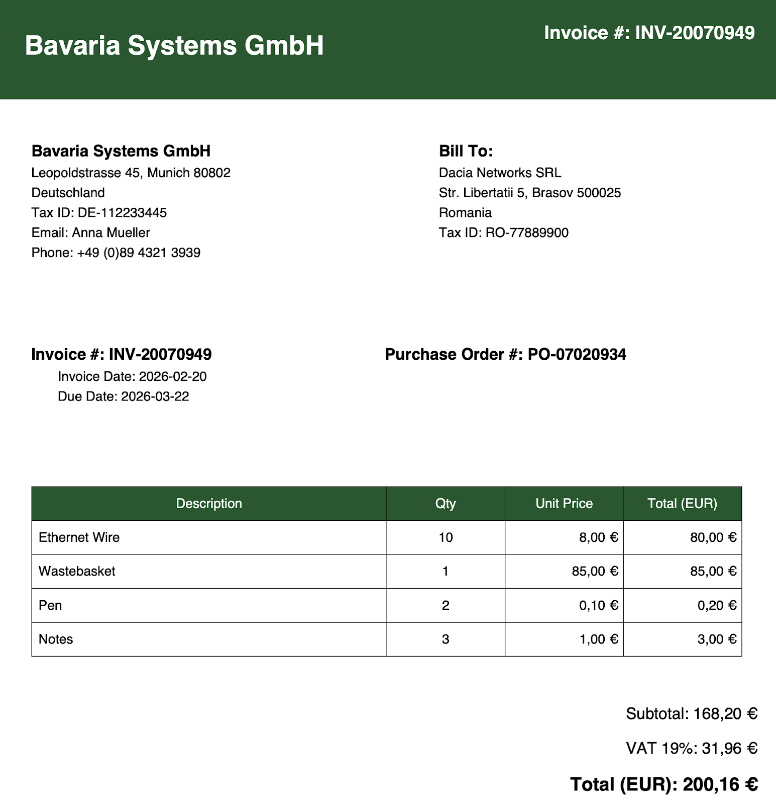
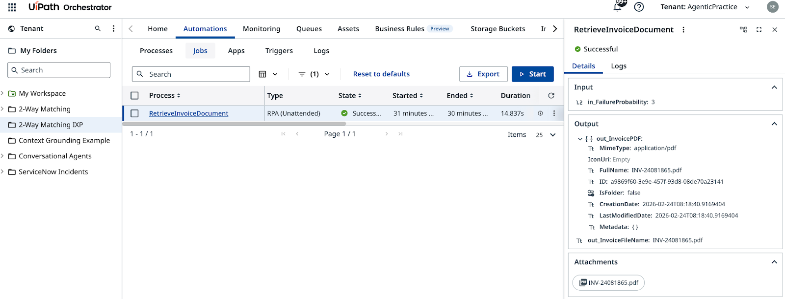

# Step 2 — Configure a Robot

**Set up invoice PDF retrieval from a Storage Bucket**

---

## Goal

Create the Maestro Agentic Process, import your BPMN diagram, and connect the first task to the **RetrieveInvoiceDocument** RPA process. Unlike the standard exercise where the robot returns JSON, this robot retrieves a **PDF file name** from a Storage Bucket — the agent will extract structured data from the PDF in the next step.

## Key Difference from the Standard Exercise

| | Standard Exercise | IXP Exercise |
|-|-------------------|--------------|
| Robot process | `Retrieve.Invoice` | `RetrieveInvoiceDocument` |
| Robot folder | `2-Way Matching` | `2-Way Matching IXP` |
| Output | Invoice + PO as JSON | PDF filename in Storage Bucket |

## Steps

### Create the Maestro Agentic Process

1. In **Studio Web**, create a new **Agentic Process**.

    { .screenshot }

2. Import your BPMN diagram. Select the **2-Way Matching IXP Process.bpmn** file you exported in Step 1.

    { .screenshot }

3. Delete the auto-generated empty process placeholder.

4. Rename the process to **2-Way Matching IXP Process**.

5. Rename the project to **2-Way Matching IXP Project**.

    { .screenshot }

### Configure the robot task

6. Select the robot task node in the BPMN canvas.

7. Open the properties panel and set the action to **Start and wait for RPA workflow**.

    { .screenshot }

8. Search for and select the **RetrieveInvoiceDocument** process from the **2-Way Matching IXP** folder.

    { .screenshot }

9. Review the process outputs. The robot returns a **PDF filename** stored in a Storage Bucket — this is what the agent will use to access and process the invoice document.

    { .screenshot }

### Test the process

10. Click **Debug** to launch the process.

    { .screenshot }

11. Confirm the robot completed successfully and returned a PDF filename in the output variables.

    { .screenshot }

The robot is now retrieving invoices as PDFs. In the next step, you'll configure the agent to extract structured data from those PDFs using IXP.

[← Step 1: Create BPMN Process](create-bpmn.md) | [Next: Configure an Agent →](configure-agent.md)
