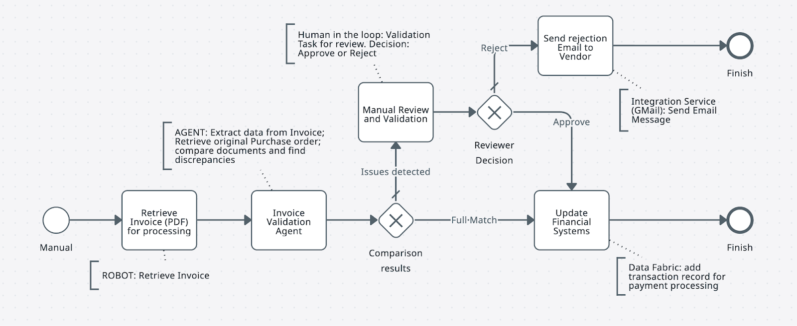

# Step 1 — Create BPMN Process

**Model the IXP-enhanced invoice matching workflow**

---

## Goal

Design the BPMN diagram for the IXP-based invoice matching process. The process is structurally similar to the standard version, with one key difference: the robot retrieves a **PDF document** (not pre-structured JSON), and the agent extracts structured data from it using **IXP (Intelligent eXtraction & Processing)**.

## Matching Variants

This exercise uses **2-way matching** — comparing an invoice against a Purchase Order. For reference, more advanced variants exist:

| Variant | Documents Compared |
|---------|--------------------|
| **2-way** | Invoice + Purchase Order |
| **3-way** | Invoice + Purchase Order + Goods Receipt Note |
| **4-way** | Invoice + Purchase Order + Goods Receipt Note + Inspection Report |

You're building the 2-way variant.

## Steps

1. Open **[bpmn.uipath.com](https://bpmn.uipath.com/)** in your browser.

2. Create a new diagram and model the invoice matching process:
    - A **Start Event** triggers when a new invoice PDF arrives
    - A **Robot task** retrieves the PDF from a Storage Bucket
    - An **Agent task** extracts data using IXP, looks up the PO, and performs matching
    - An **Exclusive Gateway** routes based on the agent's decision:
        - Full match → update Data Service → End
        - Mismatch → Human review → End
        - Rejected → Send supplier notification → End

    { .screenshot }

3. Review all paths and confirm each has an End Event.

4. Export the diagram as a `.bpmn` file. Save it as **2-Way Matching IXP Process.bpmn**.

    { .screenshot }

[← Back to Overview](index.md) | [Next: Configure a Robot →](configure-robot.md)
