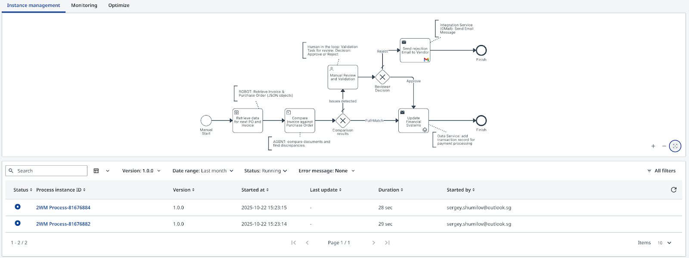
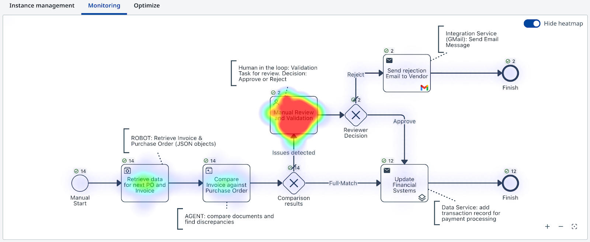

# You did it!

!!! tip "Congratulations!"

    You've built a complete agentic invoice-matching process from scratch.

---

## What you built

Everything works as planned! The process is now complete — it retrieves invoice PDFs, extracts and validates data using IXP, routes exceptions to human review, sends rejection emails, and stores approved records for payment processing. All orchestrated by Maestro.

Using UiPath Platform services has never been so easy!

Summary:

| Component | Role |
|-----------|------|
| **Robot** | Retrieves an invoice PDF from the Storage Bucket |
| **AI Agent** | Extracts data with IXP, looks up the Purchase Order, and runs 2-way matching |
| **Human task** | Presents the mismatch summary in Action Center for review |
| **API connectors** | Sends the rejection email and stores approved records in Data Fabric |

This is a production-pattern process. The same design — Robot → Agent → Human → API — applies to a wide range of real-world document processing scenarios.

---

## Next steps

### 1. Publish and run your process from Maestro dashboard

Your process is now complete. Publish it to your "**Personal Workspace**" and run it like any other UiPath process — it triggers robotic and agentic jobs automatically, in the right sequence, involving humans only when needed.

- Open your solution in **Studio Web**
- Publish to your **Personal Workspace** 
- Trigger a run from **Orchestrator** or **Maestro**
- Watch the execution trace end-to-end from **Maestro** dashboard:

{ .screenshot width="900" }

### 2. Explore Maestro analytics

After a few runs, head over to **Maestro** to explore execution details for each transaction. Here is how the analytics view looks:

- Transaction-level execution details
- End-to-end process flow visualization
- Exception and escalation rates

{ .screenshot width="900" }

---

## Keep iterating

**Improve the agent prompt**

- The current prompt misses some edge cases — similar-but-not-identical line item descriptions, for example.
- Modify the system prompt and re-test with the same invoices.
- Measure how the matching decision changes.

**Test the boundaries**

- Set `in_FailureProbability` to different values and run multiple times.
- Deliberately submit an invoice with a missing PO ID and observe the escalation path.

**Expand the process**

- Add a second document type (e.g. credit notes).
- Introduce a new escalation path for high-value mismatches.
- Connect the approval path to an additional downstream system.

The skills you practiced here — prompt engineering, agentic orchestration, human-in-the-loop design, API integration — are the building blocks of modern enterprise automation. Keep experimenting. Change the prompts. Break things. Fix them. That's how it sticks.

---

## Learn more

| Resource | Description |
|----------|-------------|
| UiPath Academy | Official learning paths for Agent Builder and Maestro |
| UiPath Documentation | API references, platform guides, release notes |
| UiPath Community | Forum for questions, shared automations, and tips |
